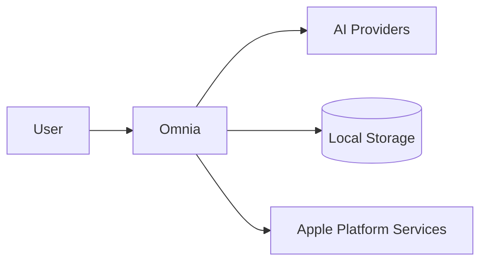
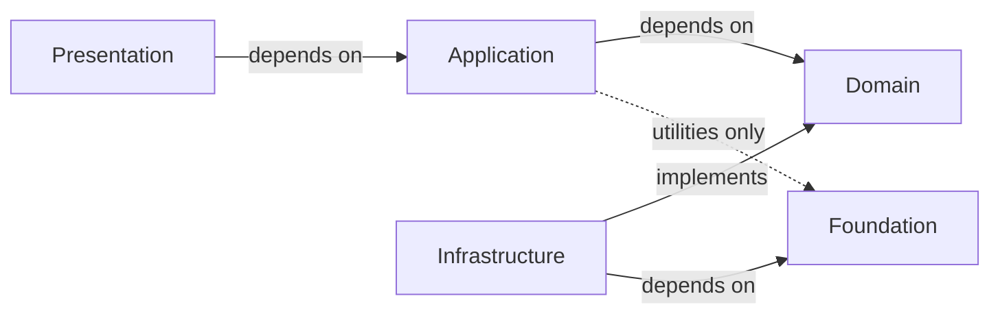
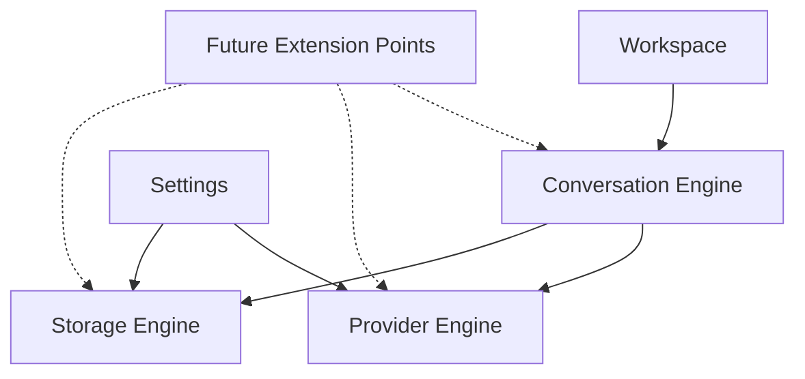

# System Overview

> This document is the highest-level architecture specification of Omnia.
>
> It describes the system as a whole: why it exists, its subsystems, and the constraints that govern them.
>
> A new engineer should understand Omnia after reading only this document.

## Executive Summary

Omnia is a native AI workspace for Apple platforms: iOS, iPadOS, and macOS.

It is a client for OpenAI-compatible APIs. It provides a single, stable interface to interchangeable AI providers.

The system is local-first. All user data — conversations, connections, and credentials — lives on-device. AI requests travel directly from the device to the provider chosen by the user. Omnia owns no accounts, no models, and no servers.

The architecture is a strict layered structure. Dependencies point inward, so business logic stays independent of the UI, the providers, and the platform.

The system evolves by extension, not by redesign. New providers, new platforms, and future capabilities are added through stable extension points defined in this architecture.

## Architecture Drivers

The major forces shaping the architecture:

- **Product Principles** — the eight Product Principles in `Documentation/Product/PRODUCT_PRINCIPLES.md` are the primary forces shaping the architecture. The most consequential are Privacy First (user data stays on the device and requests go directly to the user's chosen provider), Provider Independence (the interface is stable while the provider is interchangeable), and Native Experience (the system follows Apple platform conventions). They are stated canonically in PRODUCT_PRINCIPLES.md and are not restated here.
- **Local-First Data** — Conversations and connections are stored on the device. The system works without Omnia-owned infrastructure and keeps data under user control.
- **Testability** — Business logic must be testable without a UI or a network. This requires the Domain to be independent of platform frameworks.

## Architectural Principles

Architectural principles are engineering rules. They govern how the system is structured, not what the product is. They complement the product principles in PRODUCT_PRINCIPLES.md without repeating them.

### Explicit Dependencies

Statement: Components declare their dependencies explicitly. They do not acquire them implicitly.

Why it exists: implicit acquisition hides the dependency graph, defeats the dependency rule, and makes testing and reasoning harder.

Practical implication: dependencies are provided at composition points, and a component's collaborators are visible from its interface.

### Dependency Inversion

Statement: High-level modules define the abstractions they consume; low-level modules implement them.

Why it exists: this is what keeps dependencies pointing inward and makes providers interchangeable.

Practical implication: the Domain defines contracts, and Infrastructure implements them; nothing in the Domain references a concrete implementation.

### Composition over Inheritance

Statement: Behavior is assembled from small components rather than inherited through class hierarchies.

Why it exists: inheritance couples types vertically and resists change; composition keeps units small and reusable.

Practical implication: shared behavior is expressed through protocols and composition, not base classes.

### Protocol-Oriented Design

Statement: Contracts are expressed as protocols, and implementations are bound at the boundary.

Why it exists: protocols provide a stable seam for providers, persistence, and services without coupling layers.

Practical implication: layer boundaries depend on protocols; concrete implementations exist only at composition time.

### Single Responsibility

Statement: A component has one reason to change.

Why it exists: components with one responsibility are understandable, testable, and independently evolvable.

Practical implication: each subsystem owns one concern; a component that accumulates responsibilities is split.

### Small, Focused Modules

Statement: Modules are small and have a clear purpose.

Why it exists: small modules limit blast radius, enable independent testing, and keep the dependency graph readable.

Practical implication: module boundaries follow subsystem boundaries, and modules do not grow without a new boundary.

### Deterministic Behavior

Statement: The same input and conditions produce the same output.

Why it exists: non-determinism makes behavior unpredictable and testing unreliable.

Practical implication: time, randomness, and external state are injected or isolated, and business logic stays pure where possible.

### Immutable Domain Models (where practical)

Statement: Domain values are immutable once created.

Why it exists: immutable state removes classes of concurrency and consistency bugs and makes reasoning simpler.

Practical implication: changes produce new values instead of mutating existing ones; mutation is confined to where identity requires it.

## System Context

Omnia sits between the user and their AI providers. It is the interface, not the owner.

- **User** — owns the providers, API keys, conversations, and decisions. Interacts with Omnia through a native interface.
- **Omnia** — the application. Provides the interface and orchestrates the interaction with providers. It does not operate infrastructure, accounts, or models.
- **AI Providers** — external OpenAI-compatible endpoints configured by the user. Requests go directly from the device to the provider; Omnia never proxies them.
- **Local Storage** — on-device storage for conversations and connections. Credentials are stored separately and securely.
- **Apple Platform Services** — platform features used by the application: Keychain, file system, accessibility, and system integrations.

## System Boundaries

Ownership defines responsibility. Omnia owns only what it can keep local and under user control. What Omnia does not own must never be built or operated by Omnia; anything external is used only at the user's explicit direction.

### Omnia Owns

- Native User Interface
- Local Storage
- Conversation Management
- Provider Configuration
- Credential Management
- Local Search
- User Preferences

### Omnia Does Not Own

- AI Models
- AI Accounts
- Provider Authentication Systems
- Provider Billing
- Cloud Infrastructure
- AI Training
- User Identity outside the device

These boundaries matter because ownership is liability. Owning a system means Omnia must operate it, secure it, and maintain it for years. The boundaries keep the product a client, not a platform, and keep user data under user control.

## High-Level Architecture

The system is organized into five layers, defined in ADR-0001. Dependencies always point inward, defined in ADR-0002.

Layer responsibilities:

- **Presentation** — user interface: screens, views, and interactions. Contains no business logic.
- **Application** — use cases and orchestration of user flows. Translates user intent into domain operations.
- **Domain** — business rules, entities, and provider-agnostic contracts. Independent of UI and platform.
- **Infrastructure** — provider adapters, networking, persistence, keychain, and platform services. Implements the Domain contracts.
- **Foundation** — reusable primitives, domain-agnostic utilities, and shared infrastructure building blocks. It is not a miscellaneous utilities layer: it must never contain business logic, feature logic, or provider-specific implementations.

Allowed dependencies are Presentation → Application, Application → Domain, Infrastructure → Domain (implementing Domain contracts), Infrastructure → Foundation, and Application → Foundation (shared utilities only, when justified).

## Core Subsystems

### Workspace

Purpose: Organize the user's work across conversations and providers.

Responsibilities:

- Present the overall structure of the user's work.
- Navigate between conversations and providers.
- Provide the entry point for creating and selecting conversations.

Interactions:

- Uses the Conversation Engine and Provider Engine through the Application layer.
- Reflects data managed by the Storage Engine.

Constraints:

- Contains no business logic.
- Must feel native on every platform.

### Conversation Engine

Purpose: Manage conversations and message history.

Responsibilities:

- Create, list, and select conversations.
- Manage message history.
- Orchestrate request and streaming response flows.

Interactions:

- Invokes providers through the Domain contract.
- Persists conversations through the Storage Engine.
- Informs the UI of incremental streaming updates.

Constraints:

- Must be testable without a network.
- Must never block the interface during streaming.

### Provider Engine

Purpose: Provide a single, stable interface to any OpenAI-compatible provider.

Responsibilities:

- Define the provider-agnostic contract.
- Select the active provider and model.
- Implement adapters for concrete providers.
- Support streaming responses.

Interactions:

- Consumed by the Conversation Engine through the Domain contract.
- Implements network requests through Infrastructure.

Constraints:

- Adding a provider must require no UI redesign.
- All providers must behave identically through the contract.

### Storage Engine

Purpose: Persist conversations and connections on-device.

Responsibilities:

- Store and retrieve conversations and message history.
- Store provider connections.
- Preserve data across sessions.

Interactions:

- Serves the Application and Domain layers.
- Uses platform persistence through Infrastructure.

Constraints:

- Data must remain on-device.
- Must never depend on Omnia-owned infrastructure.

### Settings

Purpose: Manage user configuration.

Responsibilities:

- Configure provider connections: endpoint, model, credentials.
- Manage application preferences.

Interactions:

- Consumed by the Provider Engine and Storage Engine.

Constraints:

- Configuration belongs to the user.
- Credentials must be stored securely, separate from application data.

### Security

Purpose: Protect user data and enforce privacy promises.

Responsibilities:

- Secure credential storage.
- Control access to user data.
- Prevent secrets from entering logs or analytics.

Interactions:

- Provided by Apple platform services through Infrastructure.

Constraints:

- Credentials never leave the device.

### Future Extension Points

Purpose: Define where the architecture is designed to grow.

Planned extensions are attached at these points:

- **Attachments** — extend the Conversation Engine's message model.
- **Vision Models** — extend the Provider Engine's contract.
- **Voice** — extend the Conversation Engine's input and output.
- **Prompt Library** — extend the Workspace.
- **Workspaces** — extend the Workspace's structure.
- **Plugins** — a new subsystem boundary for external extensions.

Constraints:

- Extensions must not violate the dependency rule.
- Extensions must not require redesign of existing subsystems.

### Subsystem Relationships

The Workspace drives the Conversation Engine, which orchestrates providers and storage. Settings configure the engines. Future Extension Points attach without redesign.

## Failure Philosophy

Failures are surfaced explicitly and never silent. The system degrades gracefully, preserves data, and leaves the user in control.

### Provider Unavailable

- What the user experiences: an explicit error identifying the provider; the conversation and UI remain usable.
- What data is preserved: the full conversation history and any unsent input.
- How recovery works: the user can retry or switch provider without losing context.

### Network Unavailable

- What the user experiences: an explicit connectivity error; stored content remains accessible.
- What data is preserved: all stored conversations and connections.
- How recovery works: the operation can be retried when connectivity returns.

### Streaming Interrupted

- What the user experiences: the partial response is marked as incomplete.
- What data is preserved: the partial response and full history.
- How recovery works: the user can retry the request; partial data is never silently discarded.

### Invalid Credentials

- What the user experiences: an explicit error identifying the connection as unauthorized.
- What data is preserved: all conversations; configuration remains editable.
- How recovery works: the user corrects the credentials; credentials never leave the device.

### Storage Failure

- What the user experiences: an explicit error; existing data is not lost or overwritten.
- What data is preserved: previously persisted data.
- How recovery works: writes are validated, and failed writes are reported rather than retried blindly.

### Application Restart

- What the user experiences: the application returns to the previous state.
- What data is preserved: all persisted conversations, connections, and preferences.
- How recovery works: state is reconstructed from local storage; there is no dependency on remote services.

The failure philosophy is: no silent failures, explicit errors, no data loss, graceful degradation, and user control.

## Cross-Cutting Concerns

Cross-cutting concerns apply to every layer and subsystem. They cannot be owned by a single layer: each one touches every layer's behavior, and a consistent violation anywhere breaks the whole system.

### Logging

- Logs must never contain secrets, tokens, or conversation content.
- Logging supports development and debugging, not observation.

Why it is cross-cutting: every layer handles user data and requests, so every layer is a place where sensitive content could leak into logs.

### Configuration

- Configuration is user-owned and stored locally.
- Sensible defaults reduce the need for configuration.

Why it is cross-cutting: configuration is consumed from the UI down to infrastructure; no single layer defines it alone.

### Dependency Injection

- Dependencies are provided across layer boundaries.
- Components depend on abstractions, not concrete implementations.
- Composition enables testability and provider replacement.

Why it is cross-cutting: injection is the mechanism that keeps dependencies pointing inward at every boundary.

### Error Handling

- Errors are explicit and typed.
- Failures are never silently swallowed.
- User data must never be lost as a result of an error.

Why it is cross-cutting: errors cross every layer boundary, and each layer must handle them consistently.

### Accessibility

- Accessibility is a product requirement.
- The system supports VoiceOver, Dynamic Type, keyboard navigation where appropriate, high contrast, and reduced motion.

Why it is cross-cutting: accessibility must hold for every screen and interaction, so it is a property of all features, not one subsystem.

### Security

- Credentials are stored securely, separate from application data.
- Secrets never leave the device and never enter logs.
- Security-sensitive changes require explicit review.

Why it is cross-cutting: security touches storage, networking, configuration, and the UI; no single layer can enforce it alone.

### Localization

- All user-visible strings are localized.
- No user-facing text is hardcoded in views.

Why it is cross-cutting: localization applies to every screen and feature, and must be consistent across the entire presentation layer.

## Architectural Constraints

Every future module must obey these rules. They reference ADR-0001 and ADR-0002.

- **Domain never imports SwiftUI.** (ADR-0001, ADR-0002) — Business logic stays independent of the UI framework.
- **Presentation never performs networking.** (ADR-0002) — Networking belongs to Infrastructure; the UI consumes orchestrated results only.
- **Infrastructure never owns business rules.** (ADR-0001) — Business rules belong to the Domain and Application layers.
- **Providers are interchangeable.** (ADR-0002) — Providers implement one contract; nothing in the UI or business logic depends on a specific provider.
- **Business logic belongs only to the Domain and Application layers.** (ADR-0001) — No other layer owns business decisions.
- **Dependencies point inward.** (ADR-0002) — Allowed dependencies: Presentation → Application, Application → Domain, Infrastructure → Domain (implements Domain contracts) and Infrastructure → Foundation, and Application → Foundation (shared utilities only, when justified).

## Quality Attributes

- **Maintainability** — The layered structure and the dependency rule keep ownership clear. Decisions are recorded in ADRs, so future changes have a stable reference.
- **Performance** — Streaming responses render incrementally, startup performance is measured, and memory usage has defined budgets. Performance is a design constraint, not a tuning step.
- **Predictability** — The same user action produces the same result under the same conditions. Unexpected behavior is a usability defect. The architecture supports this through deterministic domain behavior and explicit, typed failures, so variance is attributable to external conditions, never hidden state.
- **Reliability** — Errors are explicit and typed; failures are never silent. Local-first storage preserves user data independent of network conditions.
- **Security** — Credentials are stored securely on-device. Requests go directly to providers.
- **Extensibility** — Providers implement one contract, and new capabilities attach at defined extension points. The architecture is designed to grow without redesign.
- **Accessibility** — Accessibility is a product requirement enforced across every screen and interaction.
- **Testability** — The Domain is independent of the UI and platform, and dependencies are injected across boundaries. Business logic is testable without a network or a device.

## Evolution Strategy

Omnia evolves through extension, not modification.

- **New providers** — added through the Provider Engine's contract. No UI redesign, no changes to business logic.
- **New platforms** — the architecture is platform-agnostic below Presentation. New platforms are integrated through the native layer.
- **New modules** — attach at the defined extension points, inside their own layer boundaries.
- **Future synchronization** — only if it remains consistent with local-first data and user ownership. Requires a new ADR before it is considered.
- **Future plugins** — introduced as a new subsystem boundary behind a defined contract.
- **Future AI capabilities** — extend the Provider Engine and Conversation Engine contracts.

A change that cannot be expressed within this architecture is proposed as an ADR. It is never implemented as an exception.

## Relationship to ADRs

- **ADR-0001** defines the architectural style: layered clean architecture and the responsibility of every layer.
- **ADR-0002** defines the dependency direction rule that this document relies on throughout.
- This document is the highest-level architectural view. ADRs record the specific decisions beneath it.
- Future ADRs will refine specific architectural areas — the provider contract, storage, streaming, and extension points — without changing the overall structure unless a new ADR explicitly decides otherwise.

## Related Documents

- `Documentation/Architecture/02_LAYERED_ARCHITECTURE.md`
- `Documentation/Architecture/03_MODULE_MODEL.md`
- `Documentation/Architecture/04_AI_PROVIDER_ARCHITECTURE.md`
- `Documentation/Architecture/05_LOCAL_STORAGE_ARCHITECTURE.md`
- `Documentation/Architecture/06_DEPENDENCY_INJECTION.md`
- `Documentation/Architecture/ADR/ADR-0001-architectural-style.md`
- `Documentation/Architecture/ADR/ADR-0002-dependency-direction.md`
- `Documentation/Product/PRODUCT_CHARTER.md`
- `Documentation/Product/PRODUCT_PRINCIPLES.md`
- `.ai/AI_CONSTITUTION.md`
