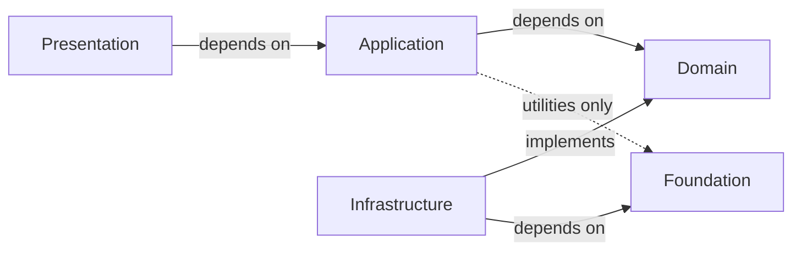

# Layered Architecture

> This document is the definitive specification of the architectural layers of Omnia.
>
> It is normative. Future implementation MUST conform to this document.
>
> It defines layer responsibilities, ownership, dependency rules, communication, boundaries, package strategy, and architectural constraints.
>
> It intentionally avoids implementation details.

## Executive Summary

Omnia uses a strict layered architecture to keep business logic independent of the user interface, the AI providers, and the platform. The system is divided into five layers: Presentation, Application, Domain, Infrastructure, and Foundation. Dependencies always point inward through the allowed dependency edges.

This document is the normative refinement of the architecture. ADR-0001 establishes the architectural style and the responsibility of each layer. ADR-0002 establishes the dependency direction rule. SYSTEM_OVERVIEW describes the system as a whole. This document specifies each layer in detail — what belongs in it, what must never enter it, how it communicates, and what it owns — so an engineer knows exactly where new code belongs. Where this document is more specific than its sources, it refines them; it never contradicts them.

## Architectural Goals

The layered architecture is chosen to achieve:

- **Maintainability** — clear ownership makes each change local and reviewable.
- **Provider Independence** — one stable contract isolates every AI provider.
- **Scalability** — new providers, platforms, and capabilities attach at defined boundaries without redesign.
- **Replaceability** — each layer can be replaced without touching the layers above it.
- **Testability** — business logic is independent of the UI, the network, and the platform.
- **Modularity** — module boundaries follow layer boundaries, limiting blast radius.
- **Long-Term Evolution** — the structure stays coherent over the next five years.
- **Deterministic Behavior** — the same input and conditions produce the same output.

## Layer Overview

The complete stack, from outermost to innermost:



### Presentation

- Purpose: the user interface.
- Ownership: the UI and nothing else.
- Primary Responsibilities: render state, translate user intent, manage navigation.
- Architectural Constraints: contains no business logic; never performs networking.

### Application

- Purpose: orchestration of user flows.
- Ownership: use cases and workflow coordination.
- Primary Responsibilities: translate intent into domain operations, sequence work, define transaction boundaries.
- Architectural Constraints: depends on Domain, never on Infrastructure.

### Domain

- Purpose: the core business rules and provider-agnostic contracts.
- Ownership: business rules, entities, and contracts.
- Primary Responsibilities: define entities, value objects, domain services, repository protocols, and policies.
- Architectural Constraints: platform-independent; imports no UI, networking, or persistence.

### Infrastructure

- Purpose: implementation of the Domain contracts.
- Ownership: provider adapters, persistence, networking, keychain, and platform services.
- Primary Responsibilities: implement the abstractions the Domain declares.
- Architectural Constraints: implements Domain contracts; never owns business rules.

### Foundation

- Purpose: domain-agnostic primitives.
- Ownership: reusable building blocks with no product meaning.
- Primary Responsibilities: provide utilities, configuration, and logging primitives.
- Architectural Constraints: contains no business, feature, or provider logic.

## Layer Specifications

Each layer is specified precisely so an engineer knows where new code belongs.

### Presentation Layer

- **Purpose**: the user interface. It renders state and translates user intent into application operations.
- **Responsibilities**: render screens and views; observe and present state from the Application layer; translate user actions into use-case invocations; manage navigation and presentation-only concerns such as layout, animation, accessibility, and localization.
- **Contains**: views, screens, navigation containers, and presentation state objects.
- **Must NOT contain**: business logic, networking, persistence access, provider code, or domain operations.
- **Allowed Dependencies**: Application; Foundation for shared utilities only, when justified.
- **Forbidden Dependencies**: Infrastructure; Domain.
- **Communication Model**: communicates with Application through use cases and consumes ready-to-render state. It never performs work.
- **Examples of Typical Components**: chat screen, settings screen, navigation containers.
- **Review Notes**: check for business rules in views, direct network calls, direct storage access, and references to providers.

### Application Layer

- **Purpose**: orchestration. It knows what to do, not how to do it.
- **Responsibilities**: define use cases; coordinate use cases and cross-entity flows through application services; orchestrate workflows; define transaction boundaries; validate input before domain operations.
- **Contains**: use cases, application services, workflow coordinators, and validators.
- **Must NOT contain**: business rules that belong to the Domain, concrete infrastructure implementations, or UI.
- **Allowed Dependencies**: Domain; Foundation for shared utilities only, when justified.
- **Forbidden Dependencies**: Presentation; Infrastructure.
- **Communication Model**: depends on Domain contracts; concrete implementations are supplied by the Composition Root through dependency injection.
- **Examples of Typical Components**: send message use case, conversation management service.
- **Review Notes**: check for duplicated business rules, direct infrastructure dependencies, and upward references.

### Domain Layer

- **Purpose**: the core of the system. It contains business rules and provider-agnostic contracts.
- **Responsibilities**: define entities, value objects, domain services, repository protocols, policies, and business rules.
- **Contains**: entities, value objects, domain services, repository protocols, and policies.
- **Must NOT contain**: Apple UI frameworks, networking, persistence, provider implementations, or platform APIs.
- **Allowed Dependencies**: none below it. The Domain defines contracts; it does not depend on the layers that implement them.
- **Forbidden Dependencies**: SwiftUI or any UI framework; networking; persistence; provider implementations; Foundation is permitted only where it has no platform coupling.
- **Communication Model**: exposes protocols and contracts; consumers depend on these abstractions, never on concrete implementations.
- **Examples of Typical Components**: conversation entity, message value object, provider contract, conversation repository protocol.
- **Review Notes**: verify the layer imports no UI, network, or persistence framework, and that every contract is platform-agnostic.

### Infrastructure Layer

- **Purpose**: implementation of the Domain contracts. It is where platform and provider reality lives.
- **Responsibilities**: implement repositories, provider adapters, persistence, networking, keychain access, file system access, and serialization; provide concrete implementations of the abstractions the Domain declares.
- **Contains**: concrete implementations of Domain protocols, provider adapters, network clients, keychain services, and serializers.
- **Must NOT contain**: business rules, user interface, or presentation state.
- **Allowed Dependencies**: Domain (implementing its contracts); Foundation.
- **Forbidden Dependencies**: Presentation; Application; any upward reference.
- **Communication Model**: implements Domain contracts; instances are bound to consumers by the Composition Root.
- **Examples of Typical Components**: repository implementation, provider adapter, keychain service.
- **Review Notes**: verify every implementation satisfies a Domain protocol, contains no business logic, and references no views.

### Foundation Layer

- **Purpose**: reusable, domain-agnostic building blocks shared by the layers.
- **Responsibilities**: provide reusable primitives, configuration, logging, pure utilities, and shared abstractions.
- **Contains**: pure utilities, logging and configuration primitives, and domain-agnostic abstractions.
- **Must NOT contain**: business logic, feature logic, provider logic, or product decisions.
- **Allowed Dependencies**: none internal. The Foundation is the bottom of the dependency graph.
- **Forbidden Dependencies**: Domain, Application, Presentation, and Infrastructure; any business, feature, or provider logic.
- **Communication Model**: consumed by the other layers as pure primitives; it never depends upward.
- **Examples of Typical Components**: logging primitive, configuration storage, pure utility functions.
- **Review Notes**: verify nothing product-specific enters the layer and that every element justifies its place; it is not a storage for code with no home.

## Dependency Rules

The dependency rules are normative and apply to every module.

### Allowed Dependency Graph

- Presentation → Application
- Application → Domain
- Infrastructure → Domain (implements Domain contracts)
- Infrastructure → Foundation
- Application → Foundation (shared utilities only, when justified)


### Forbidden Dependency Graph

- Any dependency that points upward.
- Any skip-level dependency: Presentation bypassing Application, Application bypassing Domain.
- Domain → Infrastructure, Domain → Foundation, Domain → Presentation.
- Presentation → Infrastructure, Presentation → Domain, Presentation → Foundation.
- Infrastructure → Presentation, Infrastructure → Application.
- Providers → Views.

```mermaid
flowchart LR
    Domain["Domain"] -.x SwiftUI["SwiftUI / UI"]
    Domain -.x SQLite["Persistence"]
    Domain -.x URLSession["Networking"]
    Presentation["Presentation"] -.x Infrastructure["Infrastructure"]
    Infrastructure -.x Presentation
```

### Dependency Inversion

High-level modules define the abstractions they consume; low-level modules implement them. The Domain declares repository and provider contracts; the Infrastructure implements them. This inversion keeps the dependency arrow pointing inward while the outer layers satisfy the inner layers' needs.

### Composition Root

The Composition Root is the single place where concrete implementations are bound to abstractions. It is the only place that knows the full dependency graph. It lives at the edge of the application, never inside the layers, so no layer references a concrete implementation of another layer.

### Protocol Boundaries

Layer boundaries are expressed as protocols. A caller depends on the protocol; the implementation is supplied at composition time. This is what makes each layer replaceable and testable in isolation.

### Dependency Ownership

Every dependency has an owner. The dependency graph is not implicit: each dependency is declared, justified, and recorded. A dependency without a documented owner is a specification violation.

## Cross-Layer Communication

Layers communicate through stable, explicit mechanisms. Implementation details are not part of this specification; the mechanisms are.

- **Protocols** — the primary mechanism. A layer depends on a protocol; an implementation is provided at the boundary.
- **Dependency Injection** — implementations are injected where a consumer depends on an abstraction.
- **Commands** — explicit requests to perform an operation.
- **Queries** — explicit requests for information.
- **Events** — notification of facts, delivered without coupling the emitter to the listener.
- **Responses** — typed results of an operation, including explicit failures.

Hidden dependencies are forbidden. No layer reaches across another layer, and no layer acquires its dependencies by lookup.

## Architectural Boundaries

Architectural ownership is fixed. Each layer owns its concern and nothing else.

### Presentation

- What it owns: the user interface and presentation state.
- What it never owns: business rules, data, networking, providers.
- How ownership transfers: user intent is handed to the Application layer as use-case invocations.

### Application

- What it owns: use cases, orchestration, and transaction boundaries.
- What it never owns: business rules, concrete infrastructure, UI.
- How ownership transfers: orchestrated operations are handed to the Domain as domain operations; results are returned upward as responses.

### Domain

- What it owns: business rules, entities, and contracts.
- What it never owns: UI, networking, persistence, providers.
- How ownership transfers: contracts are declared for Infrastructure to implement; business results are returned through application services.

### Infrastructure

- What it owns: implementations of the Domain contracts and platform services.
- What it never owns: business rules, UI.
- How ownership transfers: implementations are bound to abstractions by the Composition Root and consumed by the upper layers through those abstractions.

### Foundation

- What it owns: domain-agnostic primitives.
- What it never owns: product or feature behavior.
- How ownership transfers: primitives are consumed directly by any layer that is allowed to depend on Foundation.

## Swift Package Strategy

The system is composed of packages aligned with the layers. Package names are conceptual; the repository decides how the boundaries are expressed in the build system. This document does not define physical folder structures.

- **OmniaFoundation** — domain-agnostic primitives, utilities, configuration, and logging.
- **OmniaInfrastructure** — provider adapters, persistence, networking, keychain, and platform services.
- **OmniaDomain** — business rules, entities, and provider-agnostic contracts; no platform dependencies.
- **OmniaApplication** — use cases and orchestration.
- **OmniaPresentation** — the user interface for each platform.
- **OmniaApp** — the application shell and Composition Root.

A package does not span layers. A package depends only on the packages of the layers it is allowed to depend on.

## Architectural Constraints

These constraints are mandatory. Every future module must obey them.

- Business logic exists only in the Domain and Application layers.
- Networking never reaches the Presentation layer.
- Providers never know the Views.
- Foundation contains no feature logic.
- Infrastructure implements abstractions; it never defines the contracts it implements.
- Every dependency must have a documented owner.
- Dependencies point inward; allowed dependencies are Presentation → Application, Application → Domain, Infrastructure → Domain (implements Domain contracts) and Infrastructure → Foundation, and Application → Foundation (shared utilities only, when justified).
- The Composition Root is the only place where abstractions are bound to implementations.

A module that cannot satisfy these constraints is not designed for this architecture. A change that requires a different structure is proposed as an ADR; it is never implemented as an exception.

## Quality Attributes

The layered architecture is the mechanism by which the quality attributes are achieved.

- **Maintainability** — clear layer ownership makes each change local and reviewable.
- **Security** — secrets and data access are confined to Infrastructure; the Domain and Presentation never handle credentials directly.
- **Performance** — streaming and rendering concerns stay in their owning layers; work is scheduled where it belongs.
- **Reliability** — failures are explicit and typed; layer boundaries keep error handling consistent.
- **Accessibility** — presentation-level concern, enforced in the layer that owns the interface.
- **Provider Independence** — one contract in the Domain is implemented by every provider in Infrastructure.
- **Replaceability** — every layer depends on abstractions, so any layer can be replaced without touching its consumers.
- **Extensibility** — new providers and capabilities attach at defined boundaries without redesign.
- **Predictability** — deterministic domain behavior and explicit, typed failures keep behavior attributable to external conditions, never hidden state.
- **Testability** — the Domain is independent of UI, network, and platform, and dependencies are injected across boundaries.

## Architecture Fitness Functions

Architectural fitness functions are automated checks that verify the architecture stays intact as the codebase grows. They are future enforcement mechanisms; today the rules in this document are verified during code review.

Planned fitness functions:

- No SwiftUI imports inside Domain.
- No URLSession inside Presentation.
- Infrastructure implements the repository protocols declared in Domain.
- Layer violations fail CI.
- Every new dependency requires justification.

Each fitness function will be recorded in an ADR before it is enforced.

## Evolution Strategy

The architecture evolves through extension, not modification.

- New capabilities attach at defined extension points.
- Existing layer boundaries are preserved.
- Breaking architectural changes require an ADR.
- Package boundaries remain stable.

A change that cannot be expressed within this architecture is proposed as an ADR. It is never implemented as an exception.

## Relationship to Other Documents

This document refines, without contradicting, the decisions recorded elsewhere.

- **SYSTEM_OVERVIEW** — this document details the layers the System Overview summarizes.
- **ADR-0001** — this document specifies the responsibility of every layer the ADR establishes.
- **ADR-0002** — this document operationalizes the dependency direction rule.
- **PRODUCT_PRINCIPLES** — this document is the architectural expression of the principles, in particular Provider Independence and Long-Term Thinking.
- **AI_CONSTITUTION** — this document is governed by the constitution's architecture rules: strict layering and downward dependency direction.

Where a future ADR changes a rule stated here, the ADR wins for that rule and this document is updated.

## Related Documents

- `Documentation/Architecture/01_SYSTEM_OVERVIEW.md`
- `Documentation/Architecture/03_MODULE_MODEL.md`
- `Documentation/Architecture/04_AI_PROVIDER_ARCHITECTURE.md`
- `Documentation/Architecture/05_LOCAL_STORAGE_ARCHITECTURE.md`
- `Documentation/Architecture/06_DEPENDENCY_INJECTION.md`
- `Documentation/Architecture/ADR/ADR-0001-architectural-style.md`
- `Documentation/Architecture/ADR/ADR-0002-dependency-direction.md`
- `Documentation/Product/PRODUCT_CHARTER.md`
- `Documentation/Product/PRODUCT_PRINCIPLES.md`
- `.ai/AI_CONSTITUTION.md`
