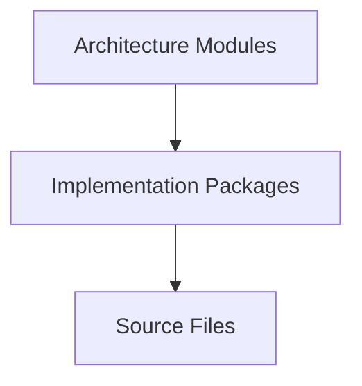

# Architectural Building Blocks

> This document is the common architectural vocabulary of Omnia.
>
> It is normative. Every engineer and every AI agent MUST use this terminology when designing or implementing Omnia.
>
> Future documents and implementation MUST conform to these definitions.

## Executive Summary

Architectural terminology matters because names carry meaning. When two engineers use different words for the same element, the architecture drifts in practice: code that is called a service behaves like an engine, boundaries blur, and ownership becomes unclear. A consistent vocabulary prevents architectural drift by giving every element a fixed definition, so reviews and implementation decisions start from the same understanding. This document defines the architectural building blocks of Omnia, how they differ, how they interact, and how new elements are introduced.

## Architectural Philosophy

Omnia uses explicit architectural building blocks because naming is part of the design. A fixed set of named elements makes the architecture legible and enforceable.

The goals are:

- **Consistency** — the same term always means the same element.
- **Ownership** — every element has a defined owner.
- **Replaceability** — elements are consumed through interfaces and can be replaced.
- **Scalability** — new behavior is expressed with existing elements before new ones are invented.
- **Long-Term Maintainability** — definitions remain stable over years of development.

## Architectural Building Blocks

Each building block is defined by purpose, responsibilities, ownership, interactions, and when it should be introduced.

### Module

- Purpose: the architectural unit of ownership; a named, cohesive part of the system.
- Responsibilities: own one concern, expose a stable interface, evolve independently.
- What it owns: the behavior that fulfills its responsibility and the interface through which it is consumed.
- What it must never own: another module's responsibility.
- Typical interactions: consumed by other modules through its interface; communicates through protocols and services.
- When it should be introduced: when a concern is large enough to need its own boundary and owner.
- When it should NOT be introduced: for small units that fit inside an existing module without blurring its responsibility.

### Layer

- Purpose: the horizontal grouping of modules by architectural position.
- Responsibilities: enforce dependency direction and group behavior by abstraction level.
- What it owns: the rules of its position in the dependency graph.
- What it must never own: business behavior that belongs to a specific layer.
- Typical interactions: modules within a layer depend on the layer directly below it.
- When it should be introduced: at the system level, defined once in the layered architecture.
- When it should NOT be introduced: as a new layer to justify a single module.

### Service

- Purpose: an element that performs a unit of work on behalf of a consumer.
- Responsibilities: execute an operation, coordinate dependencies, return a result.
- What it owns: the operation it provides.
- What it must never own: business rules that belong to the domain.
- Typical interactions: invoked by consumers; depends on protocols and other services.
- When it should be introduced: when an operation is used by more than one consumer.
- When it should NOT be introduced: for a single-use operation that lives inside its caller.

### Engine

- Purpose: an element that manages a continuous or stateful capability.
- Responsibilities: own a lifecycle, coordinate state, expose operations over time.
- What it owns: the state and lifecycle of its capability.
- What it must never own: the user interface.
- Typical interactions: driven by the Application layer; emits events; returns responses.
- When it should be introduced: when behavior is long-running, stateful, or event-driven.
- When it should NOT be introduced: for stateless operations that are better expressed as services.

### Repository

- Purpose: an element that provides access to stored data through an abstraction.
- Responsibilities: retrieve and persist data, hide the storage implementation.
- What it owns: the data-access contract for its aggregate.
- What it must never own: business rules.
- Typical interactions: implemented in Infrastructure; consumed through a protocol.
- When it should be introduced: when a stored aggregate needs a defined access point.
- When it should NOT be introduced: when direct storage access already satisfies the need.

### Adapter

- Purpose: an element that translates one interface into another.
- Responsibilities: adapt an external or internal interface to the contract the system expects.
- What it owns: the translation between two interfaces.
- What it must never own: business rules or user interface.
- Typical interactions: sits at a boundary; consumes an external interface and provides a contract.
- When it should be introduced: when an external or legacy interface must conform to a contract.
- When it should NOT be introduced: when the interface already conforms to the contract.

### Provider

- Purpose: an implementation of an external capability behind a stable contract.
- Responsibilities: implement a contract for a concrete external service.
- What it owns: the implementation of the contract for one external service.
- What it must never own: the contract itself or the user interface.
- Typical interactions: consumed through the contract; never referenced directly.
- When it should be introduced: when a new interchangeable external capability is added.
- When it should NOT be introduced: when the capability is not interchangeable.

### Policy

- Purpose: a decision rule that governs behavior.
- Responsibilities: express a business or architectural rule as a decision.
- What it owns: the rule it encodes.
- What it must never own: the mechanics of applying the rule.
- Typical interactions: consulted by services and use cases; depends on no external state.
- When it should be introduced: when a decision rule is reused or expected to change.
- When it should NOT be introduced: for a rule that is only meaningful inside one operation.

### Coordinator

- Purpose: an element that sequences work across other elements.
- Responsibilities: orchestrate a workflow, define ordering, manage failures.
- What it owns: the sequence and the workflow state.
- What it must never own: the operations it coordinates.
- Typical interactions: invokes services and engines; returns a combined result.
- When it should be introduced: when a workflow spans several elements and ordering matters.
- When it should NOT be introduced: for a single operation that needs no sequencing.

### Value Object

- Purpose: an immutable value defined by its properties.
- Responsibilities: hold a value, support comparison by content.
- What it owns: its value.
- What it must never own: identity or mutable state.
- Typical interactions: passed between elements as data.
- When it should be introduced: when equality by content is meaningful.
- When it should NOT be introduced: when an entity's identity is the meaningful property.

### Entity

- Purpose: an object with identity that persists over time.
- Responsibilities: hold state, maintain identity, enforce its own invariants.
- What it owns: its identity and lifecycle.
- What it must never own: infrastructure concerns.
- Typical interactions: persisted through repositories; changed through domain operations.
- When it should be introduced: when identity and continuity matter.
- When it should NOT be introduced: for data that is a value, not an identity.

### Interface (Protocol)

- Purpose: a contract that declares behavior without implementation.
- Responsibilities: define the operations a consumer can invoke.
- What it owns: the contract.
- What it must never own: implementation.
- Typical interactions: implemented by one or more concrete elements.
- When it should be introduced: at every boundary where an implementation must be replaceable.
- When it should NOT be introduced: for a type that has a single implementation and no boundary.

### Configuration

- Purpose: user-owned settings that influence behavior.
- Responsibilities: hold and expose configuration without embedding product decisions.
- What it owns: the configuration values and their defaults.
- What it must never own: business logic.
- Typical interactions: read by the layers that need configuration.
- When it should be introduced: when a behavior must be adjustable.
- When it should NOT be introduced: when a sensible default removes the need.

### Utility

- Purpose: a pure, stateless helper.
- Responsibilities: provide a reusable function or transformation.
- What it owns: the function it provides.
- What it must never own: state or product behavior.
- Typical interactions: called directly by any element allowed to depend on it.
- When it should be introduced: when pure logic is reused in more than one place.
- When it should NOT be introduced: when the logic belongs to a domain concept.

### Boundary

- Purpose: the edge of an architectural element.
- Responsibilities: separate an element from its environment and define its contract.
- What it owns: the contract at the edge.
- What it must never own: behavior on either side of the edge.
- Typical interactions: protocols and adapters sit on boundaries.
- When it should be introduced: when an element must be independently testable or replaceable.
- When it should NOT be introduced: where no isolation is needed.

### Extension Point

- Purpose: a defined place where the system is designed to grow.
- Responsibilities: declare how new behavior attaches without modifying existing behavior.
- What it owns: the seam and its contract.
- What it must never own: the extensions themselves.
- Typical interactions: new modules and providers attach at extension points.
- When it should be introduced: when a capability is known to vary or grow.
- When it should NOT be introduced: when the growth is hypothetical, not planned.

## Module Model

A module is the architectural unit of ownership defined in this vocabulary.

- **Responsibilities** — one responsibility, defined by the module's purpose.
- **Ownership** — one owner is accountable for the module.
- **Interfaces** — the module is consumed only through its public interface.
- **Evolution** — the module evolves within its stable interface; breaking a contract is replacement.
- **Boundaries** — internals are private; dependencies are declared and documented.

## Module Categories

Modules are classified by the kind of concern they own:

- **Core Modules** — foundational behavior of the product. They change slowly and are depended on widely.
- **Feature Modules** — product capabilities delivered to the user.
- **Infrastructure Modules** — implementations of platform and provider services.
- **Integration Modules** — adapters that connect the system to external services.
- **Support Modules** — shared, domain-agnostic assistance used across modules.

Classification is descriptive, not restrictive.

## Module Communication

Approved communication:

- **Protocols** — the primary mechanism. Elements are consumed through the protocols they expose.
- **Dependency Injection** — implementations are provided to consumers, never acquired.
- **Application Services** — orchestrated operations that cross module boundaries.
- **Events** — notification of facts, where the emitter and listener should stay decoupled.
- **Explicit Interfaces** — every interaction is declared in the public interface.

Forbidden communication:

- **Hidden dependencies** — acquired implicitly, never declared.
- **Global state** — shared mutable state without an owner.
- **Cross-layer shortcuts** — reaching across a layer boundary to bypass the layer between.

## Architectural Naming Guidelines

Names must be precise. The suffix of a name states the nature of the element:

- **Engine** — use for stateful, lifecycle-managed capabilities.
- **Service** — use for operations performed on behalf of consumers.
- **Manager** — avoid; prefer a name that states the operation or the owned resource.
- **Coordinator** — use for elements that sequence work across other elements.
- **Adapter** — use for elements that translate one interface into another.
- **Repository** — use for elements that provide data access through an abstraction.
- **Policy** — use for decision rules.
- **Factory** — use for elements that construct other elements.
- **Builder** — avoid; prefer construction through a factory or a value type.

Avoid ambiguous terminology. A name must not leave the reader guessing whether the element is stateful or stateless, or whether it owns a resource. When a term is ambiguous, the element is named for what it actually does.

## Architectural Constraints

These constraints are mandatory:

- **No cyclic dependencies** — elements never depend on each other in a cycle.
- **Every module has one owner** — ownership is never shared.
- **Every interface has one responsibility** — a contract does not accumulate unrelated operations.
- **Every dependency has a documented direction** — the dependency graph is explicit.
- **Hidden communication is forbidden** — all interaction is declared.

A violation is fixed, never accommodated.

## Relationship to Swift Packages

Architecture and implementation are distinct levels:

- **Architecture Modules** — the units of ownership and responsibility defined in this document.
- **Implementation Packages** — the units of build organization.
- **Source Files** — the units of code.

Packages implement architecture; they do not define it. A module may become one package, several small modules may share one package, and a package must never contain unrelated modules. The architecture is defined by modules; packages realize them.

## Quality Attributes

This architectural model improves:

- **Maintainability** — consistent vocabulary makes the system legible and reviewable.
- **Replaceability** — elements are consumed through interfaces and can be replaced.
- **Scalability** — new behavior is expressed with existing building blocks.
- **Predictability** — the same term always implies the same behavior.
- **Testability** — elements with defined boundaries are testable in isolation.
- **Documentation** — a fixed vocabulary makes documentation precise and consistent.

## Evolution Strategy

New architectural concepts are introduced deliberately. Introducing a new building block requires:

- **Architectural justification** — the existing building blocks cannot express the concept.
- **Documentation** — the new block is defined in this document before it is used.
- **Architecture Review** — the addition is reviewed against the vocabulary.
- **Potential ADR** — a significant new concept is recorded as an ADR.

A new building block is never introduced informally. If an existing block expresses the concept, the existing block is used.

## Related Documents

- `Documentation/Architecture/01_SYSTEM_OVERVIEW.md`
- `Documentation/Architecture/02_LAYERED_ARCHITECTURE.md`
- `Documentation/Architecture/ADR/ADR-0001-architectural-style.md`
- `Documentation/Architecture/ADR/ADR-0002-dependency-direction.md`
- `Documentation/Product/PRODUCT_CHARTER.md`
- `Documentation/Product/PRODUCT_PRINCIPLES.md`
