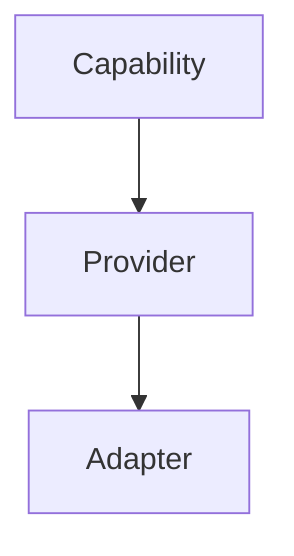
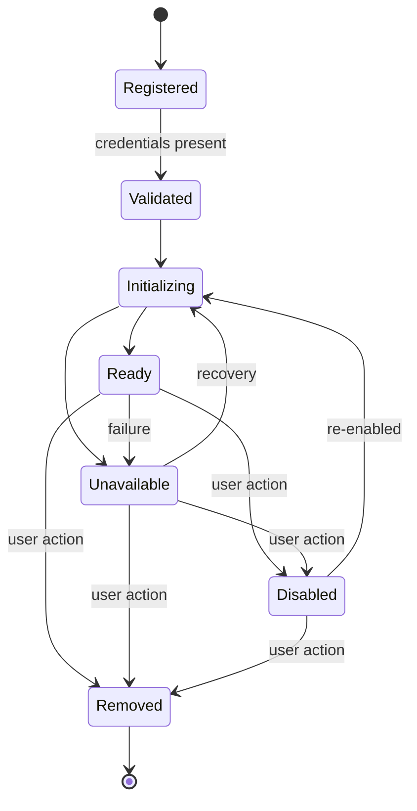
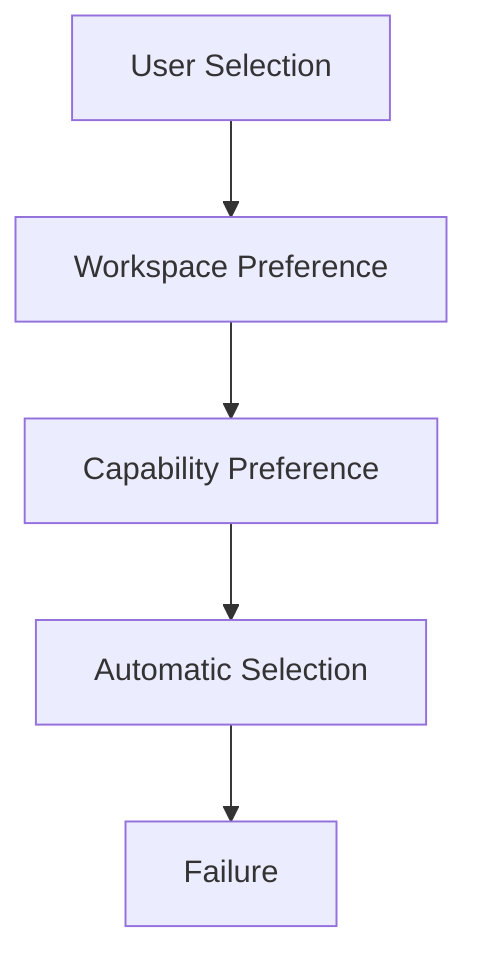

# AI Provider Architecture

> This document defines the architectural model for integrating AI providers into Omnia.
>
> It defines the architecture, not the implementation.
>
> It is normative. Implementation MUST conform to the model described here.

## Executive Summary

Omnia is a client for AI providers. Its value is that the interface is stable while the provider is interchangeable. The provider architecture makes that interchangeability possible: it defines how Omnia interacts with AI providers so that adding, replacing, or removing a provider never requires redesigning the application.

Provider independence is a core architectural requirement, not a feature. It is the product's reason to exist. Without it, Omnia is one more client locked to one ecosystem. With it, the application stays stable while the ecosystem beneath it changes.

The architecture is anchored in one principle: the application depends on capabilities, never on providers. This document is consistent with the product principles defined in `Documentation/Product/PRODUCT_PRINCIPLES.md` and with the dependency direction established in `ADR-0002`.

## Architectural Philosophy

Omnia is not an AI provider.

Omnia orchestrates AI providers.

Providers are replaceable.

Capabilities are stable.

Providers are interchangeable.

The architecture evolves by adding providers, not by changing the application.

These statements are the foundation of the provider architecture. Every section that follows exists to make them true. The application never depends on a specific provider; it depends on what a provider can do. A provider is one way to deliver a capability, never the definition of it.

## Architectural Model

The provider architecture rests on three core concepts:

- **Capability** — what the application needs. Capabilities are stable and provider-agnostic.
- **Provider** — what the user has connected. A provider is an external service that can deliver capabilities.
- **Adapter** — how a provider is connected. An adapter translates between Omnia abstractions and a provider's own interface.

Each concept has a distinct role. The capability is the contract; the provider is the source; the adapter is the translation. The capability is decided by the application, the provider is chosen by the user, and the adapter is owned by the implementation.

## Capability Model

Capabilities represent what the application needs, independent of any provider.

Capabilities include:

- **Text Generation** — producing text from a prompt.
- **Conversation** — multi-turn interaction with context.
- **Streaming** — incremental delivery of generated content.
- **Vision** — understanding images as input.
- **Image Generation** — producing images from a prompt.
- **Embeddings** — representing content as vectors.
- **Tool Calling** — invoking tools on behalf of the model.
- **Structured Output** — output conforming to a defined structure.
- **Audio** — speech input and output.
- **Reasoning** — extended inference before response.

Each capability is defined by:

- **Purpose** — what the capability is for.
- **Responsibilities** — what the capability must deliver.
- **Constraints** — the boundaries within which it operates.
- **Relationship to providers** — how providers deliver it, never how they define it.

Capabilities must remain provider-agnostic. A capability is expressed in Omnia's own terms. Providers may differ in quality, latency, or fidelity of delivery; the capability contract does not change.

## Provider Model

A Provider is an external service that the user has connected to Omnia. A provider is defined by:

- **Identity** — a stable identifier within the application.
- **Capabilities** — the set of capabilities the provider can deliver.
- **Configuration** — the settings that govern how it is used.
- **Authentication** — the credentials that authorize access.
- **Availability** — whether the provider can be reached and used.
- **Metadata** — descriptive information about the provider.
- **Limits** — constraints on usage, such as rates and maximums.
- **Versioning** — the provider's interface version.

Providers expose capabilities but never define them. A provider declares which capabilities it can deliver; the definition of those capabilities lives in the Capability Model. The application does not learn what a provider is; it learns what a provider can do.

## Adapter Model

The Adapter pattern connects the provider model to the capability model.

An adapter translates between Omnia abstractions and a provider-specific interface. The rest of the application speaks only in capabilities; the adapter speaks the provider's language. Everything that is provider-specific is confined to the adapter.

Adapters are responsible for:

- Exposing a provider's capabilities in Omnia's terms.
- Translating requests and responses across the boundary.
- Reporting capability availability accurately.
- Surfacing failures in terms Omnia understands.

Adapters must never own:

- Business logic.
- Application state.
- The user interface.
- The definition of a capability.

An adapter is the boundary where the provider world meets the Omnia world. Everything on the Omnia side of that boundary is provider-agnostic.

## Provider Lifecycle

Every provider passes through a defined lifecycle:

- **Registration** — the provider is known to the application.
- **Validation** — the provider's configuration is verified.
- **Initialization** — the provider is prepared for use.
- **Ready** — the provider is available for capabilities.
- **Unavailable** — the provider cannot be used at this moment.
- **Disabled** — the user has turned the provider off.
- **Removed** — the provider no longer exists in the application.

The lifecycle gives the architecture a single, explicit path for every provider. State transitions are the only way a provider changes its status.

## Capability Discovery

Omnia determines which capabilities are available through discovery.

Discovery answers one question: what can this provider do? The answer comes from provider metadata, declared at registration and refined at initialization. The application never probes capabilities empirically; it asks the provider and trusts the declared metadata.

Dynamic capability registration allows the set of available capabilities to change over time without changing the application. A provider may gain or lose capabilities as its own interface evolves. Omnia reflects that change through discovery rather than through hard-coded expectations.

## Provider Selection Strategy

When the application needs a capability, a provider is selected. Selection follows a priority order:

- **User Selection** — the user explicitly chose a provider. It is honored first.
- **Workspace Preference** — the current workspace defines a preferred provider.
- **Capability Preference** — when no provider is preferred, a provider that best delivers the required capability is chosen.
- **Automatic Selection** — the application selects a suitable available provider.
- **Failure** — when no provider can deliver the capability, the application reports this clearly instead of degrading silently.

Every step is explicit. The user's choice always wins; when the user has not chosen, the application follows documented preferences before falling back to automatic selection.

## Failure Philosophy

Failures are expected. The architecture defines how each one behaves.

For every failure case, the following are defined: user experience, data preservation, recovery, and expected architecture behavior.

### Provider Unavailable

The provider cannot be reached. The user is informed that the provider is unavailable; the attempt is preserved and retryable.

### Authentication Failure

The provider rejected the credentials. The user is informed that re-authentication is required; no data is lost.

### Rate Limit Exceeded

The provider refuses due to usage limits. The request is preserved; retry behavior is governed by the provider's stated limits.

### Streaming Interrupted

A stream ends before completion. The partial content already received is preserved; the user can decide to continue or abandon.

### Network Failure

The network connection fails mid-operation. The operation state is preserved and can be resumed when the network connection returns.

### Provider Removed

A provider is removed while it was in use. In-flight work is handled gracefully and the user is informed.

Every case follows two principles:

- **No data loss** — user content is preserved before, during, and after any failure.
- **Graceful degradation** — a failure of one provider never breaks the application.

## Authentication Model

Authentication is owned architecturally.

Providers own authentication. The provider defines how identity is verified; the adapter implements that requirement.

Omnia owns credential storage. Credentials remain local to the device and under the user's control. Omnia never holds, routes, or shares credentials.

The division is strict: the provider decides how access is authorized; the application decides how credentials are stored. Neither side crosses the other's boundary.

## Provider Configuration

Provider configuration has four levels:

- **Provider settings** — settings intrinsic to the provider connection.
- **Workspace overrides** — provider settings adjusted for a specific workspace.
- **Global defaults** — fallback values applied when nothing else is set.
- **Capability preferences** — per-capability preferences for how a provider is used.

Ownership follows the levels: the provider owns its intrinsic settings, the workspace owns its overrides, and the user owns the defaults. Configuration is always explicit about which level is in effect.

## Future Provider Types

The architecture must accommodate provider types that do not exist today.

Examples of provider types:

- **Cloud LLM** — a hosted language model service.
- **Local LLM** — a model running on the user's own hardware.
- **Vision Provider** — a service specialized for image understanding.
- **Speech Provider** — a service specialized for speech.
- **Embedding Provider** — a service specialized for embeddings.
- **Image Provider** — a service specialized for image generation.
- **Workflow Provider** — a service that orchestrates multi-step workflows.
- **Knowledge Provider** — a service that provides access to knowledge bases.

The architecture accommodates future provider types through the capability model. A new type of provider is a new provider that delivers capabilities; it is not a new architectural concept. As long as a capability expresses what the application needs, any future provider can be integrated without changing the architecture.

## Architectural Constraints

The following constraints are mandatory:

- **Capabilities never depend on providers.**
- **Providers never know the UI.**
- **Adapters contain no business logic.**
- **Provider APIs never leak into the Domain layer.**
- **Provider implementations remain replaceable.**

Each constraint protects one boundary of the provider architecture. Violating a constraint reintroduces the coupling the architecture exists to prevent.

## Relationship to Layers

The provider architecture maps onto the layered architecture as follows:

- **Presentation** — consumes capabilities; never mentions providers.
- **Application** — orchestrates capabilities and coordinates selection.
- **Domain** — owns the capability and provider models.
- **Infrastructure** — implements adapters and credential storage.
- **Foundation** — provides shared, provider-agnostic support.

The layers hold distinct responsibilities. The Domain defines what the application needs. The Infrastructure connects what the user has. Nothing above Infrastructure ever depends on a specific provider.

## Quality Attributes

The provider architecture supports:

- **Provider Independence** — the application depends on capabilities, never on providers.
- **Maintainability** — provider-specific code is confined to adapters.
- **Replaceability** — any provider can be replaced by another delivering the same capability.
- **Extensibility** — new providers are added without changing the application.
- **Security** — credentials stay local and under user control.
- **Predictability** — selection and failure behavior are defined and explicit.
- **Testability** — capabilities are tested against contracts, not against specific providers.
- **Reliability** — failures degrade gracefully without data loss.

## Evolution Strategy

New providers are introduced by adding to the architecture, never by changing it.

Adding a provider should require:

- **No changes to Presentation** — the interface already speaks capabilities.
- **No changes to Domain** — the capability and provider models already exist.
- **Minimal Infrastructure work** — shared infrastructure is reused.
- **Possible Adapter implementation only** — the new provider needs a translation layer.

This is the intended cost of integration. The architecture concentrates the work of adding a provider in exactly one place — the adapter — so that the rest of the application remains untouched and the product principle of provider independence holds.

## Relationship to Other Documents

This document refines the architectural decisions established elsewhere:

- **`01_SYSTEM_OVERVIEW`** — this document details the provider dimension of the system overview.
- **`02_LAYERED_ARCHITECTURE`** — this document assigns provider responsibilities to layers.
- **`03_MODULE_MODEL`** — this document applies the building-block vocabulary to providers and adapters.
- **`ADR-0001`** — this document is consistent with the chosen architectural style.
- **`ADR-0002`** — this document respects the established dependency direction.
- **`PRODUCT_PRINCIPLES`** — this document turns the product principles into an architecture.

## Related Documents

- `Documentation/Architecture/01_SYSTEM_OVERVIEW.md`
- `Documentation/Architecture/02_LAYERED_ARCHITECTURE.md`
- `Documentation/Architecture/03_MODULE_MODEL.md`
- `Documentation/Architecture/05_LOCAL_STORAGE_ARCHITECTURE.md`
- `Documentation/Architecture/06_DEPENDENCY_INJECTION.md`
- `Documentation/Architecture/ADR/ADR-0001-architectural-style.md`
- `Documentation/Architecture/ADR/ADR-0002-dependency-direction.md`
- `Documentation/Product/PRODUCT_CHARTER.md`
- `Documentation/Product/PRODUCT_PRINCIPLES.md`
