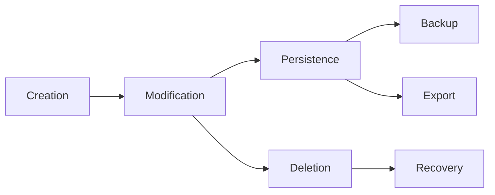

# Local Storage Architecture

> This document specifies how Omnia owns, stores, protects, and evolves user data.
>
> It defines the architecture, not the implementation.
>
> It is normative. Implementation MUST conform to the model described here.

## Executive Summary

Local storage is how Omnia honors its central promise: the user owns the data. Every conversation, message, prompt, connection, and preference lives on the device, under the user's control, and remains removable by the user.

Local-first architecture is fundamental, not incidental. It is the mechanism that makes privacy, offline operation, and provider independence possible at once. If data were remote, Omnia would need servers, an account system, and a proxy — all of which the product explicitly rejects. Local storage removes that dependency by construction: the application works without any infrastructure other than the provider the user chose to reach.

The architecture is anchored in one principle: the user owns the data; Omnia owns the storage; providers own neither.

## Storage Philosophy

Storage follows the product principles of Omnia, defined in `Documentation/Product/PRODUCT_PRINCIPLES.md`. The principles most relevant to storage are **User Ownership** and **Privacy First**:

- **User Ownership** — the user's data is the user's property. Storage exists to serve it, never to capture it.
- **Privacy First** — data remains on-device by default. Storage is designed so that nothing leaks by accident.

Storage adds engineering principles of its own, distinct from the product principles:

- **Offline First** — the application must function without a network connection. Local storage makes that possible.
- **Local First** — the device is the primary home of all user data.
- **Predictability** — storage behavior is defined and explicit, never surprising.
- **Replaceability** — no storage decision is so entrenched that the application cannot change it.

Storage belongs to Omnia because Omnia is the application the user trusts with their data. Omnia is accountable for protecting, preserving, and returning that data on demand. Providers own none of it: a provider sees only what the user sends it in a single request.

## Storage Model

The storage model describes conceptual categories of data. Categories express what data is and who owns it, not how it is stored.

- **Workspace** — the unit of organization. Owned by the user.
- **Conversation** — a recorded interaction. Owned by the user.
- **Message** — an individual contribution to a conversation. Owned by the user.
- **Attachment** — content attached to a message. Owned by the user.
- **Prompt** — reusable user-authored content. Owned by the user.
- **Provider Configuration** — connection settings for a provider. Owned by the user.
- **Credential Reference** — a pointer to credentials held in secure storage. Owned by the user; guarded by Omnia.
- **Preferences** — user choices about how the application behaves. Owned by the user.
- **Indexes** — derived structures that make data findable. Derived from user data; managed by Omnia.
- **Temporary Data** — in-progress work that has no permanent value. Managed by Omnia.
- **Cache** — copies that improve performance. Managed by Omnia; always regenerable.

The pattern is consistent: the user owns the content; Omnia manages the mechanics. Derived and temporary categories are Omnia's to manage because they hold no user value of their own.

## Data Ownership

Ownership is explicit for every byte of stored data.

**What belongs to the user:**

- Conversations and messages.
- Attachments and prompts.
- Provider configuration and credentials.
- Preferences and workspace organization.

**What belongs to Omnia:**

- The application's own state.
- Indexes and caches.
- Temporary and derived data.

**What belongs to providers:**

- Nothing stored by Omnia. A provider receives only what the user sends in a request and retains it under its own policy, not Omnia's.

Architectural boundaries follow ownership. User data is protected as user property: exportable, removable, and never held hostage. Omnia data is managed as application concerns: regenerable and disposable. Provider data does not exist inside Omnia's storage at all.

## Storage Lifecycle

Every piece of user data passes through a defined lifecycle:

- **Creation** — data enters the system.
- **Modification** — data changes over time.
- **Persistence** — data is durably retained.
- **Backup** — data is protected against loss.
- **Export** — data leaves the system in a usable form.
- **Deletion** — data is removed at the user's request.
- **Recovery** — deleted or lost data is restored.

Each stage is explicit. The user can always move data from creation to export; the user can always move data from creation to deletion. Omnia never silently removes user data and never makes it irrecoverable without the user's intent.

## Data Classification

Data is classified by the consequence of losing it.

- **Critical** — unrecoverable user content. Losing it is unacceptable. Treated with maximum protection.
- **Persistent** — user data that must survive restarts and last for the life of the product. Stored durably.
- **Temporary** — in-progress data with limited value. Safe to lose.
- **Cached** — regenerable copies that improve performance. Always replaceable.
- **Sensitive** — credentials and private content. Treated with isolation and protection.
- **Configuration** — settings that shape behavior. Durable but low-cost to restore.

The architecture treats each category according to its classification. The more a category means to the user, the more protection it receives. The less a category matters, the freer Omnia is to manage it as an implementation detail.

## Security Model

Security is designed into the storage model.

- **Credential separation** — credentials are never stored alongside the data they protect.
- **Sensitive data isolation** — private content is isolated from application data.
- **Encryption boundaries** — sensitive data is protected at rest; the boundary of that protection is defined, not incidental.
- **Local-only ownership** — protected data never leaves the device except under the user's explicit action.

The security model is architectural, not technical. It defines which data is protected, how it is isolated, and who can release it. The mechanism by which protection is achieved is an implementation concern.

## Storage Boundaries

Storage must never contain what belongs elsewhere.

Storage must never contain:

- **Provider logic** — how a provider works is not data.
- **Business rules** — how the application decides is not data.
- **Presentation state** — what the interface is showing is not user data.
- **Temporary network state** — the state of a single network connection is not storage.

Storage holds facts, not behavior. When a fact begins to dictate behavior, it has crossed the boundary into logic and must be re-homed.

## Offline Behavior

Offline behavior is a requirement, not a fallback.

- **Workspace** — fully available offline; the user's organization is local.
- **Conversation history** — fully available offline; past interactions are on-device.
- **Provider unavailable** — the application continues to work; only provider-dependent operations are blocked, and attempts are preserved.
- **Application restart** — user data survives; the application returns to its prior state.

The architectural expectation is consistent: the device is the source of truth. Being offline must never take the user's own data away.

## Future Synchronization

Synchronization is an extension, never a replacement.

- Local storage remains the source of truth.
- Synchronization never becomes the owner of data.

If synchronization is added, it serves the device, not the reverse. Sync copies data between the device and another location under the user's control; it never makes the device depend on that location. Removing a sync target leaves the user's data intact and local.

## Relationship to Layers

Storage responsibilities map onto the layers as follows:

- **Presentation** — renders stored data; never owns it.
- **Application** — orchestrates storage operations and preserves user intent.
- **Domain** — defines the data model and its ownership rules.
- **Infrastructure** — implements persistence, protection, and recovery.
- **Foundation** — provides shared, storage-agnostic primitives.

The layers hold distinct responsibilities. The Domain decides what data is and who owns it. The Infrastructure decides how data is persisted and protected. Nothing above Infrastructure depends on a specific storage technology.

## Quality Attributes

The storage architecture supports:

- **Privacy** — data stays on-device by default.
- **Reliability** — user data survives failures and restarts.
- **Recoverability** — lost data can be restored.
- **Maintainability** — storage behavior is defined and reviewable.
- **Replaceability** — storage technology can change without changing the data model.
- **Performance** — the application remains responsive with local data.
- **Offline operation** — the application works without a network connection.

## Architectural Constraints

The following constraints are mandatory:

- **Storage never owns business logic.**
- **Storage never depends on providers.**
- **Storage remains provider-independent.**
- **User data remains exportable.**
- **Credentials are isolated.**

Each constraint protects the ownership boundary. A violation converts storage from a faithful steward of user data into an owner of the data itself.

## Evolution Strategy

Storage evolves without changing its commitments.

- **New storage technologies** — adopted as implementation changes; the data model and ownership rules stay stable.
- **Future cloud sync** — added as an extension; local storage remains the source of truth.
- **New data types** — introduced through the data model and classification, never through ad-hoc persistence.
- **Migration** — every change to the data model migrates existing data without loss.
- **Versioning** — stored data is versioned so that older data remains readable.

Evolution is safe because the architecture separates what data is from how it is stored. Omnia can change the mechanics of storage freely; the user's ownership never changes.

## Relationship to Other Documents

This document refines and complements the established architecture:

- **`01_SYSTEM_OVERVIEW`** — this document details the data dimension of the system overview.
- **`02_LAYERED_ARCHITECTURE`** — this document assigns storage responsibilities to layers.
- **`03_MODULE_MODEL`** — this document applies the building-block vocabulary to storage.
- **`04_AI_PROVIDER_ARCHITECTURE`** — this document defines what data a provider sees; this document defines where all other data lives.
- **`ADR-0001`** — this document is consistent with the chosen architectural style.
- **`ADR-0002`** — this document respects the established dependency direction.
- **`PRODUCT_PRINCIPLES`** — this document turns the product principles into a storage architecture.

## Related Documents

- `Documentation/Architecture/01_SYSTEM_OVERVIEW.md`
- `Documentation/Architecture/02_LAYERED_ARCHITECTURE.md`
- `Documentation/Architecture/03_MODULE_MODEL.md`
- `Documentation/Architecture/04_AI_PROVIDER_ARCHITECTURE.md`
- `Documentation/Architecture/06_DEPENDENCY_INJECTION.md`
- `Documentation/Architecture/ADR/ADR-0001-architectural-style.md`
- `Documentation/Architecture/ADR/ADR-0002-dependency-direction.md`
- `Documentation/Product/PRODUCT_CHARTER.md`
- `Documentation/Product/PRODUCT_PRINCIPLES.md`
