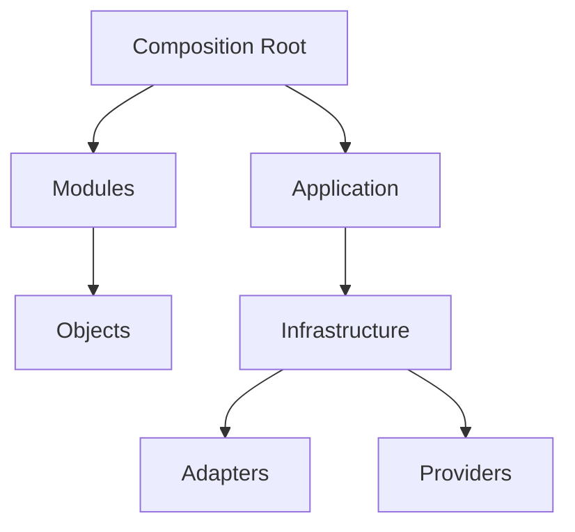

# Dependency Injection Architecture

> This document defines the dependency injection architecture of Omnia.
>
> It defines architectural dependency management. It does NOT define a DI framework. It does NOT define implementation.
>
> It is normative. Implementation MUST conform to the model described here.

## Executive Summary

Dependency injection is how Omnia keeps its architecture honest. Every object declares what it needs, receives it from the outside, and never reaches into the world to acquire it. This single rule is what makes the layers stay ordered, the modules stay replaceable, and the tests stay meaningful.

Dependency injection exists for one reason: to keep dependencies explicit. When dependencies are explicit, ownership is clear, boundaries are enforceable, and every part of the system can be constructed and verified in isolation. Without it, dependencies become hidden, boundaries blur, and the architecture described in the layered documents stops being true in code.

The relationship to the layered architecture is direct. The layers define what may depend on what. Dependency injection is the mechanism that enforces that direction at construction time.

## Composition Philosophy

Dependency injection rests on a small set of principles.

- **Explicit dependencies** — every dependency is declared by the object that needs it.
- **No hidden dependencies** — nothing is acquired implicitly from the environment.
- **Constructor injection preferred** — a dependency is delivered at construction, so an object is complete from the moment it exists.
- **Dependency ownership** — every dependency has one owner, which is the Composition Root, not the consumer.
- **Composition Root** — construction is centralized in one architectural place.

These principles exist because each one prevents a specific failure. Explicit dependencies prevent hidden coupling. No hidden dependencies prevent surprises at runtime. Constructor injection prevents partially constructed objects. Dependency ownership prevents responsibility drift. The Composition Root prevents construction from scattering through the codebase.

## Composition Root

The Composition Root is the single architectural place where dependencies are composed.

Composition occurs conceptually at the Composition Root: the point where the application starts and where the object graph is assembled. Construction belongs there because it is the only place that has enough knowledge to assemble the whole graph.

Construction must not leak into business objects. A business object that constructs its dependencies stops being a consumer and becomes a coordinator. It then carries knowledge about the rest of the system, which is precisely the coupling the architecture exists to prevent.

## Dependency Ownership

Ownership of construction is distributed by responsibility.

- **Application owns composition** — the Composition Root assembles the graph.
- **Modules own internal objects** — each module constructs its own internals.
- **Domain owns no infrastructure** — the domain receives what it needs, never builds it.
- **Infrastructure owns implementations** — infrastructure provides the concrete objects behind abstractions.
- **Presentation owns presentation objects** — the interface constructs the objects it needs to render.

The rule is consistent: whoever owns a kind of object constructs that kind of object. Nobody constructs what they merely consume.

## Lifetime Model

Dependencies have conceptual lifetimes. Lifetime describes who shares an instance and how long it lives, not how it is implemented.

- **Application** — lives for the life of the application. Shared application-wide.
- **Workspace** — lives for the life of a workspace. Shared within that workspace.
- **Session** — lives for the life of a session. Shared within that session.
- **Conversation** — lives for the life of a conversation. Shared within that conversation.
- **Transient** — created per use; no sharing.

Ownership follows lifetime. The owner of a lifetime is accountable for creating and releasing the objects that live within it. A longer-lived object must not depend on a shorter-lived one, because that would hold the short-lived object beyond its lifetime.

## Injection Strategies

Dependencies are delivered through a small set of strategies. Each has a role; each is chosen by what is being delivered.

- **Constructor Injection** — the dependency is required and provided at construction. Used when an object cannot function without it.
- **Factory Injection** — the object receives a way to create something, rather than the thing itself. Used when the consumer must create many instances or decide when to create.
- **Protocol Injection** — the dependency is delivered through its contract, so the consumer sees only the abstraction. Used at every boundary where an implementation must be replaceable.
- **Configuration Injection** — the object receives the settings it needs. Used when an object needs configuration, rather than a service.

Each strategy exists to keep a dependency explicit. Whatever is delivered, the delivery is always visible to the consumer and never acquired from the environment.

## Forbidden Patterns

The following patterns are forbidden.

- **Service Locator** — objects asking a registry for dependencies. It hides dependencies and makes the graph invisible.
- **Global Singleton Abuse** — singletons shared beyond their natural lifetime. It creates hidden shared state.
- **Hidden Dependencies** — anything acquired implicitly rather than declared.
- **Static Global Services** — services reached without being delivered. It bypasses the Composition Root entirely.
- **Runtime Construction in Domain** — the domain building its own dependencies during execution.
- **Business Objects Creating Providers** — a business object constructing a provider or an adapter.

Each pattern is forbidden for the same reason: it reintroduces the hidden coupling that dependency injection exists to eliminate.

## Module Composition

Modules are composed through their boundaries, never through their internals.

Each module declares the dependencies it needs as contracts. The Composition Root satisfies those contracts with implementations from other modules. A module never references another module's internals, and it never constructs another module's objects.

Dependency direction follows the layers. A module may receive dependencies from modules below it or beside it, never from modules above it. The Composition Root is the only place where the full set of modules is seen together.

## Testability

Dependency injection is what makes the architecture testable.

- **Mock Providers** — a provider is replaced with a controllable implementation.
- **Mock Storage** — storage is replaced with an in-memory implementation.
- **Test Composition** — a test composes its own graph with test doubles.
- **Replaceable implementations** — any boundary can be satisfied with a test implementation.

The architectural consequence is that every part of the system can be verified in isolation. Because dependencies are delivered, a test delivers what it wants. The same boundary that enables replacing a real provider with another provider enables replacing it with a test double.

## Architectural Constraints

The following constraints are mandatory:

- **Dependencies are explicit.**
- **No layer creates higher layers.**
- **Domain knows only abstractions.**
- **Construction remains centralized.**

Each constraint protects the dependency graph. A violation is a seam where hidden coupling enters the system, and it is fixed rather than accommodated.

## Relationship to Layers

Dependency ownership is assigned per layer.

- **Presentation** — receives the application services it renders; owns presentation objects.
- **Application** — receives domain and infrastructure dependencies; orchestrates.
- **Domain** — receives nothing it does not declare; knows only abstractions.
- **Infrastructure** — provides implementations behind abstractions.
- **Foundation** — provides shared primitives, free of composition.

The Composition Root sits at the application's edge. It is the one place with knowledge of all layers, and the one place allowed to assemble them.

## Future Evolution

The dependency architecture supports future growth without change.

- **Plugins** — new features delivered through declared contracts and composed at the root.
- **New Providers** — new provider implementations delivered through the provider contract.
- **New Modules** — new modules declare dependencies and are composed like existing ones.
- **Future Sync** — synchronization is delivered as a dependency, never reached for.
- **Future Services** — any future service is added through an abstraction and delivered explicitly.

Evolution is supported because the architecture never hard-codes what exists today. Anything new is delivered through the same mechanism: a declared contract, satisfied at the Composition Root.

## Relationship to Other Documents

This document refines and complements the established architecture:

- **`01_SYSTEM_OVERVIEW`** — this document details the composition dimension of the system.
- **`02_LAYERED_ARCHITECTURE`** — this document enforces the layered dependency direction at construction.
- **`03_MODULE_MODEL`** — this document defines how modules receive their dependencies.
- **`04_AI_PROVIDER_ARCHITECTURE`** — this document delivers providers to the application through composition.
- **`05_LOCAL_STORAGE_ARCHITECTURE`** — this document delivers storage to the application through composition.
- **`ADR-0001`** — this document is consistent with the chosen architectural style.
- **`ADR-0002`** — this document is consistent with the established dependency direction.

## Related Documents

- `Documentation/Architecture/01_SYSTEM_OVERVIEW.md`
- `Documentation/Architecture/02_LAYERED_ARCHITECTURE.md`
- `Documentation/Architecture/03_MODULE_MODEL.md`
- `Documentation/Architecture/04_AI_PROVIDER_ARCHITECTURE.md`
- `Documentation/Architecture/05_LOCAL_STORAGE_ARCHITECTURE.md`
- `Documentation/Architecture/ADR/ADR-0001-architectural-style.md`
- `Documentation/Architecture/ADR/ADR-0002-dependency-direction.md`
- `Documentation/Product/PRODUCT_CHARTER.md`
- `Documentation/Product/PRODUCT_PRINCIPLES.md`
