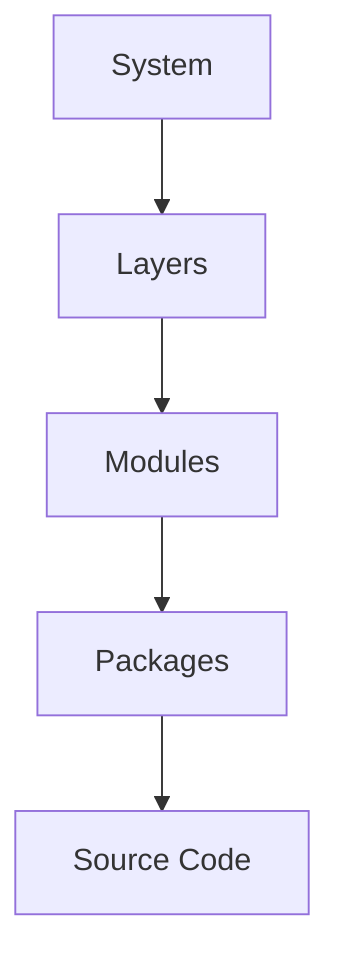
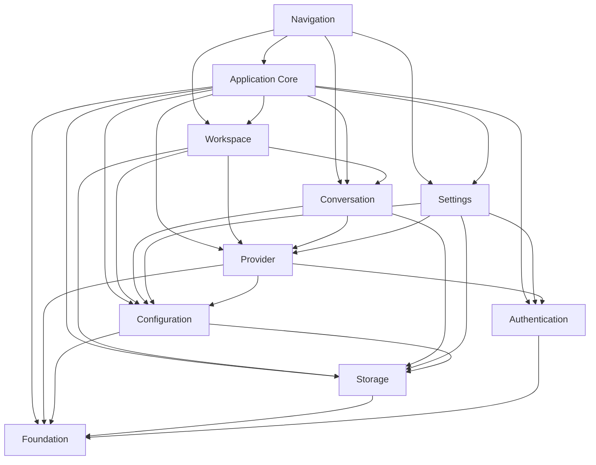
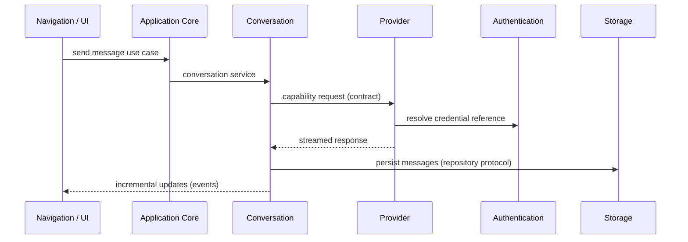
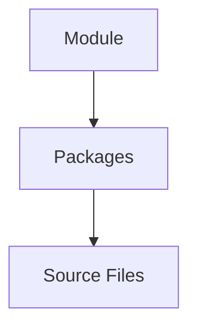

# Module Structure

> This document is the normative specification of the modular architecture of Omnia.
>
> It defines module boundaries, ownership, interactions, mapping to implementation, and evolution rules. It does NOT define package names, folder structures, or package manifests.
>
> It is normative. Implementation MUST conform to the module model described here.

## Executive Summary

Modules are the primary implementation units of Omnia. The layers define what may depend on what; modules define what exists and who owns it. When an engineer implements Omnia, the first question is not which layer a piece of code belongs to — it is which module owns it. The layers remain the constraint; the module is the home.

The structure of Omnia has five levels:

- **System** — Omnia as a whole: the product, its invariants, and its boundaries. Defined in the System Overview and the product documents.
- **Layers** — the horizontal architectural positions: Presentation, Application, Domain, Infrastructure, and Foundation. Layers define the allowed dependency edges (ARC-002, ADR-0001).
- **Modules** — the units of ownership and responsibility, and the primary implementation units. A module owns one concern, exposes a stable public interface, and occupies a defined position within the layers. Defined in this document.
- **Packages** — the units of build organization that implement modules. Packages are an implementation concern and are defined in future documents, never here.
- **Source Code** — the files that realize packages.

A module is not a package, and a package is not a module. The module is the architectural unit; the package is the implementation unit. A module may span layers, but only through the allowed dependency edges: each surface of a module lives in exactly one layer, and no module surface ever jumps a layer boundary.

This document bridges the Architecture Foundation and implementation. It applies the vocabulary of ARC-003, the layers of ARC-002, the provider architecture of ARC-004, the storage architecture of ARC-005, and the composition rules of ARC-006 to a concrete, finite set of modules that implementation can be organized around.

## Module Architecture Principles

The principles govern how every module is designed. Each principle states what it requires and why it exists.

### Explicit Ownership

Statement: Every module has exactly one owner who is accountable for it.

Why it exists: shared ownership is no ownership. An element without an owner is an element no one maintains.

Practical implication: ownership is recorded at the module level. The owner is accountable for the module's contracts, its evolution, and its compliance with the architecture.

### Stable Public Interfaces

Statement: A module is consumed only through its public interface, and that interface changes only through a deliberate process.

Why it exists: consumers depend on contracts. An unstable contract breaks every consumer silently and spreads change across the system.

Practical implication: public interfaces are treated as contracts. Changing a contract is replacement, never revision (ARC-003).

### Internal Encapsulation

Statement: A module's internals are private; nothing outside the module may reach into them.

Why it exists: encapsulation is what makes a module replaceable and testable. An exposed internal is a dependency the module does not control.

Practical implication: all interaction with a module passes through its public interface. Hidden communication and direct internals access are forbidden.

### No Cyclic Dependencies

Statement: The module dependency graph is acyclic.

Why it exists: a cycle means two modules own parts of each other. Cycles make evolution, testing, and reasoning impossible in isolation.

Practical implication: when a cycle appears, it is a specification violation and is fixed, never accommodated. A cycle is resolved by moving the shared contract to a lower module or by introducing an intermediate contract.

### Replaceability

Statement: Every module can be replaced by another that honors the same contract.

Why it exists: replaceability is what keeps a long-lived codebase changeable. A module that cannot be replaced is a module the project cannot change.

Practical implication: dependencies are expressed against protocols; implementations are bound at the Composition Root (ARC-006).

### Testability

Statement: Every module can be verified in isolation.

Why it exists: a module that cannot be tested alone cannot be changed safely. Testability is what makes the dependency rules enforceable.

Practical implication: module boundaries are seams. Each module delivers its dependencies and can be composed with test doubles (ARC-006).

### Provider Independence

Statement: No module depends on a specific provider.

Why it exists: provider independence is the reason Omnia exists (PRODUCT_PRINCIPLES). It is a module-level rule, not a feature.

Practical implication: providers are consumed through the capability contract; provider-specific code never leaves the Infrastructure surface of the Provider module (ARC-004).

## Module Boundaries

A module is a bounded unit. Its boundary separates what it owns from what it does not, and it defines the only surface through which the module is consumed.

### What a Module Owns

A module owns:

- its responsibility — the concern it exists to serve;
- the behavior that fulfills that responsibility;
- the public interface through which it is consumed;
- its state and the rules that govern it;
- its internals — nothing outside the module may depend on them.

A module owns nothing it merely consumes. A module that uses a dependency does not own the dependency's behavior.

### What a Module Exposes

A module exposes:

- its public interface — the contracts through which it is consumed;
- the events it emits — facts about its own state, delivered without coupling the emitter to the listener;
- the configuration it owns — user-owned values with sensible defaults.

The public interface is the complete and only surface of the module.

### What Remains Private

The following remain private to a module:

- implementation details — concrete types, persistence layout, provider-specific code, and presentation internals;
- the dependencies it uses — dependencies are never re-exposed;
- its construction — concrete implementations are bound at the Composition Root (ARC-006).

### How Modules Evolve

- Within the boundary: internals change freely as long as the public interface is stable.
- At the boundary: a public interface changes only through the replacement process.
- Never: a boundary is crossed by reaching into another module's internals.

The evolution rules are specified in the Module Evolution section.

### Boundary Invariants

The following invariants hold for every module boundary:

- The public interface is the only surface.
- The dependency graph is acyclic.
- No surface crosses a layer boundary.
- Every dependency is declared and documented.
- Every module has exactly one owner.

A boundary that violates an invariant is fixed, never accommodated.

## Module Catalog

The module catalog is the complete set of architectural modules of Omnia. Every element of the system belongs to exactly one module. A module that appears here is defined by this document; a module that does not appear here does not exist architecturally.

Categories follow ARC-003: Core, Feature, Infrastructure, Integration, and Support. Classification is descriptive, not restrictive.

| Module | Category | Primary Surfaces | Owns |
|---|---|---|---|
| Application Core | Core | Application | composition, orchestration, application state |
| Workspace | Feature | Domain, Application, Presentation | workspace structure, workspace preferences |
| Conversation | Core | Domain, Application, Presentation | conversations, messages, streaming state |
| Provider | Core | Domain, Infrastructure | capabilities, provider contracts, adapters |
| Storage | Core | Domain, Infrastructure | data model, repositories, persistence |
| Settings | Feature | Application, Presentation | connection settings, preferences |
| Configuration | Support | Domain, Infrastructure | configuration values, defaults, levels |
| Authentication | Support | Domain, Infrastructure | credentials, credential references |
| Navigation | Feature | Presentation | navigation structure, presentation state |
| Foundation | Support | Foundation | domain-agnostic primitives |

### Application Core

- **Category**: Core Module.
- **Layer Position**: Application, including the application edge.
- **Purpose**: assemble and start the application; own composition, application-level orchestration, and the application lifecycle.
- **Responsibilities**: host the Composition Root, the only place where abstractions are bound to implementations (ARC-006); own the application entry point and lifecycle; orchestrate cross-module workflows through application services; define transaction boundaries; own application and session state.
- **Owned Concepts**: composition, application lifecycle, session, entry point, cross-module orchestration.
- **Public Interface**: the application entry; application services; the composition contract.
- **Dependencies**: every other module, through its public interface; Foundation for shared utilities only.
- **Collaborators**: every module. Application Core is the only module that sees the whole system (ARC-006).
- **Architectural Constraints**: composition happens only here; contains no business rules; never references a concrete implementation outside composition; never touches the UI.

### Workspace

- **Category**: Feature Module.
- **Layer Position**: Domain, Application, Presentation.
- **Purpose**: organize the user's work across conversations and providers (ARC-001).
- **Responsibilities**: create, list, select, rename, and delete workspaces; manage workspace membership of conversations and providers; apply workspace preferences and provider overrides (ARC-004); drive conversation and provider selection; provide the entry point for creating and selecting conversations (ARC-001).
- **Owned Concepts**: workspace aggregates, workspace organization, workspace preferences and overrides.
- **Public Interface**: workspace repository protocol (Domain surface); workspace services (Application surface); workspace presentation surface.
- **Dependencies**: Conversation, Provider, and Storage through their contracts; Configuration.
- **Collaborators**: Conversation, Provider, Storage, Settings, Navigation, Application Core.
- **Architectural Constraints**: workspaces are user-owned data (ARC-005); the presentation surface contains no business logic; the module is testable without a platform.

### Conversation

- **Category**: Core Module.
- **Layer Position**: Domain, Application, Presentation.
- **Purpose**: manage conversations and message history; orchestrate request and streaming response flows (ARC-001 Conversation Engine).
- **Responsibilities**: create, list, and select conversations; manage messages and message history; run request, streaming, and completion flows; handle interruption and partial responses; persist conversation state through the storage contract.
- **Owned Concepts**: conversation aggregates, message value objects, streaming state, request-response flows.
- **Public Interface**: conversation services (Application surface); message events (delivered to the presentation surface); conversation presentation surface.
- **Dependencies**: Provider through the capability contract; Storage through its repository protocols; Configuration.
- **Collaborators**: Workspace, Provider, Storage, Application Core, Navigation.
- **Architectural Constraints**: testable without a network; never blocks the interface during streaming (ARC-001); messages are user-owned data (ARC-005).

### Provider

- **Category**: Core Module.
- **Layer Position**: Domain, Infrastructure.
- **Purpose**: provide a single, stable interface to interchangeable AI providers (ARC-001 Provider Engine; ARC-004).
- **Responsibilities**: define the provider-agnostic capability contract; own the provider model; select provider and model through the selection strategy; implement adapters for concrete providers; report capability availability; support streaming.
- **Owned Concepts**: capabilities, provider model, adapters, selection strategy, provider lifecycle.
- **Public Interface**: capability contract (Domain surface); provider contract; provider selection services.
- **Dependencies**: Authentication through the credential contract; Configuration; Foundation.
- **Collaborators**: Conversation, Workspace, Settings, Application Core.
- **Architectural Constraints**: capabilities never depend on providers; adapters contain no business logic; provider APIs never leak above Infrastructure (ARC-004); adding a provider requires no UI redesign (PRODUCT_PRINCIPLES).

### Storage

- **Category**: Core Module.
- **Layer Position**: Domain, Infrastructure.
- **Purpose**: persist user data on-device and enforce data ownership (ARC-001 Storage Engine; ARC-005).
- **Responsibilities**: define the data model and ownership rules; declare repository protocols for stored aggregates; implement persistence, migration, indexes, caches, and temporary data; isolate credentials from application data; keep data on-device.
- **Owned Concepts**: data model, repository protocols, ownership rules, data classification, persistence, migration.
- **Public Interface**: repository protocols (Domain surface); storage services (Application surface).
- **Dependencies**: Foundation.
- **Collaborators**: Conversation, Workspace, Settings, Configuration, Application Core.
- **Architectural Constraints**: data remains on-device; never depends on Omnia-owned infrastructure; storage never owns business logic; user data stays exportable and removable (ARC-005).

### Settings

- **Category**: Feature Module.
- **Layer Position**: Application, Presentation.
- **Purpose**: manage user configuration of connections and application preferences (ARC-001 Settings).
- **Responsibilities**: configure provider connections — endpoint, model, and credentials; manage application preferences; expose settings use cases and presentation surface; persist settings through the storage contract.
- **Owned Concepts**: connection settings, application preferences, the settings presentation surface.
- **Public Interface**: settings services (Application surface); connection configuration contract; settings presentation surface.
- **Dependencies**: Configuration; Provider and Authentication through their contracts; Storage.
- **Collaborators**: Configuration, Provider, Authentication, Storage, Navigation, Application Core.
- **Architectural Constraints**: configuration belongs to the user; credentials are stored securely and separately from application data (ARC-001, ARC-005).

### Configuration

- **Category**: Support Module.
- **Layer Position**: Domain, Infrastructure.
- **Purpose**: own user-owned configuration values, their defaults, and their levels (ARC-001 cross-cutting Configuration; ARC-003 Configuration).
- **Responsibilities**: hold configuration values and sensible defaults; expose typed configuration access; enforce the configuration levels — provider settings, workspace overrides, global defaults, and capability preferences (ARC-004); persist configuration through the storage contract.
- **Owned Concepts**: configuration model, defaults, configuration levels, configuration storage contract.
- **Public Interface**: typed configuration protocol.
- **Dependencies**: Storage; Foundation.
- **Collaborators**: Provider, Workspace, Settings, Application Core, and every module that consumes configuration.
- **Architectural Constraints**: configuration is user-owned; contains no business logic; sensible defaults reduce the need for configuration (PRODUCT_PRINCIPLES).

### Authentication

- **Category**: Support Module.
- **Layer Position**: Domain, Infrastructure.
- **Purpose**: own credential storage and credential access; protect secrets (ARC-001 Security; ARC-004 Authentication Model; ARC-005).
- **Responsibilities**: store credentials securely and separately; provide credential references to consumers; control access to user data; prevent secrets from entering logs or analytics (ARC-001).
- **Owned Concepts**: credentials, credential references, credential storage, access control.
- **Public Interface**: credential storage protocol (Domain surface); credential reference type.
- **Dependencies**: Foundation; the platform's secure storage through the Infrastructure surface.
- **Collaborators**: Provider (adapters), Settings, Storage, Application Core.
- **Architectural Constraints**: credentials never leave the device (ARC-001, ARC-004, ARC-005); providers own authentication but never credential storage (ARC-004); secrets never enter logs.

### Navigation

- **Category**: Feature Module.
- **Layer Position**: Presentation.
- **Purpose**: own the navigation structure and presentation flow (ARC-002 Presentation).
- **Responsibilities**: define the screen flow; navigate between workspaces, conversations, settings, and provider configuration; manage presentation state; handle platform navigation conventions.
- **Owned Concepts**: navigation structure, presentation state, routes.
- **Public Interface**: navigation flow contract; navigation presentation surface.
- **Dependencies**: Application Core through application services; Foundation for shared utilities only.
- **Collaborators**: Workspace, Conversation, and Settings through their presentation surfaces; Application Core.
- **Architectural Constraints**: contains no business logic; must feel native on every platform (ARC-001, PRODUCT_PRINCIPLES).

### Foundation

- **Category**: Support Module.
- **Layer Position**: Foundation.
- **Purpose**: provide domain-agnostic primitives shared by all modules (ARC-002 Foundation).
- **Responsibilities**: provide pure utilities, logging primitives, configuration primitives, and shared abstractions.
- **Owned Concepts**: utilities, logging, primitives, shared abstractions.
- **Public Interface**: the primitive APIs.
- **Dependencies**: none internal. Foundation is the bottom of the dependency graph (ARC-002).
- **Collaborators**: every module allowed to depend on it.
- **Architectural Constraints**: contains no business, feature, or provider logic (ARC-002); nothing product-specific enters the module.

## Module Interaction Model

Modules collaborate only through approved mechanisms, and only across allowed edges. A module's public interface is the only surface through which it is consumed.

### Allowed Communication

- **Protocols** — the primary mechanism. A module is consumed through the protocols it exposes; implementations are supplied at the Composition Root (ARC-003, ARC-006).
- **Dependency Injection** — dependencies are delivered to consumers, never acquired (ARC-006).
- **Application Services** — orchestrated operations that cross module boundaries (ARC-003).
- **Events** — notification of facts, delivered without coupling the emitter to the listener (ARC-003).
- **Explicit Interfaces** — every interaction is declared; commands, queries, and typed responses (ARC-002).

### Forbidden Communication

- **Hidden dependencies** — anything acquired implicitly rather than declared.
- **Global state** — shared mutable state without an owner.
- **Cross-layer shortcuts** — a module surface reaching across a layer boundary to bypass the layer between (ARC-002, ARC-003).
- **Direct internals access** — reaching into another module's internals instead of its public interface.
- **Provider-specific leakage** — provider code reaching the presentation surface. Providers never know the views (ARC-004).

### Dependency Direction

Arrows point from consumer to dependency. All edges are consistent with the allowed dependency edges of ARC-002. Application Core depends on every module because it is the Composition Root; that is the deliberate exception to fan-in (ARC-006). Navigation's edges to Workspace, Conversation, and Settings are within the Presentation layer, between presentation surfaces.

The module dependency graph is normative:

The graph contains no cycle. A cycle is a specification violation.

### Event Flow

Events deliver facts without coupling the emitter to the listener. The Conversation module is the primary event emitter: it announces incremental streaming updates, completion, and interruption. Navigation and the presentation surfaces listen. No emitter knows its listeners, and no listener polls for facts it should receive.

The send-message flow shows the allowed communication pattern:

Every interaction in the flow is explicit and declared. No module acquires a dependency, no module reaches across a layer, and no module touches another module's internals.

## Ownership Model

Ownership is assigned once, at the module level, and never shared.

### Data

The user owns the content; Omnia owns the mechanics; providers own nothing stored by Omnia (ARC-005).

- **The user owns** conversations, messages, workspaces, prompts, attachments, provider configuration, credentials, and preferences. These are the user's property: exportable, removable, never held hostage.
- **Modules own the mechanics.** Storage owns persistence and derived structures — indexes, caches, and temporary data. Conversation owns conversation aggregates. Workspace owns workspace aggregates. Authentication owns credentials and credential references.
- **Providers own nothing stored by Omnia.** A provider sees only what the user sends in a single request (ARC-005).

### State

Every module owns its state; no state is global. A module's state is private to it and governed by its own rules. No module reads or writes another module's state; it interacts through the public interface.

### Configuration

- **The user owns the configuration values.** Configuration is user-owned and stored locally (ARC-001).
- **Configuration** owns the model, the defaults, and the levels: provider settings, workspace overrides, global defaults, and capability preferences (ARC-004).
- **Settings** owns the surface through which the user manages configuration.
- **No module embeds product decisions in its configuration.** Sensible defaults reduce the need for configuration (PRODUCT_PRINCIPLES).

### Workflows

- **Application Core** owns cross-module orchestration and transaction boundaries.
- **Conversation** owns the request, streaming, and completion workflow.
- **Provider** owns provider selection and the provider lifecycle (ARC-004).
- **Storage** owns persistence, migration, and recovery flows.
- **Authentication** owns the credential lifecycle: storage, reference, and re-authentication.
- **Navigation** owns the user flow between screens.

A workflow is owned by exactly one module. A workflow that crosses modules is orchestrated by Application Core.

### Lifetimes

State is scoped by the lifetime model of ARC-006:

- **Application** — lives for the life of the application; owned by Application Core.
- **Workspace** — lives for the life of a workspace; owned by Workspace.
- **Session** — lives for the life of a session; owned by Application Core.
- **Conversation** — lives for the life of a conversation; owned by Conversation.
- **Transient** — created per use; owned by the creating module.

A longer-lived module must never depend on a shorter-lived one (ARC-006).

## Module Evolution

Modules evolve through extension, not modification. Every change to the module structure requires architecture review, and a significant change is recorded as an ADR.

### Adding Modules

A new module is added only when a concern is large enough to need its own boundary and owner (ARC-003). Adding a module requires:

- **Architectural justification** — the existing modules cannot express the concern (ARC-003).
- **Documentation** — the module is defined in this document before it is used.
- **Architecture review** — the addition is reviewed against the vocabulary and the dependency graph.
- **Potential ADR** — a significant new module is recorded as an ADR.

New behavior attaches at the extension points of ARC-001. A new provider attaches inside the Provider module; a new capability extends the Provider contract; plugins attach at a new extension point.

### Splitting Modules

A module is split when it owns more than one concern. Each split produces modules that each own one concern. Splitting requires:

- **Contract preservation** — the public interfaces remain stable during the split.
- **One concern per result** — each new module owns exactly one concern.
- **Dependency review** — the dependency graph is re-verified for cycles and layer violations after the split.

### Deprecating Modules

A module is deprecated before it is removed. Deprecation is explicit and phased:

1. **Announce** — the module is marked deprecated; no new consumers are added.
2. **Migrate** — existing consumers move to the replacement.
3. **Remove** — the module is removed when no consumer remains.

A significant deprecation is recorded as an ADR.

### Replacing Modules

A module is replaced through its contract. Replacement is the only way a public interface changes: consumers depend on the contract, not the module (ARC-003). Replacing a module requires:

- **Contract preservation** — consumers are unaffected until the new contract is declared.
- **Coexistence** — the old and new implementations may both exist during the transition.
- **Removal** — the old module is removed only when no consumer remains.

## Architecture Fitness Rules

These rules validate the module structure. They are mandatory and verified during review today; they may become automated fitness functions in the future (ARC-002).

- **No cyclic module dependencies.** The module dependency graph is acyclic. A cycle is a specification violation.
- **Stable public contracts.** Public interfaces change only through the replacement process; a break is never a silent revision.
- **Hidden dependencies forbidden.** All interaction passes through a module's public interface and is declared.
- **Layer violations forbidden.** No module surface reaches across a layer boundary; all edges follow the allowed dependency edges of ARC-002.
- **Explicit ownership required.** Every module has exactly one owner; shared ownership is a violation.
- **Every dependency is declared and documented.** A dependency without a documented owner is a violation (ARC-002).
- **Composition happens only at the Composition Root.** Any module constructing its own concrete dependencies is a violation (ARC-006).
- **Provider code never reaches the presentation surface.** Provider-specific behavior is confined to the Provider module's Infrastructure surface (ARC-004).

A module that cannot satisfy these rules is not designed for this architecture. A change that requires a different structure is proposed as an ADR; it is never implemented as an exception.

## Mapping to Implementation

Modules are implemented by packages. A module is the architectural unit; a package is the build unit that realizes it (ARC-003).

- A module may become one package, or several small modules may share one package; a package never contains unrelated modules (ARC-003).
- A package does not span layers (ARC-002). A module with surfaces in more than one layer is realized by one package per layer surface.
- The mapping is conceptual. This document defines no package names, no folder structures, and no package manifests; the repository decides how module boundaries are expressed in the build system (ARC-002).
- The conceptual package strategy is defined in ARC-002. The concrete realization is the subject of the future PACKAGE_STRUCTURE document.

## Relationship to Future Documents

This document is the architectural foundation for the implementation phase. It supplies the module contracts, boundaries, and ownership rules that the following future documents rely on:

- **PACKAGE_STRUCTURE** — the document that maps modules to packages concretely: package names, folder structures, and the workspace layout. This document supplies the module boundaries that PACKAGE_STRUCTURE realizes; PACKAGE_STRUCTURE must never contradict this document.
- **IMPLEMENTATION_ROADMAP** — the document that sequences implementation work. Modules give the roadmap stable units with defined ownership and interfaces, so work can be planned, reviewed, and delivered one module at a time.
- **Swift Package workspace** — the build-system realization of packages. This document ensures the workspace can be assembled without architectural ambiguity: every package has a defined architectural position, and every dependency is declared and justified.

Each future document is implementation-level. This document is architectural and remains the reference for what may be built and where it belongs.

## Related Documents

- `Documentation/Architecture/01_SYSTEM_OVERVIEW.md`
- `Documentation/Architecture/02_LAYERED_ARCHITECTURE.md`
- `Documentation/Architecture/03_MODULE_MODEL.md`
- `Documentation/Architecture/04_AI_PROVIDER_ARCHITECTURE.md`
- `Documentation/Architecture/05_LOCAL_STORAGE_ARCHITECTURE.md`
- `Documentation/Architecture/06_DEPENDENCY_INJECTION.md`
- `Documentation/Architecture/ADR/ADR-0001-architectural-style.md`
- `Documentation/Architecture/ADR/ADR-0002-dependency-direction.md`
- `Documentation/Product/PRODUCT_CHARTER.md`
- `Documentation/Product/PRODUCT_PRINCIPLES.md`
