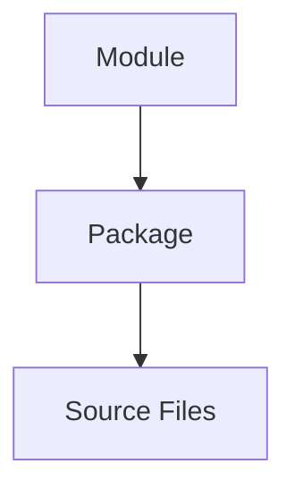

# Package Model

> This document is the normative specification of the package model of Omnia.
>
> It defines what a package is: its responsibilities, ownership, boundaries, public API philosophy, dependency rules, lifecycle, and testing expectations.
>
> It does NOT define the actual package list. That is the subject of the future PACKAGE_STRUCTURE document.
>
> It is normative. Implementation MUST conform to the package model described here.

## Executive Summary

The Package Model exists because architecture must become buildable code. Modules are the architectural units of ownership; packages are the implementation units that realize them (ARC-003, ARC-007). Without a package model, every engineer decides where code belongs, boundaries drift, and the layered architecture stops being enforceable in the build system. The Package Model fixes what a package is in Omnia so that the rules are applied once and everywhere.

The relationship between the architectural and implementation levels is direct:

- **Module** — the architectural unit of ownership and responsibility. Modules define what is owned and what may depend on what (ARC-003, ARC-007).
- **Package** — the implementation unit that realizes one or more modules. A package is the unit of compilation, encapsulation, and reuse.
- **Source Files** — the code that makes up a package.

A module is not a package, and a package is not a module. The module defines what is owned; the package defines how it is built and consumed. This document defines the enduring rules of packages — the model every package in the repository conforms to. The concrete package list is defined in the future PACKAGE_STRUCTURE document.

## Package Philosophy

The philosophy governs every package. Each principle states what it requires and why it exists.

### Packages Implement Architecture

Statement: A package realizes a module; it never defines architecture.

Why it exists: architecture decided in code cannot be reviewed, recorded, or enforced. Decisions belong in the architecture documents; packages carry them out (ARC-003).

Practical implication: when a package and a module disagree, the module wins and the package is corrected.

### Packages Are Implementation Units

Statement: Packages exist to be built, consumed, and tested. They are units of compilation, not units of ownership.

Why it exists: ownership is an architectural concern that belongs to modules (ARC-007). A package that owns a concern it does not realize is a package with no architectural home.

Practical implication: package boundaries follow module boundaries; a package is justified by the module it implements, never by convenience.

### Packages Expose Stable Contracts

Statement: The public API of a package is its contract, and it changes only through a deliberate process.

Why it exists: consumers depend on contracts. An unstable public API breaks every consumer silently and spreads change across the build.

Practical implication: a package's public API is minimal and stable. Changing it is replacement, never revision (ARC-003, ARC-007).

### Packages Hide Implementation Details

Statement: A package's internals are private; consumers depend only on its public API.

Why it exists: hidden internals are what make a package replaceable and testable. An exposed internal is a dependency the package does not control.

Practical implication: nothing outside a package reaches into its internals. Interaction passes through the public API.

### Packages Evolve Independently

Statement: A package can be created, changed, tested, and replaced without redesigning its consumers, as long as its contract holds.

Why it exists: independent evolution is what keeps a long-lived codebase changeable. A package that cannot change alone forces change on everything that consumes it.

Practical implication: package evolution is confined behind the public API; consumers are insulated from internal change.

## Package Definition

### What Is a Package

A package is the unit of compilation and encapsulation in Omnia. It is the build-level realization of one or more architecture modules. A package is the unit that:

- compiles as a unit;
- exposes a public API;
- hides its internal implementation;
- declares its dependencies explicitly;
- is tested in isolation.

A package is consumed by other packages only through its public API.

### What Is Not a Package

A package is not:

- a module — a module is architectural; a package is implementation (ARC-003);
- a layer — a package never spans layers (ARC-002);
- a folder — folders organize code within a package; they are not packages;
- a catch-all — a package is never a collection of unrelated code with no home (ARC-002).

### Required Characteristics

Every package MUST:

- declare a public API;
- own a single architectural responsibility, from the module or modules it realizes;
- declare all dependencies explicitly;
- contain no hidden dependencies;
- be independently testable;
- have an explicit owner.

A unit that cannot satisfy these characteristics is not a package in Omnia.

## Package Anatomy

A package is described by its conceptual parts. The anatomy is conceptual; this document defines no folder structures.

### Public API

- Purpose: the surface through which consumers use the package.
- Responsibility: define the operations a consumer can invoke.
- What it must never be: a leak of the internal implementation.
- Rule: the public API is the contract. It is minimal, intentional, and stable.

### Internal Implementation

- Purpose: the private code that realizes the public API.
- Responsibility: implement the contract without exposing how.
- What it must never be: visible to consumers.
- Rule: internals change freely as long as the contract holds.

### Resources

- Purpose: data the package needs at runtime that is not code.
- Responsibility: own the data the package uses.
- What it must never be: shared implicitly with other packages.
- Rule: resources are private to the package that owns them.

### Tests

- Purpose: the package's verification suite.
- Responsibility: verify the package in isolation and against its contracts.
- What it must never be: dependent on another package's internals.
- Rule: tests are owned by the package and follow the Testing Model.

### Configuration

- Purpose: package-level settings and defaults.
- Responsibility: hold values the package needs without embedding product decisions.
- What it must never be: a place for product logic.
- Rule: configuration is user-owned and default-driven (PRODUCT_PRINCIPLES).

### Dependencies

- Purpose: the packages this package consumes.
- Responsibility: declare what the package needs.
- What it must never be: hidden, cyclic, or beyond what is needed.
- Rule: dependencies are declared, directed, and minimal (Dependency Rules).

## Package Boundaries

The boundary of a package separates what it owns from what it does not, and defines the only surface through which it is consumed.

### What a Package Owns

A package owns:

- its public API;
- its internal implementation;
- its resources;
- its tests;
- its declared dependencies — as declarations, never as ownership of the dependency's behavior.

### What Remains Private

The following remain private to a package:

- the internal implementation;
- the resources;
- the internal structure of the dependencies it uses.

A package's internal surface is invisible to consumers and is not part of any contract.

### Public Surface

The public surface is the public API only. It is the complete and only surface through which the package is consumed. A package has no other public surface.

### Internal Surface

The internal surface is everything the public API does not expose. It is owned by the package and is not a contract. Consumers never depend on the internal surface.

### Friend Packages

Omnia has no friend packages. Cross-package access to a package's internal surface is not part of the model: packages interact only through public APIs. The single sanctioned exception is tests, governed by the Testing Model, where a package may verify its own internals and compose its dependencies with test doubles.

## Dependency Rules

Dependency rules are normative and apply to every package.

### Allowed Dependencies

A package may depend only on packages whose architectural position allows the dependency. Allowed dependencies follow the allowed dependency edges of ARC-002:

- a package in the Presentation position may depend on Application and, for shared utilities only, Foundation;
- a package in the Application position may depend on Domain and, for shared utilities only, Foundation;
- a package in the Infrastructure position may depend on Domain (implementing its contracts) and Foundation;
- a package in the Domain position depends on no package of another layer;
- a package in the Foundation position depends on no package of another layer.

### Forbidden Dependencies

The following dependencies are forbidden:

- upward dependencies — a package depending on a package of a higher layer;
- skip-level dependencies — a package bypassing the layer between;
- hidden dependencies — undeclared dependencies;
- cyclic dependencies — two packages depending on each other.

### Dependency Direction

Dependencies point inward (ADR-0002). An arrow in the package graph points from the consumer to the dependency. The package graph is a directed graph that respects the layer order: Presentation, Application, Domain, Infrastructure, Foundation.

### No Cyclic Package Dependencies

The package dependency graph is acyclic. A cycle is a build-level specification violation: it means two packages own parts of each other and cannot be built, tested, or evolved in isolation. A cycle is resolved by moving the shared contract to a lower package or by introducing an intermediate package; it is never accommodated.

### No Hidden Dependencies

Every dependency is declared and justified. A dependency without a documented owner is a violation (ARC-002). No package acquires its dependencies by lookup; dependencies are delivered to the package's consumers through composition (ARC-006).

## Package Lifecycle

Every package passes through a defined lifecycle.

### Creation

A package is created only to realize an existing module (ARC-007) or a justified grouping of closely related modules. Creation requires:

- architectural justification — the module or grouping exists in the module structure;
- documentation — the package is recorded before it is used;
- architecture review — the package is reviewed against the module-to-package mapping.

### Evolution

A package evolves within its contract: internals change freely; the public API changes only through the replacement process (ARC-003, ARC-007). A package that breaks its contract without the replacement process is a violation.

### Versioning

Every package is versioned. A version records contract stability: a change that preserves the contract is a revision; a change that breaks the contract is a replacement. The versioning scheme itself is defined in the future PACKAGE_STRUCTURE document.

### Deprecation

A package is deprecated before it is removed. Deprecation is explicit and phased:

1. **Announce** — the package is marked deprecated; no new consumers are added.
2. **Migrate** — existing consumers move to the replacement.
3. **Remove** — the package is removed when no consumer remains.

### Removal

A package is removed only when no consumer remains. Removal is the terminal step of deprecation; a package is never removed while a consumer depends on it.

## Testing Model

Testing is how the architecture is verified. Every package is responsible for its own verification.

### Unit Tests

Unit tests verify a package in isolation. Every package MUST have unit tests that exercise its public API and its internal behavior. A package's unit tests depend only on the package itself and its test doubles.

### Integration Tests

Integration tests verify contracts across package boundaries. A contract is verified where it is consumed: integration tests confirm that a consumer and a dependency agree on the contract. Integration tests exercise only public APIs.

### Test Doubles

Test doubles are implementations of dependencies supplied to the code under test. Test composition is a seam: a test composes its own graph with the doubles it needs (ARC-006). Test doubles replace real dependencies without changing the code under test.

### Package Isolation

A package's tests never depend on another package's internals. Isolation is what makes a failing package diagnosable and a changed package safe. If a test needs a seam, the seam is expressed in the public API, not in another package's internals.

## Package Evolution

Package evolution follows module evolution (ARC-007). A package changes shape only when the module structure justifies it.

### When to Create a New Package

Create a new package when:

- a new module is added to the module structure (ARC-007);
- an existing package accumulates a distinct responsibility that needs its own boundary.

A new package must satisfy the required characteristics of a package.

### When to Merge Packages

Merge packages when:

- two packages are never consumed separately;
- one package better expresses the responsibility of its module or modules.

A merge is valid only if the result still owns a single architectural responsibility and still satisfies the required characteristics.

### When to Split Packages

Split a package when:

- it owns more than one architectural responsibility;
- it is consumed by consumers that need only part of its surface.

A split follows the module splitting rules of ARC-007: contracts are preserved, each result owns one responsibility, and the dependency graph is re-verified after the split.

### Criteria for Package Extraction

A responsibility is a candidate for extraction into a new package when it has:

- a distinct owner;
- a stable contract;
- independent testability.

Extraction must not create a cycle and must not cross a layer.

## Relationship to Modules

Modules and packages are two levels of the same structure (ARC-003, ARC-007).

- **Modules define architecture.** Modules own responsibilities and boundaries; they are the architectural units.
- **Packages implement modules.** Packages realize modules as buildable, testable units.
- **One module may map to one package.** This is the default mapping.
- **Multiple closely related modules may temporarily share one package.** This is allowed when the modules are consumed together and the grouping preserves a single responsibility. The grouping is temporary: it is reviewed when either module needs to evolve independently.
- **One package must never mix unrelated architectural responsibilities.** A package that spans unrelated modules, or that spans layers, is a violation.

The mapping from modules to packages is defined concretely in the future PACKAGE_STRUCTURE document. This document defines the rules the mapping must obey.

## Architecture Fitness Rules

These rules validate every package. They are mandatory and verified during review today; they may become automated fitness functions in the future (ARC-002).

- **Stable public API.** The public surface changes only through the replacement process; a break is never a silent revision.
- **Minimal dependencies.** A package depends only on what it needs; an unjustified dependency is a violation.
- **Explicit ownership.** Every package has exactly one owner; shared ownership is a violation.
- **No cyclic imports.** The package dependency graph is acyclic.
- **Replaceable implementation.** A package's internals can be replaced without changing its consumers.
- **No layer violations.** No package depends on a package of a higher layer or spans a layer boundary.
- **No hidden dependencies.** Every dependency is declared and justified.

A package that cannot satisfy these rules is not designed for this architecture. A change that requires a different model is proposed as an ADR; it is never implemented as an exception.

## Relationship to Future Documents

This document is the implementation contract for every package in the repository. It supplies the rules that the following future documents rely on:

- **09_PACKAGE_STRUCTURE.md** — the document that defines the actual package list: package names, the module-to-package mapping, and each package's public surface. This model supplies the rules; PACKAGE_STRUCTURE supplies the inventory.
- **10_WORKSPACE_STRUCTURE.md** — the document that defines how packages are assembled into a workspace. This model supplies the dependency and boundary rules the workspace must respect.
- **Implementation Roadmap** — the document that sequences implementation work. This model supplies the unit of work: a package is the smallest independently buildable and testable unit.

Each future document is implementation-level. This document is architectural and remains the reference for what a package is and how it must behave.

## Related Documents

- `Documentation/Architecture/01_SYSTEM_OVERVIEW.md`
- `Documentation/Architecture/02_LAYERED_ARCHITECTURE.md`
- `Documentation/Architecture/03_MODULE_MODEL.md`
- `Documentation/Architecture/04_AI_PROVIDER_ARCHITECTURE.md`
- `Documentation/Architecture/05_LOCAL_STORAGE_ARCHITECTURE.md`
- `Documentation/Architecture/06_DEPENDENCY_INJECTION.md`
- `Documentation/Architecture/07_MODULE_STRUCTURE.md`
- `Documentation/Architecture/ADR/ADR-0001-architectural-style.md`
- `Documentation/Architecture/ADR/ADR-0002-dependency-direction.md`
- `Documentation/Product/PRODUCT_CHARTER.md`
- `Documentation/Product/PRODUCT_PRINCIPLES.md`
