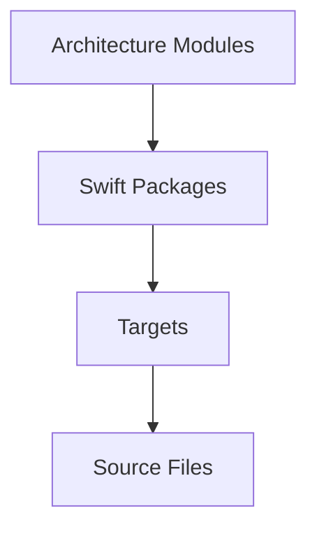
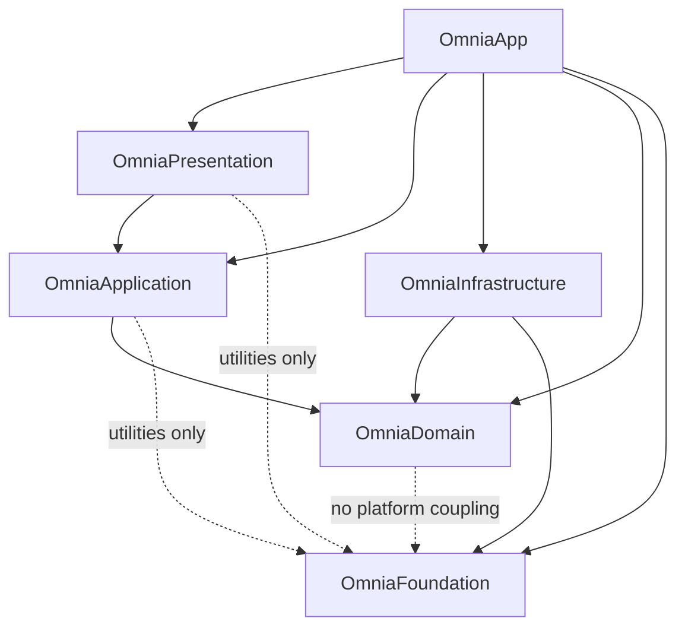
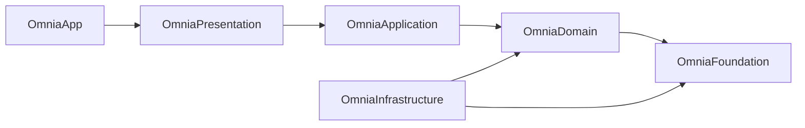

# Package Structure

> This document is the normative specification of the Swift Package topology of Omnia.
>
> It defines the concrete package inventory, the module-to-package mapping, the package dependency graph, and the public boundaries of every package. It does NOT define package manifests, target layouts, or folder structures.
>
> It is normative. Implementation MUST conform to the package topology described here.

## Executive Summary

Packages exist to make the architecture buildable. Modules define what exists and who owns it; packages define how that structure is compiled, tested, and delivered as a unit. A package turns an architectural boundary into a build boundary: it can be compiled, tested, and versioned independently, and its dependencies are declared in one place. When a boundary is a package, an engineer cannot silently cross it; the build system enforces what the architecture declares.

The relationship between the architectural level and the implementation level has four steps:



- **Architecture Modules** — the units of ownership and responsibility (ARC-007). The module is the architectural unit; this document never redefines it.
- **Swift Packages** — the units of build organization that realize modules (ARC-002, ARC-003). A package is the unit of compilation and encapsulation; this document defines the complete package inventory.
- **Targets** — the units within a package that realize a single module surface, preserving the module boundaries of ARC-007 inside the package. Target layout is the subject of the future WORKSPACE_STRUCTURE document, not this one.
- **Source Files** — the files that realize targets.

Omnia is composed of exactly six packages: OmniaFoundation, OmniaDomain, OmniaApplication, OmniaInfrastructure, OmniaPresentation, and OmniaApp. These are the concrete realization of the conceptual package strategy of ARC-002. Each package occupies exactly one architectural position: a package never spans layers (ARC-002), so a module with surfaces in more than one layer is realized by one package per layer surface (ARC-007). Every dependency between packages follows the allowed dependency edges of ARC-002 and ADR-0002.

Package names describe architectural position, not implementation. A name never records a technology, a provider, or a tooling choice; the topology must survive changes to those (ARC-008).

This document bridges the package model of ARC-008 and the module structure of ARC-007: it is the mapping from the architectural module inventory to a concrete, stable set of build units that the workspace can assemble.

## Package Inventory

The initial package set is fixed at six packages. There is no other package. A new package is introduced only through the Evolution Strategy section.

### OmniaFoundation

- **Purpose**: domain-agnostic primitives shared by every package. It realizes the Foundation module (ARC-007).
- **Responsibilities**: provide pure utilities, logging primitives, configuration primitives, and shared abstractions with no product meaning.
- **Public API**: the primitive APIs — pure utility functions, the logging interface, the configuration primitive, and shared value types.
- **Internal Responsibilities**: the implementation of the primitives themselves.
- **Dependencies**: none. OmniaFoundation is the bottom of the dependency graph (ARC-002).
- **Architectural Layer**: Foundation.
- **Owner**: Founder, the recorded owner of the Foundation module.

### OmniaDomain

- **Purpose**: the Domain layer — business rules, entities, value objects, and provider-agnostic contracts. It realizes the Domain surfaces of the Provider, Storage, Configuration, Authentication, Workspace, and Conversation modules (ARC-007).
- **Responsibilities**: define the capability contract and the provider model (Provider); define the data model and the repository protocols (Storage); define the configuration model, its defaults, and its levels (Configuration); define the credential storage protocol and credential references (Authentication); own the workspace aggregates and the workspace repository protocol (Workspace); own the conversation aggregates and message value objects (Conversation).
- **Public API**: the contracts — the capability contract, the repository protocols, the typed configuration protocol, the credential storage protocol, and the entities and value objects.
- **Internal Responsibilities**: the pure implementations of domain logic — aggregates, value objects, and policies.
- **Dependencies**: OmniaFoundation, for primitives with no platform coupling (ARC-002).
- **Architectural Layer**: Domain.
- **Owner**: Founder, the recorded owner of the realized modules.

### OmniaInfrastructure

- **Purpose**: the implementation of the Domain contracts and the platform services. It realizes the Infrastructure surfaces of the Provider, Storage, Configuration, and Authentication modules (ARC-007).
- **Responsibilities**: implement provider adapters (Provider); implement persistence, migration, indexes, caches, and temporary data (Storage); implement configuration persistence (Configuration); implement secure credential storage and access control (Authentication); provide networking, keychain, and platform services.
- **Public API**: the concrete implementations of the Domain contracts, exposed for composition by the Composition Root. No upper package depends on them directly.
- **Internal Responsibilities**: adapters, network clients, keychain services, serializers, and storage engines.
- **Dependencies**: OmniaDomain, whose contracts it implements; OmniaFoundation.
- **Architectural Layer**: Infrastructure.
- **Owner**: Founder, the recorded owner of the realized modules.

### OmniaApplication

- **Purpose**: use cases, application services, and orchestration of user flows. It realizes the Application surfaces of the Application Core, Workspace, Conversation, and Settings modules (ARC-007).
- **Responsibilities**: define use cases and application services; orchestrate cross-module workflows; define transaction boundaries; validate input before domain operations; own Application Core's orchestration services; expose workspace, conversation, settings, and connection-configuration services.
- **Public API**: the application services and use cases consumed by the Presentation layer.
- **Internal Responsibilities**: workflow orchestration, sequencing, and validation. It contains no business rules that belong to the Domain, no user interface, and no concrete infrastructure.
- **Dependencies**: OmniaDomain; OmniaFoundation for shared utilities only, when justified.
- **Architectural Layer**: Application.
- **Owner**: Founder, the recorded owner of the realized modules.

### OmniaPresentation

- **Purpose**: the user interface. It realizes the Presentation surfaces of the Navigation, Workspace, Conversation, and Settings modules (ARC-007).
- **Responsibilities**: render state and translate user intent into use-case invocations; own the navigation structure and presentation flow (Navigation); present workspaces, conversations, settings, and provider configuration.
- **Public API**: the presentation surfaces — the navigation structure and the workspace, conversation, and settings screens.
- **Internal Responsibilities**: views, screens, presentation state, navigation, layout, accessibility, and localization.
- **Dependencies**: OmniaApplication; OmniaFoundation for shared utilities only, when justified.
- **Architectural Layer**: Presentation.
- **Owner**: Founder, the recorded owner of the realized modules.

### OmniaApp

- **Purpose**: the application shell and Composition Root. It realizes the application edge of the Application Core module (ARC-006, ARC-007).
- **Responsibilities**: host the Composition Root — the only place where abstractions are bound to implementations (ARC-006); own the application entry point and lifecycle; own application and session state; assemble the complete object graph.
- **Public API**: the executable entry point; the composition contract.
- **Internal Responsibilities**: the wiring of the full dependency graph and the application lifecycle. It contains no business rules and no user interface.
- **Dependencies**: every other package — OmniaPresentation, OmniaApplication, OmniaInfrastructure, OmniaDomain, and OmniaFoundation.
- **Architectural Layer**: the application edge. OmniaApp is not a layer; it is the assembly point at which the layers are composed (ARC-006).
- **Owner**: Founder, the recorded owner of the Application Core module.

## Module-to-Package Mapping

Every module of ARC-007 is realized by the packages of its surfaces. The mapping follows the layer position of each module: a package does not span layers (ARC-002), so a module with surfaces in several layers is realized by one package per surface.

| Module | Realized by | Mapping | Justification |
|---|---|---|---|
| Foundation | OmniaFoundation | one-to-one | The Foundation module has a single surface and is realized entirely by the Foundation package. |
| Application Core | OmniaApplication, OmniaApp | one-to-many | Application Core owns both Application-layer orchestration and the application edge. Orchestration is realized in OmniaApplication; the Composition Root, entry point, and lifecycle are realized in OmniaApp, because the Composition Root sits at the application edge (ARC-006). |
| Workspace | OmniaDomain, OmniaApplication, OmniaPresentation | one-to-many | The module spans Domain, Application, and Presentation; a package does not span layers (ARC-002), so one package per surface. |
| Conversation | OmniaDomain, OmniaApplication, OmniaPresentation | one-to-many | Same rationale: the module spans Domain, Application, and Presentation. |
| Provider | OmniaDomain, OmniaInfrastructure | one-to-many | The capability contract and provider model live in the Domain surface; the adapters live in the Infrastructure surface. Provider APIs never leak above Infrastructure (ARC-004). |
| Storage | OmniaDomain, OmniaInfrastructure | one-to-many | Repository protocols and the data model live in the Domain surface; persistence and migration live in the Infrastructure surface. Storage services are realized from the Domain surface and consumed by the Application layer. |
| Settings | OmniaApplication, OmniaPresentation | one-to-many | Application services are realized in OmniaApplication; the presentation surface is realized in OmniaPresentation. |
| Configuration | OmniaDomain, OmniaInfrastructure | one-to-many | The configuration model, defaults, and levels live in the Domain surface; persistence lives in the Infrastructure surface. |
| Authentication | OmniaDomain, OmniaInfrastructure | one-to-many | The credential storage protocol and credential references live in the Domain surface; secure storage lives in the Infrastructure surface. |
| Navigation | OmniaPresentation | one-to-one | The module has a single Presentation surface and is realized entirely by the Presentation package. |

The mapping is one-to-many for every module with more than one surface, and one-to-one for the two single-surface modules. No mapping is many-to-many.

At the package level the mapping is many-to-one: each layer package hosts the surfaces of several modules. This is the layer-aligned topology mandated by ARC-002. It does not merge modules: within a package, every module surface preserves its own boundary and is realized as its own target, so no package contains unrelated modules (ARC-007, ARC-008). The target layout is the subject of the WORKSPACE_STRUCTURE document.

## Package Dependency Graph

The package dependency graph is derived from the allowed dependency edges of ARC-002 and the module dependency graph of ARC-007. Arrows point from consumer to dependency.

### Allowed Dependencies



Why these edges are allowed:

- **OmniaApp → every package** — the Composition Root is the only place that sees and assembles the whole graph (ARC-006). This is the deliberate exception to fan-in, inherited from Application Core (ARC-007).
- **OmniaPresentation → OmniaApplication** — presentation surfaces consume use cases and application services (ARC-002).
- **OmniaApplication → OmniaDomain** — application services depend on domain contracts (ARC-002).
- **OmniaInfrastructure → OmniaDomain** — infrastructure implements the domain contracts (ARC-002).
- **OmniaInfrastructure → OmniaFoundation** — platform and provider work uses domain-agnostic primitives (ARC-002).
- **Application and Presentation → Foundation** — shared utilities only, when justified (ARC-002).
- **OmniaDomain → OmniaFoundation** — primitives with no platform coupling, which is how the Foundation edges of the Provider, Storage, Configuration, and Authentication modules are realized (ARC-007).

### Forbidden Dependencies

```mermaid
flowchart LR
    Presentation["OmniaPresentation"] -.x Infrastructure["OmniaInfrastructure"]
    Presentation -.x Domain["OmniaDomain"]
    Presentation -.x App["OmniaApp"]
    Application["OmniaApplication"] -.x Infrastructure
    Application -.x Presentation
    Application -.x App
    Infrastructure["OmniaInfrastructure"] -.x Application
    Infrastructure -.x Presentation
    Infrastructure -.x App
    Domain["OmniaDomain"] -.x Infrastructure
    Domain -.x Application
    Domain -.x Presentation
    Domain -.x App
    Foundation["OmniaFoundation"] -.x Domain
    Foundation -.x Infrastructure
    Foundation -.x Application
    Foundation -.x Presentation
    Foundation -.x App
```

Why these edges are forbidden:

- **Upward edges** — an inner package depending on an outer one (for example OmniaInfrastructure → OmniaPresentation) creates a cycle in intent and couples platform services to the UI (ADR-0002).
- **Skip-level edges** — a package bypassing the package between it and its dependency (for example OmniaPresentation → OmniaDomain) bypasses orchestration, validation, and contracts (ARC-002).
- **Foundation depends on nothing** — the Foundation is the bottom of the graph; no internal dependency exists below it (ARC-002).
- **No package depends on OmniaApp** — the shell is the top; depending on it would make every package depend on the composition of everything (ARC-006).

### Dependency Direction



Dependencies always point inward. Consumers sit above or outside; dependencies sit below or inside. Arrows run from consumer to dependency, so every arrow points from an outer position to an inner one (ARC-007). OmniaApp is the only package with outgoing edges to every other package. No arrow points from an inner package to an outer one, and the graph contains no cycle. A cycle is a specification violation (ARC-002, ARC-007).

## Public Surface

Every package exports exactly its public interface and nothing else. The following table states, for each package, what is exported, what stays internal, and where the package is designed to grow. All descriptions are conceptual contracts, not Swift code.

| Package | Exported interfaces | Implementation details | Extension points |
|---|---|---|---|
| OmniaFoundation | Pure utility functions; the logging interface; the configuration primitive; shared value types and abstractions with no product meaning. | The implementation of the primitives. | New domain-agnostic primitives. Nothing product-specific may enter. |
| OmniaDomain | The contracts: the capability contract and the provider model; the repository protocols; the typed configuration protocol; the credential storage protocol; the entities and value objects. | Aggregates, value objects, and policies — pure and platform-independent. | New capabilities, which extend the capability contract (ARC-004); new policies; new contracts for future aggregates. |
| OmniaInfrastructure | The concrete implementations of the Domain contracts, exposed for composition by the Composition Root only. | Provider adapters, network clients, keychain services, serializers, persistence engines, and the configuration and secure-storage implementations. | New provider adapters, which implement the existing capability contract (ARC-004); new storage engines, which implement the repository protocols (ARC-005). |
| OmniaApplication | The application services and use cases consumed by Presentation. | Workflow orchestration, validation, and sequencing. | New use cases and application services for existing modules. |
| OmniaPresentation | The presentation surfaces: the navigation structure and the workspace, conversation, and settings screens. | Views, screens, presentation state, navigation, layout, accessibility, and localization. | New screens; new platform presentation surfaces. |
| OmniaApp | The executable entry point; the composition contract. | The Composition Root wiring and the application lifecycle. | The composition of new packages and providers at the root (ARC-006). |

## Package Responsibilities

### Ownership

Package ownership follows module ownership (ARC-007). Every package inherits its owner from the modules it realizes; the recorded owner of the module structure is the project owner (Founder). The owner is accountable for each package's contracts, its evolution, and its compliance with the architecture (ARC-008).

- Every package has exactly one owner; shared ownership is a violation (ARC-008).
- A package never has an owner that differs from the owner of the modules it realizes.
- Ownership is recorded at the module level (ARC-007) and inherited at the package level; it is never re-assigned at the package level.

### What a Package Must Never Contain

The following are forbidden in each package. They are the package-level expression of the layer constraints of ARC-002.

| Package | Must never contain |
|---|---|
| OmniaFoundation | Business, feature, or provider logic; product decisions; code with no home (ARC-002). |
| OmniaDomain | SwiftUI or any UI framework; networking; persistence; provider implementations; platform APIs (ARC-002). |
| OmniaInfrastructure | Business rules; the user interface; presentation state; the contracts it implements — it implements contracts, never defines them (ARC-002). |
| OmniaApplication | Business rules that belong to the Domain; concrete infrastructure implementations; user interface (ARC-002). |
| OmniaPresentation | Business logic; networking; persistence access; provider code (ARC-002). |
| OmniaApp | Business rules; product behavior; anything that is not composition and lifecycle. |

## Evolution Strategy

The package topology is designed to remain stable for years. Change follows the module structure: a package change that does not follow a module change is suspect. Long-term maintainability is preferred over optimization (ARC-008).

### Adding Packages

A package is added only to realize a new architectural concern that needs its own build boundary. Adding a package requires:

- **Architectural justification** — the existing packages cannot host the concern without violating a boundary (ARC-003).
- **Documentation** — this document is updated before the package is used.
- **Architecture review** — the addition is reviewed against the dependency graph.
- **Potential ADR** — a significant addition is recorded as an ADR.

New behavior attaches at extension points, not in new packages. A new provider attaches inside OmniaInfrastructure; a new capability extends the contract in OmniaDomain; a new screen attaches inside OmniaPresentation.

### Splitting Packages

A package is split when it hosts concerns that no longer belong together. Splitting requires:

- **Boundary preservation** — the public interfaces remain stable during the split.
- **One concern per result** — each resulting package owns one concern.
- **Dependency review** — the dependency graph is re-verified for cycles and layer violations after the split.

Splitting is driven by the module structure (ARC-007), never by build convenience.

### Removing Packages

A package is deprecated before it is removed. Deprecation is explicit and phased:

1. **Announce** — the package is marked deprecated; no new consumers are added.
2. **Migrate** — existing consumers move to the replacement.
3. **Remove** — the package is removed when no consumer remains.

A significant removal is recorded as an ADR (ARC-007).

### Moving Modules Between Packages

A module surface moves between packages only when the module structure changes (ARC-007). Moving is never a tooling decision. Every move requires:

- **Architecture review** — the move is reviewed against the module structure and the dependency graph.
- **Documentation** — this document is updated.
- **Dependency re-verification** — the graph is re-verified for cycles and layer violations.

### Review Requirement

All architectural changes require review. A change that requires a different topology is proposed as an ADR; it is never implemented as an exception (ARC-002, ARC-007).

## Relationship to Workspace

This document defines the package topology: the six packages, their responsibilities, their boundaries, and their dependencies. It does not define how a package is assembled.

The future WORKSPACE_STRUCTURE document (10_WORKSPACE_STRUCTURE.md) defines how each package is assembled into the workspace: its targets, its manifest, and the build configuration. Targets realize module surfaces within a package; every module surface keeps its own boundary as a target, so the module boundaries of ARC-007 remain visible in the build system. The workspace document defines Package.swift, folder structures, and file placement; this document defines neither.

The relationship is one of assembly, not of redesign:

- The packages declared here are the packages the workspace assembles; the workspace introduces no package of its own.
- The dependencies declared here become the package dependencies recorded in the manifests.
- The composition edges of OmniaApp become the cross-package wiring assembled at the Composition Root (ARC-006).
- The workspace document must never contradict this document. Where a future ADR changes the topology, this document and the workspace document are updated together.
