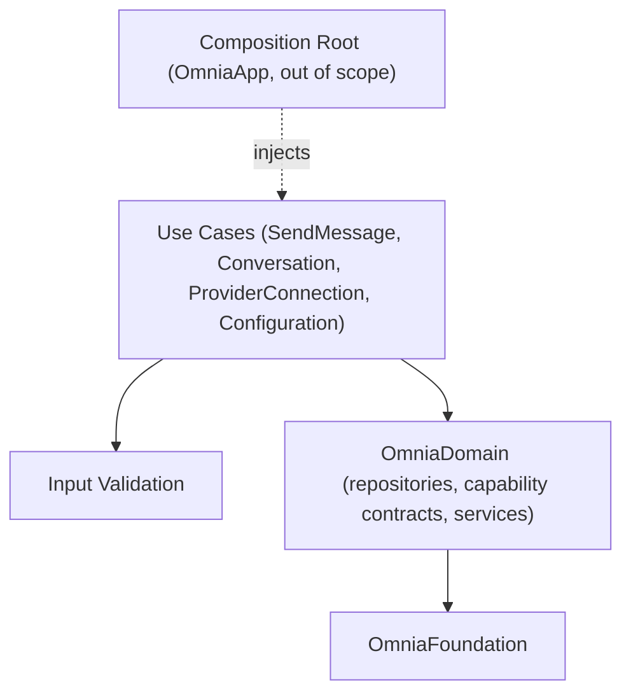

# Application Sprint 1 Roadmap

> The implementation roadmap for Application Sprint 1: the use cases and application services for conversation, provider, and configuration flows — first among them the send-message use case, which orchestrates the verified provider capabilities and the storage repositories.

## Purpose

This document is the roadmap for Application Sprint 1. It defines what the sprint delivers, the Application API contract to be written and frozen, the application services to be built, the order of implementation, and the criteria that mark the sprint complete. It is the planning artifact that `PROJECT_STATE.md` points to for "Application implementation per the implementation roadmap", and the direct successor to `DOMAIN_SPRINT_2_ROADMAP.md` and `INFRASTRUCTURE_SPRINT_2_ROADMAP.md`.

It is read by the engineers and AI agents who execute the sprint. It does not replace the architecture or the Application API specification; it sequences a specification against them.

## Scope

This roadmap covers the OmniaApplication package only: the Application layer surfaces of the Conversation, Provider, and Configuration modules (`ARC-009`) — the conversation application service, the send-message use case, the provider connection application service, and the configuration application service (milestone #8: "use cases and application services for conversation, provider, and configuration flows").

It does not cover the workspace application service (a future application sprint), nor the Presentation, application-shell, or Composition Root packages. The Composition Root that assembles the concrete Infrastructure implementations is owned by OmniaApp (`ARC-006`, `ARC-009`) and is out of scope here. No Infrastructure work happens in this sprint: no network, no persistence, no provider adapters.

## Sprint Objective

The Application layer owns the use cases, application services, orchestration, and input validation of the product (`ARC-002`, `ARC-007`). It is the first layer that turns the frozen Domain contracts (`DES-009` v0.3.0) and the verified concrete capabilities of Infrastructure Sprint 2 (`DES-010` v1.1.0) into orchestrated user flows. Infrastructure Sprint 2 delivered the capability call methods on the provider adapter, but nothing yet invokes them in a user-facing flow; the send-message use case is the first such flow (`PRD-005`).

The sprint follows the same contract-first discipline the previous sprints used:

1. **Write and freeze** the OmniaApplication public API contract (`Documentation/Design/APPLICATION_API.md`, DES-011 v1.0.0): the use-case surface for conversation, provider, and configuration flows, reviewed against the architecture and ratified as Application API Freeze v1.
2. **Implement** the application services against the frozen contract, consuming only the Domain contracts and capability contracts — never the Infrastructure implementations, which are injected by the future Composition Root (`ARC-006`) — keeping the package building and its tests green at every step.

The sprint is complete when the contract is frozen, the conversation, send-message, provider connection, and configuration services are implemented and tested, the package depends only on OmniaDomain and OmniaFoundation, and all tests pass.

## Sprint Stages

### Stage 1 — Application API Specification and Freeze

1. Write `Documentation/Design/APPLICATION_API.md` (DES-011) at v1.0.0, following the DES-009/DES-010 document structure, specifying the Application layer's public surface: the conversation surface (create, load/select, list by workspace membership, delete conversations, message history, and the send-message flow), the provider connection surface (configure, list, remove connections; credentials by reference), the configuration surface (typed settings with per-level resolution), the application value objects and error taxonomy, and the input-validation rules.
2. Review the document with the Documentation workflow and the documentation review checklist, and verify it against `ARC-002`, `ARC-004`, `ARC-006`, `ARC-007`, `ARC-009`, `ADR-0001`/`ADR-0002`, the frozen `DES-009` v0.3.0, and the frozen `DES-010` v1.1.0.
3. Record the freeze. From that point, DES-011 v1.0.0 is part of the frozen contract; a further change requires another specification revision, exactly as the prior API freezes do (`PROJECT_STATE.md`).

Milestone: **Application API Freeze** — ratified on 2026-08-05; `DES-011` v1.0.0 status is Ratified and the freeze is recorded in `PROJECT_STATE.md`.

### Stage 2 — Implementation

Implement the application services in the order defined in the Implementation Order section. Each step adds OmniaApplication types and leaves the package building with its tests green (`PROJECT_STATE.md` next-tasks rule). No implementation step precedes the review of the corresponding surface in the specification.

### Stage 3 — Package Verification

Verify the OmniaApplication package against the frozen contract and the layer discipline, and update the documentation.

## Requirements

The requirements derive from the layer responsibilities of `ARC-009`, the dependency-injection rules of `ARC-006`, the module structure of `ARC-007`, the capability contract of `DES-009` v0.3.0, and the concrete capabilities of `DES-010` v1.1.0. The Application defines no contracts and owns no rules beyond orchestration and input validation (`ARC-002`, `ARC-009`, `ADR-0001`).

### The Application Surface

The contract defines the public surface of OmniaApplication for the three flows in scope (milestone #8):

- **Conversation** — the conversation application service: create, load (select), list by workspace membership, and delete conversations, and read message history, orchestrating the Domain `ConversationRepository` and the workspace membership (`DES-009` §3.3, §3.5).
- **Send message** — the send-message use case: orchestrate the request and streaming-response flow over the streaming capability contract, the `ProviderSelectionService`, and the `ConversationRepository` (ARC-001 send-message, `ARC-007`).
- **Provider connection** — the provider connection application service: configure a provider connection (endpoint, model, capabilities), store the credential by reference through the `CredentialStorageProtocol`, and list and remove configured providers through the `ProviderRepository` (`DES-009` §3.1, §3.7).
- **Configuration** — the configuration application service: read and write typed settings through the `ConfigurationRepository` with per-level resolution (`DES-009` §3.5, §3.6).

### Value Objects and Errors

- Application request, response, and streaming-view types are immutable, `Equatable & Sendable` value types owning no business logic (`ARC-002`).
- The application error taxonomy is built on the Foundation error abstraction (`DES-001` §3.9). Domain errors — `RepositoryError`, `CapabilityError`, `CredentialStorageError` — are surfaced as they are, never wrapped or redefined (`DES-009` §3.9).

### Orchestration, Never Rules

- The application services orchestrate the Domain contracts and validate input at the boundary; they never invent business rules (`ARC-002`, `ADR-0001`).
- The send-message use case builds the capability request from the preserved conversation history, delivers the streaming updates to the caller incrementally, appends and persists the assembled assistant message on completion, and preserves partial content on interruption, never discarding it (`ARC-001`).
- The flows never block the caller and are testable without a network (`ARC-001`).

### Dependency Graph

The package dependency graph is fixed (`DES-011`, `ARC-009`):

- OmniaApplication depends only on OmniaDomain, whose contracts it orchestrates, and on OmniaFoundation among Omnia packages.
- The Application never references Infrastructure types, provider adapters, network, or persistence. Concrete implementations are injected by the Composition Root, which is owned by OmniaApp and out of scope here (`ARC-006`).
- The internal type dependency graph remains acyclic: the services compose the Domain contracts; nothing depends upward (`ARC-002`, `ARC-007`, `ARC-009`).

Notes on the graph:

- The services consume the Domain contracts; they define no contract (`ARC-002`).
- The Composition Root injects the concrete Infrastructure implementations; the Application never references them (`ARC-006`).
- Nothing above the package boundary of OmniaApplication is exercised here; Presentation is Presentation Sprint 1 (milestone #9).

### Implementation Order

The order is bottom-up by dependency. Each step leaves the package building and its tests green.

1. **Application API specification and freeze** — `DES-011` v1.0.0 written, reviewed, and frozen (Application API Freeze).
2. **Application value objects and errors** — the use-case request, response, and streaming-view types and the application error taxonomy per the frozen contract.
3. **Conversation service** — create, load (select), list by workspace membership, and delete use cases over the Domain `ConversationRepository` and the workspace membership, with input validation.
4. **Send-message use case** — the streaming orchestration flow over the streaming capability contract, `ProviderSelectionService`, and `ConversationRepository`: deltas delivered, completion persisted, interruption preserving partial content.
5. **Provider connection service** — configure, list, and remove provider connections over the `ProviderRepository` and `CredentialStorageProtocol`, credentials by reference.
6. **Configuration service** — typed settings read/write over the `ConfigurationRepository` with per-level resolution.
7. **Package verification** — full unit-test pass; dependency verification that OmniaApplication depends only on OmniaDomain and OmniaFoundation; layer verification that no UI framework, presentation state, network, persistence, or Infrastructure/provider-adapter concept enters the package and that the public surface matches the frozen `DES-011` v1.0.0 exactly; confirmation that the internal dependency graph is acyclic and that the application services are testable without a network (`ARC-001`, `ARC-002`, `ARC-006`, `ARC-009`).

### Completion Criteria

The sprint is complete when all of the following hold:

- The Application API specification is written, reviewed, and frozen (**Application API Freeze**, `DES-011` v1.0.0 Ratified).
- The conversation service exists: create, load (select), list by workspace membership, and delete over the frozen `ConversationRepository` (`DES-009` §3.3); message history returned with the aggregate.
- The send-message use case exists and orchestrates the streaming flow: deltas delivered, the assembled assistant message appended and persisted on completion, partial content preserved on interruption — never discarded (`ARC-001`).
- The provider connection service exists: configure, list, and remove connections; credentials stored by reference through the `CredentialStorageProtocol`, never the secret (`ARC-001`, `ARC-005`).
- The configuration service exists: typed settings with per-level resolution over the `ConfigurationRepository` (`DES-009` §3.5, §3.6).
- OmniaApplication depends only on OmniaDomain and OmniaFoundation, and its internal dependency graph is acyclic (`ARC-009`).
- No forbidden dependency exists: no UI framework, presentation state, network, persistence, or Infrastructure/provider-adapter reference; concrete implementations are injected, never referenced (`ARC-002`, `ARC-006`, `ADR-0001`, `ADR-0002`).
- The application services are testable without a network; the flows never block the caller (`ARC-001`).
- The package builds and all unit tests pass, verified with the standard build/test pipeline.
- Documentation is updated: `PROJECT_STATE.md` records Application Sprint 1 progress, and the roadmap reference in `README.md` resolves to this document.

## Non-Goals

The following are explicitly out of scope for Application Sprint 1:

- **No workspace application service** — the milestone scopes conversation, provider, and configuration flows; workspace services are a future application sprint.
- **No conversation renaming** — the frozen `Conversation` aggregate carries no name (`DES-009` §3.3) and renaming is a Workspace-module responsibility (`ARC-007`); it becomes expressible only through a Domain specification revision. Conversation listing runs through workspace membership because the frozen `ConversationRepository` declares no enumeration method (`DES-009` §3.5).
- **No Composition Root** — the assembly of the object graph is owned by OmniaApp (`ARC-006`); this sprint exposes the application services for composition only.
- **No Presentation or application shell** — no UI, no view models; Presentation Sprint 1 is milestone #9 (`ARC-009`).
- **No Infrastructure work** — no network, no persistence, no provider adapters; the Infrastructure package is unchanged from Infrastructure Sprint 2 (`DES-010` v1.1.0).
- **No change to the frozen Foundation, Domain, or Infrastructure API** — the DES-001..DES-010 contracts are the existing contract and are not modified; `DES-011` is the only new contract.
- **No third-party packages** — native Apple APIs are preferred (SWIFT.md, `PRODUCT_CHARTER`).
- **No new packages** — the package set is fixed at six (`ARC-009`).
- **No dependency-injection framework** — explicitly excluded by the architecture (`ARC-006`).

## Related Documents

- `README.md`
- `Documentation/Product/PRODUCT_CHARTER.md`
- `Documentation/Product/PRODUCT_PRINCIPLES.md`
- `Documentation/Product/VISION.md`
- `Documentation/Product/Roadmap/DOMAIN_SPRINT_2_ROADMAP.md`
- `Documentation/Product/Roadmap/INFRASTRUCTURE_SPRINT_2_ROADMAP.md`
- `Documentation/Architecture/01_SYSTEM_OVERVIEW.md`
- `Documentation/Architecture/02_LAYERED_ARCHITECTURE.md`
- `Documentation/Architecture/04_AI_PROVIDER_ARCHITECTURE.md`
- `Documentation/Architecture/06_DEPENDENCY_INJECTION.md`
- `Documentation/Architecture/07_MODULE_STRUCTURE.md`
- `Documentation/Architecture/09_PACKAGE_STRUCTURE.md`
- `Documentation/Architecture/ADR/ADR-0001-architectural-style.md`
- `Documentation/Architecture/ADR/ADR-0002-dependency-direction.md`
- `Documentation/Design/DOMAIN_API.md`
- `Documentation/Design/INFRASTRUCTURE_API.md`
- `Documentation/Design/APPLICATION_API.md`
- `project state`
