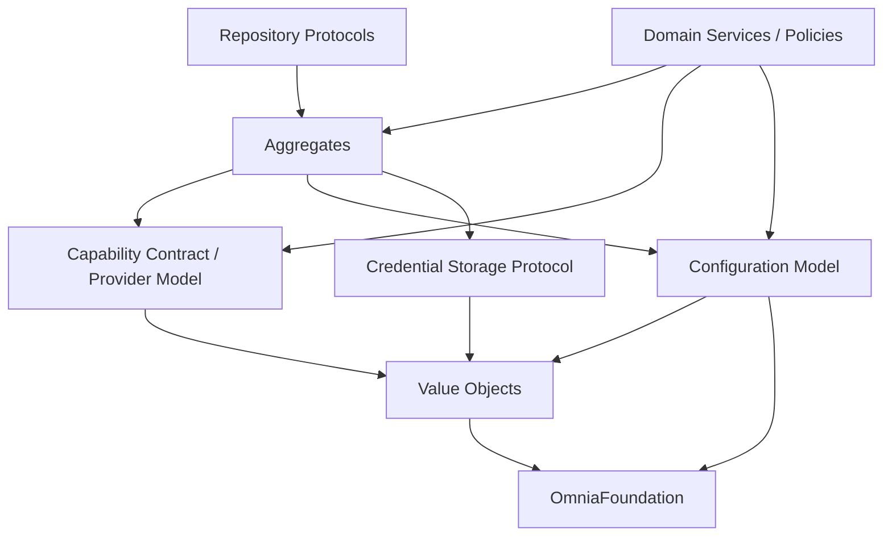

# Domain Sprint 1 Roadmap

> The implementation roadmap for Domain Sprint 1: specify, freeze, and implement the OmniaDomain package — the Domain layer's contracts and pure business logic.

## Purpose

This document is the roadmap for Domain Sprint 1. It defines what the sprint delivers, the domain model to be built, the contracts to be frozen, the order of implementation, and the criteria that mark the sprint complete. It is the planning artifact referenced as the IMPLEMENTATION_ROADMAP by `ARC-007`, `ARC-008`, and `ARC-009`, and the artifact that `PROJECT_STATE.md` points to for "Domain implementation per the implementation roadmap".

It is read by the engineers and AI agents who execute the sprint. It does not replace the architecture or the future Domain API specification; it sequences the work against them.

## Scope

This roadmap covers the OmniaDomain package only: the Domain layer surfaces of the Provider, Storage, Configuration, Authentication, Workspace, and Conversation modules (`ARC-009`). It defines what is built in Domain Sprint 1 and the order in which it is built.

It does not cover the Infrastructure, Application, Presentation, or application-shell packages. It does not define package manifests, targets, or folder structures; those belong to the future WORKSPACE_STRUCTURE document (`ARC-008`, `ARC-009`).

## Sprint Objective

Deliver the OmniaDomain package — the business rules, entities, value objects, domain services, policies, and provider-agnostic contracts of the Domain layer — following the same contract-first discipline the Foundation used:

1. **Specify and freeze** the OmniaDomain public API contract (`Documentation/Design/DOMAIN_API.md`, DES-009 — the next document in the DES series after `FOUNDATION_API.md`), reviewed against the architecture and ratified as a frozen contract.
2. **Implement** the OmniaDomain package against the frozen contract, bottom-up, in dependency order, keeping the package building and its tests green at every step.

The sprint is complete when the frozen contract is fully implemented, the package depends only on OmniaFoundation, and all tests pass. The Foundation precedent for the two stages is `FOUNDATION_API.md` (DES-001) and the Foundation Sprint 2 implementation recorded in `PROJECT_STATE.md`.

## Sprint Stages

### Stage 1 — Domain API Specification and Freeze

1. Draft the OmniaDomain public API contract specification (`Documentation/Design/DOMAIN_API.md`, DES-009), covering: the capability contract and the provider model; the typed configuration protocol; the credential storage protocol; the repository protocols for stored aggregates; the entities, value objects, domain services, and policies defined in this roadmap.
2. Review the specification with the Documentation workflow and the documentation review checklist, and verify it against `ARC-002`, `ARC-004`, `ARC-005`, `ARC-007`, `ARC-009`, and `ADR-0001`/`ADR-0002`.
3. Record the freeze. From that point, a change to the public contract requires a specification revision, exactly as the Foundation API Freeze v1 does (`PROJECT_STATE.md`).

Milestone: **Domain API Freeze v1** — ratified on 2026-08-03; `DES-009` status is Ratified and the freeze is recorded in `PROJECT_STATE.md`.

### Stage 2 — Implementation

Implement the package in the order defined in the Implementation Order section. Each step adds domain types and leaves the package building with its tests green (`PROJECT_STATE.md` next-tasks rule). No implementation step precedes the review of the corresponding contract in the specification.

## Requirements

### Domain Model

The domain model is derived strictly from the storage model of `ARC-005`, the module ownership of `ARC-007`, and the package responsibilities of `ARC-009`. Nothing is added that the architecture does not establish.

#### Aggregate Roots

An aggregate root is a stored, user-owned unit with identity, persisted through a repository protocol, and owned by one module (`ARC-003`, `ARC-007`).

| Aggregate Root | Owning Module | Persisted Through | Grounding |
|---|---|---|---|
| Workspace | Workspace | WorkspaceRepository | The unit of organization; user-owned (`ARC-005`). Workspace owns workspace aggregates (`ARC-007`, `ARC-009`). |
| Conversation | Conversation | ConversationRepository | A recorded interaction; user-owned (`ARC-005`). Conversation owns conversation aggregates and message history (`ARC-007`, `ARC-009`). |
| Provider | Provider | ProviderRepository | A provider connection the user has connected; user-owned provider configuration (`ARC-005`). The Domain owns the provider model (`ARC-004`, `ARC-007`, `ARC-009`). |

The Provider aggregate carries the provider model of `ARC-004`: identity, capabilities, configuration, availability, metadata, limits, and versioning. Credentials are not part of it; they are held by reference (`ARC-004`, `ARC-005`).

#### Entities

The aggregate roots are the entities of the Domain. Each has identity and continuity, is changed through domain operations, and is persisted through its repository (`ARC-003`).

- Workspace — enforces workspace membership rules: membership of conversations and providers is managed by identity, never by embedding the aggregates themselves (`ARC-007`).
- Conversation — owns its message history and its streaming state; enforces the invariants of appending to and interrupting a stream (`ARC-007`).
- Provider — enforces its lifecycle and the invariants of its declared capabilities and configuration (`ARC-004`).

#### Value Objects

Value objects are immutable and equal by content (`ARC-003`). They are the shared vocabulary of the Domain.

| Value Object | Grounding |
|---|---|
| Message | A contribution to a conversation; message value objects are owned by the Conversation module (`ARC-007`, `ARC-009`; `ARC-002` Domain example). |
| Capability | What the application needs, expressed provider-agnostically: purpose, responsibilities, constraints, relationship to providers (`ARC-004`). |
| ProviderIdentity | A stable identifier within the application (`ARC-004`); built on the Foundation `Identifier` primitive (DES-002). |
| ModelReference | A named model a provider offers, used by provider and model selection (`ARC-001`, `ARC-004`, `ARC-007`). |
| ProviderCapabilities | The set of capabilities a provider can deliver (`ARC-004`). |
| ProviderMetadata | Descriptive provider information (`ARC-004`). |
| ProviderLimits | Constraints on usage: rates and maximums (`ARC-004`). |
| CredentialReference | A pointer to credentials held in secure storage; never the credentials themselves (`ARC-005`; `ARC-009` Authentication). |
| ConfigurationValue and ConfigurationLevel | Configuration values and their levels: provider settings, workspace overrides, global defaults, capability preferences (`ARC-004`; `ARC-007` Configuration). |

### Domain Services

Domain services perform units of work on behalf of consumers (`ARC-003`) and belong to the Domain layer (`ARC-002`).

- **ProviderLifecycleService** — owns the provider lifecycle state machine: Registered, Validated, Initializing, Ready, Unavailable, Disabled, Removed, with state transitions as the only way a provider changes status (`ARC-004`). Implemented with the Foundation `Lifecycle` primitive (DES-007).
- **ProviderSelectionService** — applies the provider selection strategy and returns the selected provider and model (`ARC-001`, `ARC-004`).

### Policies

Policies are pure decision rules consulted by services; they depend on no external state (`ARC-003`).

- **ProviderSelectionPolicy** — the selection priority: User Selection, then Workspace Preference, then Capability Preference, then Automatic Selection, then Failure (`ARC-004`).
- **ConfigurationResolutionPolicy** — resolves configuration levels in order: provider settings, workspace overrides, global defaults, capability preferences (`ARC-004`, `ARC-007`).

### Contracts

Contracts are the provider-agnostic protocols the Domain declares and Infrastructure later implements (`ARC-002`, `ARC-009`). This sprint declares them; their implementations belong to the Infrastructure sprint.

#### Capability and Provider Contracts

- **Capability contract** — the provider-agnostic contract the application depends on. The application depends on capabilities, never on providers (`ARC-004`). The contract is extensible: adding a capability extends the contract (`ARC-007`).
- **Capability set** — defined by `ARC-004`: Text Generation, Conversation, Streaming, Vision, Image Generation, Embeddings, Tool Calling, Structured Output, Audio, and Reasoning.
- **Sprint scope** — the contract defines the full `ARC-004` capability set. The sprint implements the core capabilities the product needs now — Text Generation, Conversation, and Streaming — grounded in the Product Charter In Scope (an OpenAI-compatible client with streaming responses) and the `ARC-001` conversation flows. The remaining capabilities are declared by the contract as extension points and are not implemented this sprint.
- **Provider model** — the `ARC-004` provider model realized as a Domain type, with authentication handled by credential reference.
- **Constraints** — capabilities never depend on providers; provider APIs never leak above Infrastructure; adapters contain no business logic (`ARC-004`). Adapters are Infrastructure and are out of scope here.

#### Repository Contracts

Repository protocols for stored aggregates are declared by the Storage module's Domain surface (`ARC-007`, `ARC-009`). They define data access for each aggregate and hide the storage implementation (`ARC-003`). Implementations are Infrastructure, delivered to consumers by the Composition Root (`ARC-002`, `ARC-006`).

| Repository Protocol | Aggregate |
|---|---|
| WorkspaceRepository | Workspace |
| ConversationRepository | Conversation |
| ProviderRepository | Provider |
| ConfigurationRepository | Configuration model |

Every repository contract honors user ownership: stored data remains exportable and removable by the user, and credentials are isolated from application data (`ARC-005`).

#### Configuration Contract

The typed configuration protocol with values, defaults, and the configuration levels (`ARC-004`, `ARC-007` Configuration, `ARC-009`). Configuration is user-owned; sensible defaults reduce the need for configuration (`PRODUCT_PRINCIPLES`).

#### Authentication Contract

The credential storage protocol and the `CredentialReference` value type (`ARC-007` Authentication, `ARC-009`). Credentials never leave the device and never enter logs or analytics (`ARC-001`, `ARC-004`, `ARC-005`). Providers own authentication; Omnia owns credential storage; the contract keeps the two separate (`ARC-004`).

### Dependency Graph

The package depends only on OmniaFoundation, with no platform coupling (`ARC-002`, `ARC-009`). Inside the package, dependencies point from consumers to dependencies, and the graph is acyclic (`ARC-007`):

Notes on the graph:

- Aggregates reference one another by identity only, never by embedding another aggregate, which is what keeps the graph acyclic (`ARC-007`).
- Repository protocols depend on their aggregates; the aggregates never depend on the repositories (dependency inversion, `ARC-002`).
- The credential storage protocol depends on the `CredentialReference` value object; the aggregate layer depends on the protocol, never on credentials themselves (`ARC-005`).
- OmniaFoundation is the only external dependency; its primitives are used with no platform coupling (`ARC-002`, `ARC-009`).

### Implementation Order

The order is bottom-up by dependency. Each step leaves the package building and its tests green.

1. **Value objects and shared vocabulary** — Message, Capability, ProviderIdentity, ModelReference, ProviderCapabilities, ProviderMetadata, ProviderLimits, CredentialReference, ConfigurationValue, ConfigurationLevel. Built on Foundation primitives (Identifier, SemanticVersion for provider versioning, Clock where time is required).
2. **Capability contract and provider model** — the extensible contract and the `ARC-004` provider model.
3. **Configuration model and ConfigurationResolutionPolicy** — the typed configuration model, levels, defaults, and the pure resolution policy.
4. **Credential storage protocol** — the Authentication contract with `CredentialReference`.
5. **Aggregates** — Workspace (membership rules), Provider (lifecycle on the Foundation `Lifecycle` primitive), Conversation (message history and streaming-state invariants).
6. **Repository protocols** — WorkspaceRepository, ProviderRepository, ConversationRepository, ConfigurationRepository.
7. **Domain services and policies** — ProviderLifecycleService, ProviderSelectionService, ProviderSelectionPolicy.
8. **Package verification** — full unit-test pass for every type; dependency verification that OmniaDomain depends only on OmniaFoundation; layer verification that no UI, networking, or persistence framework is imported; confirmation that the internal dependency graph is acyclic (`ARC-002`, `ARC-007`, `ARC-008`).

### Completion Criteria

The sprint is complete when all of the following hold:

- The Domain API specification is written, reviewed, and frozen (**Domain API Freeze v1**).
- The OmniaDomain package implements the frozen contract.
- The three aggregate roots (Workspace, Conversation, Provider), the listed value objects, the capability contract, the typed configuration protocol, the credential storage protocol, the four repository protocols, the two domain services, and the two policies exist and are tested.
- OmniaDomain depends only on OmniaFoundation, and its internal dependency graph is acyclic (`ARC-009`).
- No forbidden dependency exists: no SwiftUI, networking, persistence, or provider implementation enters the Domain layer (`ARC-002`, `ADR-0001`, `ADR-0002`).
- Capabilities are provider-agnostic; no provider-specific code exists in the Domain (`ARC-004`).
- The package builds and all unit tests pass, verified with the standard build/test pipeline.
- Documentation is updated: `PROJECT_STATE.md` records Domain Sprint 1 progress, and the roadmap reference in `README.md` resolves to this document.

## Non-Goals

The following are explicitly out of scope for Domain Sprint 1:

- **No Infrastructure** — no persistence engines, provider adapters, keychain, networking, or serializers. These implement the Domain contracts in a later sprint (`ARC-009`).
- **No Application, Presentation, or shell** — no use cases, no application services, no UI, no Composition Root (`ARC-002`, `ARC-009`).
- **No new packages** — the package set is fixed at six (`ARC-009`).
- **No platform coupling** — the Domain remains testable without a network, a device, or a UI (`ARC-001`).
- **No implemented provider adapters or real network calls** — the Domain is verified against contracts and test doubles (`ARC-006`, `ARC-008`).
- **No out-of-scope domain concepts** — Attachments, Prompt Library, Voice, and Plugins are planned capabilities attached at future extension points (`ARC-001`) and are not modeled here.
- **No capability implementations beyond the core** — Vision, Image Generation, Embeddings, Tool Calling, Structured Output, Audio, and Reasoning are declared by the contract but not implemented this sprint.
- **No cloud sync and no dependency-injection framework** — both are explicitly excluded by the architecture (`ARC-005`, `ARC-006`).
- **No change to the frozen Foundation API** — the DES-001..DES-008 contracts are the existing contract and are not modified.

## Related Documents

- `README.md`
- `Documentation/Product/PRODUCT_CHARTER.md`
- `Documentation/Product/PRODUCT_PRINCIPLES.md`
- `Documentation/Product/VISION.md`
- `Documentation/Architecture/01_SYSTEM_OVERVIEW.md`
- `Documentation/Architecture/02_LAYERED_ARCHITECTURE.md`
- `Documentation/Architecture/03_MODULE_MODEL.md`
- `Documentation/Architecture/04_AI_PROVIDER_ARCHITECTURE.md`
- `Documentation/Architecture/05_LOCAL_STORAGE_ARCHITECTURE.md`
- `Documentation/Architecture/06_DEPENDENCY_INJECTION.md`
- `Documentation/Architecture/07_MODULE_STRUCTURE.md`
- `Documentation/Architecture/08_PACKAGE_MODEL.md`
- `Documentation/Architecture/09_PACKAGE_STRUCTURE.md`
- `Documentation/Architecture/ADR/ADR-0001-architectural-style.md`
- `Documentation/Architecture/ADR/ADR-0002-dependency-direction.md`
- `Documentation/Design/FOUNDATION_API.md`
- `project state`
