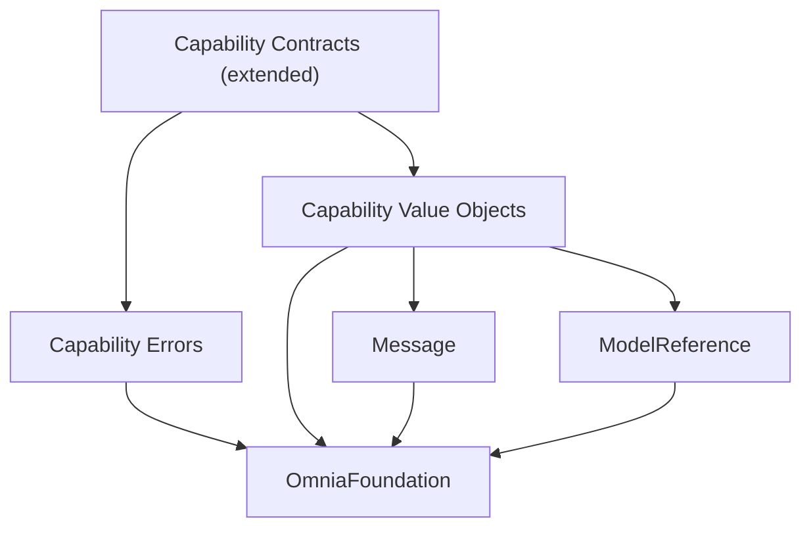

# Domain Sprint 2 Roadmap

> The implementation roadmap for Domain Sprint 2: extend the frozen Domain capability contract with concrete, provider-agnostic capability methods for Text Generation, Conversation, and Streaming — the contract the Infrastructure adapters implement and the Application layer consumes.

## Purpose

This document is the roadmap for Domain Sprint 2. It defines what the sprint delivers, the capability-contract extension to be frozen, the order of implementation, and the criteria that mark the sprint complete. It is the planning artifact that `PROJECT_STATE.md` points to for Domain Sprint 2, and the direct successor to `DOMAIN_SPRINT_1_ROADMAP.md` and the prerequisite of `INFRASTRUCTURE_SPRINT_2_ROADMAP.md`.

It is read by the engineers and AI agents who execute the sprint. It does not replace the architecture or the frozen Domain API specification; it sequences a specification revision against them.

## Scope

This roadmap covers the OmniaDomain package only: the Domain surfaces of the Provider, Storage, Configuration, Authentication, Workspace, and Conversation modules (`ARC-009`). It extends exactly one category of the frozen contract — the capability contract of `DES-009` §3.1 — and changes nothing else.

It does not cover the Infrastructure, Application, Presentation, or application-shell packages. It does not define package manifests, targets, or folder structures; those belong to the future WORKSPACE_STRUCTURE document (`ARC-008`, `ARC-009`).

## Sprint Objective

Extend the frozen Domain capability contract so providers are actually consumable: today `TextGenerationContract`, `ConversationContract`, and `StreamingContract` are empty marker protocols (`DES-009` §3.1); the concrete capability call methods are deferred until the Domain contract is extended (`DES-010` §3.6, `DES-010` §3.8). Domain Sprint 2 delivers that extension — the provider-agnostic request, response, and streaming value objects plus the concrete methods on the three realized capabilities — so Infrastructure Sprint 2 can implement the concrete provider capabilities and Application Sprint 1 can orchestrate the send-message flow (`ARC-001`).

The sprint follows the contract-first discipline of the Foundation and Domain sprints:

1. **Revise and freeze** the OmniaDomain public API contract (`Documentation/Design/DOMAIN_API.md`, DES-009) from v0.2.0 to v0.3.0, reviewed against the architecture and ratified as a specification revision. The initial contract is frozen as Domain API Freeze v1 (`DES-009` §6.3); a change to a frozen public API requires a specification revision, and this revision is additive and backward-compatible (`DES-009` §6.3).
2. **Implement** the extension against the revised contract, keeping the package building and its tests green at every step, and preserving the existing Domain API unchanged.

The sprint is complete when the extension is ratified and implemented, the existing Domain API is untouched, and all tests pass. The precedent for the two stages is the Domain Sprint 1 contract-first discipline recorded in `PROJECT_STATE.md`.

## Sprint Stages

### Stage 1 — Domain Capability Contract Extension Specification and Freeze

1. Revise `Documentation/Design/DOMAIN_API.md` (DES-009) from v0.2.0 to v0.3.0, adding the capability contract extension of the Requirements section: the capability request, response, and streaming value objects; the capability errors; and the concrete methods on the three realized capability contracts.
2. Review the revision with the Documentation workflow and the documentation review checklist, and verify it against `ARC-002`, `ARC-004`, `ARC-007`, `ARC-008`, `ARC-009`, `ADR-0001`/`ADR-0002`, and the existing frozen `DES-009`.
3. Record the freeze. From that point, the extension is part of the frozen contract and a further change requires another specification revision, exactly as Domain API Freeze v1 does (`PROJECT_STATE.md`).

Milestone: **Domain Capability Contract Extension Freeze** — ratified on 2026-08-05; `DES-009` v0.3.0 status is Ratified and the revision is recorded in `PROJECT_STATE.md`.

### Stage 2 — Implementation

Implement the extension in the order defined in the Implementation Order section. Each step adds domain types and leaves the package building with its tests green (`PROJECT_STATE.md` next-tasks rule). No implementation step precedes the review of the corresponding contract in the specification.

## Requirements

The requirements derive from the capability model of `ARC-004`, the conversation flows of `ARC-001`, the existing Domain vocabulary of `DES-009`, and the deferred concrete-capability item of `DES-010` §3.6. The Domain expresses what the application needs in the application's own terms; it never references a provider (`ARC-004`).

### The Capability Extension

The extension makes the three realized capabilities concrete (`DES-009` §3.1). It is:

- **Provider-agnostic** — expressed entirely in terms the Domain already owns: `Message`, `ModelReference`, and the capability model (`ARC-004`, `DES-009` §3.1, §3.8).
- **Additive and backward-compatible** — the existing public API is not modified; the extension only realizes the already-declared capability contracts (`DES-009` §6.3).
- **Contract-only** — the Domain declares the contract; the Infrastructure adapters implement it in Infrastructure Sprint 2 (`ARC-002`, `ARC-009`).
- **Typed and explicit** — every operation that can fail declares a typed failure; nothing fails silently (`ARC-001`, `DES-009` §3.9).

### Capability Value Objects

The revision adds the value objects the concrete methods require, built on the existing Domain vocabulary and the Foundation primitives of Section 4 of `DES-009`:

| Value Object | Purpose | Grounding |
|---|---|---|
| Text generation request | Producing text from a prompt: the prompt and the requested model. | `ARC-004` Text Generation; `DES-009` §3.1, §3.8. |
| Text generation response | The produced text. | `ARC-004` Text Generation. |
| Conversation request | Multi-turn interaction with context: the message history and the requested model. | `ARC-004` Conversation; `ARC-001` conversation flows; `DES-009` §3.3. |
| Conversation response | The assistant's reply, expressed as the existing `Message` value object so it appends to the history. | `DES-009` §3.3, §3.8. |
| Streaming request | Incremental delivery of generated content: the message history and the requested model. | `ARC-004` Streaming; `ARC-001` streaming flows. |
| Streaming updates | The incremental delivery events: content deltas, the completion event carrying the assembled assistant message, and the interruption event carrying the preserved partial content. | `ARC-004` Streaming; `ARC-001` Streaming Interrupted; `DES-009` §3.3. |

Every value object is immutable and equal by content (`ARC-003`), carries typed identities and model references built on the Foundation primitives (`DES-004`, `DES-002`), and contains no provider-specific concept (`ARC-004`).

### Capability Errors

The revision adds the typed failure surface for the capability operations, built on the Foundation error abstraction (`DES-009` §3.9):

- a capability error declaring that a provider cannot deliver the requested capability or its response could not be decoded, in Domain terms — the capability-level abstraction of a failed contract, exactly as `RepositoryError.storageUnavailable` abstracts a failed repository (`DES-009` §3.9);
- credential-resolution failures surface as the existing Domain `CredentialStorageError`, never as a new error (`DES-009` §3.7, §3.9).

The Domain never declares the failures of a concrete provider, a concrete transport, or a concrete storage technology (`DES-009` §3.9); the capability error carries no provider detail.

### The Concrete Contract Methods

The revision realizes the three capability contracts with concrete, typed methods (`ARC-004`, `ARC-003` naming):

- **Text Generation** — a method that produces text from a request and returns the text generation response.
- **Conversation** — a method that sends the conversation request (the message history) and returns the conversation response, the assistant `Message` to append to the history.
- **Streaming** — a method that returns the stream of streaming updates; the stream delivers content deltas, ends with the completion event carrying the assembled assistant message, and on interruption ends with the interruption event carrying the preserved partial content.

Each method is `async throws`, typed against the new value objects, and expresses its failures in the typed errors above (`ARC-001`, `DES-009` §3.9).

### Streaming Behavior

The streaming contract honors the failure philosophy of `ARC-001` and the streaming-state invariants of `DES-009` §3.3:

- Partial content is never silently discarded; interruption preserves it as incomplete content.
- The full conversation history is always preserved; the completion event carries the assembled assistant message so the Application layer can persist it.
- Interruption is cooperative through the stream lifecycle and the Foundation cancellation primitive (DES-008, `DES-009` §4); it requires no provider-specific concept.

### Dependency Graph

The package dependency graph is unchanged (`DES-009` §4):

- OmniaDomain continues to depend only on OmniaFoundation among Omnia packages (`ARC-009`).
- The extension uses only existing Domain types (`Message`, `ModelReference`) and the Foundation primitives already permitted by `DES-009` §4 — the cancellation primitive for streaming interruption and the clock abstraction where time is required.
- The internal type dependency graph remains acyclic; the capability value objects depend only on the existing vocabulary and never on the contracts that are extended (`ARC-002`, `ARC-007`, `ARC-009`).

### Implementation Order

The order is bottom-up by dependency. Each step leaves the package building and its tests green.

1. **Domain capability contract extension specification and freeze** — `DES-009` v0.2.0 to v0.3.0 written, reviewed, and frozen (Domain Capability Contract Extension Freeze).
2. **Capability value objects** — the text generation, conversation, and streaming request/response value objects and the streaming updates, built on the existing Domain vocabulary.
3. **Capability errors** — the typed capability failure surface on the Foundation error abstraction.
4. **Capability contract extension** — the concrete methods on `TextGenerationContract`, `ConversationContract`, and `StreamingContract`.
5. **Package verification** — full unit-test pass for every new type and contract method; dependency verification that OmniaDomain depends only on OmniaFoundation; layer verification that no UI, networking, or persistence framework is imported and no provider-specific type enters the package; confirmation that the internal dependency graph is acyclic and that the existing Domain API is unchanged (`ARC-002`, `ARC-004`, `ARC-007`, `ARC-008`, `ARC-009`).

### Completion Criteria

The sprint is complete when all of the following hold:

- The capability contract extension specification is written, reviewed, and frozen (**Domain Capability Contract Extension Freeze**, `DES-009` v0.3.0 Ratified).
- The three realized capability contracts carry concrete, provider-agnostic methods; the capability value objects and capability errors exist and are tested.
- The existing Domain API is unchanged; the existing Domain test suite remains green and no existing public type or method is modified (`DES-009` §6.3).
- OmniaDomain depends only on OmniaFoundation, and its internal dependency graph is acyclic (`ARC-009`).
- No forbidden dependency exists: no SwiftUI, networking, persistence, provider implementation, or provider-specific type enters the Domain layer (`ARC-002`, `ADR-0001`, `ADR-0002`, `ARC-004`).
- The package builds and all unit tests pass, verified with the standard build/test pipeline.
- Documentation is updated: `PROJECT_STATE.md` records Domain Sprint 2 progress, and the roadmap reference in `README.md` resolves to this document.

## Non-Goals

The following are explicitly out of scope for Domain Sprint 2:

- **No Infrastructure implementation** — no provider adapters, no networking, no concrete capability calls. The adapters implement the extended contract in Infrastructure Sprint 2 (`ARC-002`, `ARC-009`).
- **No Application, Presentation, or shell** — no use cases, no application services, no UI, no Composition Root (`ARC-002`, `ARC-009`).
- **No new capabilities** — the remaining ARC-004 capabilities (Vision, Image Generation, Embeddings, Tool Calling, Structured Output, Audio, Reasoning) remain declared extension points and are not realized (`ARC-004`, `DES-009` §3.1).
- **No change to the rest of the frozen Domain API** — aggregates, repository protocols, the configuration model, the credential storage protocol, the domain services, and the policies are not modified (`DES-009` §6.3).
- **No change to the frozen Foundation API** — the DES-001..DES-008 contracts are the existing contract and are not modified.
- **No out-of-scope domain concepts** — Attachments, Prompt Library, Voice, and Plugins remain future extension points (`ARC-001`) and are not modeled here.
- **No new packages** — the package set is fixed at six (`ARC-009`).
- **No platform coupling** — the Domain remains testable without a network, a device, or a UI (`ARC-001`).

## Related Documents

- `README.md`
- `Documentation/Product/PRODUCT_CHARTER.md`
- `Documentation/Product/PRODUCT_PRINCIPLES.md`
- `Documentation/Product/VISION.md`
- `Documentation/Product/Roadmap/DOMAIN_SPRINT_1_ROADMAP.md`
- `Documentation/Product/Roadmap/INFRASTRUCTURE_SPRINT_1_ROADMAP.md`
- `Documentation/Product/Roadmap/INFRASTRUCTURE_SPRINT_2_ROADMAP.md`
- `Documentation/Architecture/02_LAYERED_ARCHITECTURE.md`
- `Documentation/Architecture/03_MODULE_MODEL.md`
- `Documentation/Architecture/04_AI_PROVIDER_ARCHITECTURE.md`
- `Documentation/Architecture/07_MODULE_STRUCTURE.md`
- `Documentation/Architecture/08_PACKAGE_MODEL.md`
- `Documentation/Architecture/09_PACKAGE_STRUCTURE.md`
- `Documentation/Architecture/ADR/ADR-0001-architectural-style.md`
- `Documentation/Architecture/ADR/ADR-0002-dependency-direction.md`
- `Documentation/Design/DOMAIN_API.md`
- `Documentation/Design/INFRASTRUCTURE_API.md`
- `project state`
