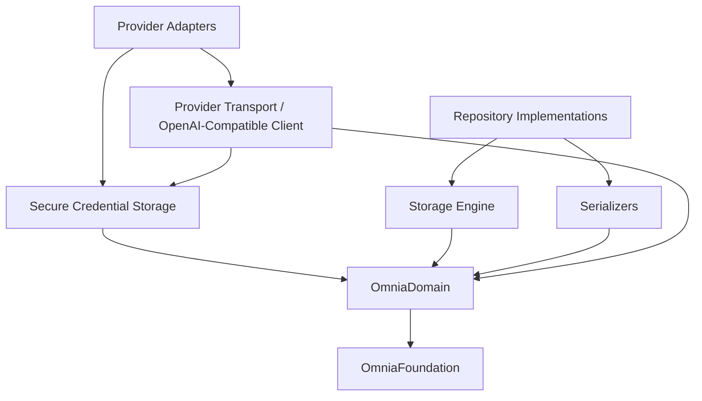

# Infrastructure Sprint 1 Roadmap

> The implementation roadmap for Infrastructure Sprint 1: specify, freeze, and implement the OmniaInfrastructure package — the implementations of the Domain contracts and the platform services.

## Purpose

This document is the roadmap for Infrastructure Sprint 1. It defines what the sprint delivers, the concrete implementations to be built, the contract to be frozen, the order of implementation, and the criteria that mark the sprint complete. It is the planning artifact that `PROJECT_STATE.md` points to for "Infrastructure implementation per the implementation roadmap", and the direct successor to `DOMAIN_SPRINT_1_ROADMAP.md`.

It is read by the engineers and AI agents who execute the sprint. It does not replace the architecture or the future Infrastructure API specification; it sequences the work against them.

## Scope

This roadmap covers the OmniaInfrastructure package only: the Infrastructure layer surfaces of the Provider, Storage, Configuration, and Authentication modules (`ARC-009`). It defines what is built in Infrastructure Sprint 1 and the order in which it is built.

It does not cover the Application, Presentation, or application-shell packages. The Composition Root that assembles the concrete implementations is owned by OmniaApp (`ARC-006`, `ARC-009`) and is out of scope here; this sprint only exposes the implementations for composition. It does not define package manifests, targets, or folder structures; those belong to the future WORKSPACE_STRUCTURE document (`ARC-008`, `ARC-009`).

## Sprint Objective

Deliver the OmniaInfrastructure package — the implementations of the Domain contracts and the platform services: repository implementations, secure credential storage, provider adapters, networking, keychain, and serializers (`ARC-009`) — following the same contract-first discipline the Foundation and Domain used:

1. **Specify and freeze** the OmniaInfrastructure public API contract (`Documentation/Design/INFRASTRUCTURE_API.md`, DES-010 — the next document in the DES series after `DOMAIN_API.md`), reviewed against the architecture and ratified as a frozen contract.
2. **Implement** the OmniaInfrastructure package against the frozen contract and against the frozen Domain API (`DES-009`), bottom-up, in dependency order, keeping the package building and its tests green at every step.

The sprint is complete when the frozen contract is fully implemented, the package depends only on OmniaDomain and OmniaFoundation, and all tests pass. The Domain precedent for the two stages is `DOMAIN_API.md` (DES-009) and the Domain Sprint 1 implementation recorded in `PROJECT_STATE.md`.

## Sprint Stages

### Stage 1 — Infrastructure API Specification and Freeze

1. Draft the OmniaInfrastructure public API contract specification (`Documentation/Design/INFRASTRUCTURE_API.md`, DES-010), covering the concrete implementations exposed for composition by the Composition Root (`ARC-009`): the storage engine and repository implementations, the aggregate serializers, the secure credential storage, the provider transport and the OpenAI-compatible client, and the provider adapters.
2. Review the specification with the Documentation workflow (`.ai/prompts/workflows/documentation.md`) and the documentation review checklist (`.ai/checklists/documentation-review.md`), and verify it against `ARC-002`, `ARC-004`, `ARC-005`, `ARC-006`, `ARC-008`, `ARC-009`, `ADR-0001`/`ADR-0002`, and the frozen `DES-009`.
3. Record the freeze. From that point, a change to the public contract requires a specification revision, exactly as the Domain API Freeze v1 does (`PROJECT_STATE.md`).

Milestone: **Infrastructure API Freeze v1** — `DES-010` status is Ratified and the freeze is recorded in `PROJECT_STATE.md`.

### Stage 2 — Implementation

Implement the package in the order defined in the Implementation Order section. Each step adds Infrastructure types and leaves the package building with its tests green (`PROJECT_STATE.md` next-tasks rule). No implementation step precedes the review of the corresponding contract in the specification.

## Requirements

The requirements derive from the layer responsibilities of `ARC-009` and the Domain contracts of `DES-009`. Infrastructure implements contracts; it never defines them (`ARC-002`, `ARC-009`).

### Scope Decisions

Three engineering decisions scope the sprint, recorded here for the plan:

- **Storage technology** — a file-based JSON document store over Foundation file APIs (`ARC-005`). Storage is a replaceable technology: the repositories hide it behind the Domain protocols (`DES-009` §3.5), and nothing above Infrastructure depends on it (`ARC-002`, `ARC-005`). File-based JSON keeps the package buildable and testable on the Linux build/CI environment with no platform coupling.
- **Provider networking** — a `ProviderTransport` abstraction plus an OpenAI-compatible HTTP client, request/response models, JSON serialization, and streaming primitives, delivered behind adapter shells that conform to the Domain capability contracts (`ARC-004`). The Domain capability contracts (`TextGenerationContract`, `ConversationContract`, `StreamingContract`) are empty marker protocols today; the adapters implement the transport seam now and the concrete call methods when the Domain contract is extended (`ARC-004`, `DES-009` §3.1).
- **Secure credential storage** — a platform backend seam for `CredentialStorageProtocol` (`DES-009` §3.7): a Keychain backend on Apple platforms and an in-memory backend for the Linux build and tests. Credentials never leave the device and never enter logs (`ARC-001`, `ARC-005`).

### Repository Implementations

Concrete implementations of the four Domain repository protocols (`DES-009` §3.5), persisted through the file-based storage engine:

| Repository Protocol | Stored Aggregate | Notes |
|---|---|---|
| WorkspaceRepository | Workspace | Stores the whole aggregate by identity (`DES-009` §3.4). |
| ConversationRepository | Conversation + message history | Stores the whole aggregate including full history (`DES-009` §3.3). |
| ProviderRepository | Provider | Stores connection and lifecycle state; never credentials (`DES-009` §3.1, `ARC-005`). |
| ConfigurationRepository | Configuration values | Stores typed values per level; never credentials or secrets (`DES-009` §3.6, `ARC-005`). |

Constraints on every implementation:

- Repositories own no business rules (`ARC-005`); they store and restore aggregates exactly as the contracts declare.
- Stored data is user-owned: exportable and removable by the user (`ARC-005`).
- Credentials are isolated from application data; configuration holds `CredentialReference` pointers, never secrets (`ARC-004`, `ARC-005`).
- Storage failures are translated into the Domain `RepositoryError.storageUnavailable` (`DES-009` §3.9).

### Serializers

Infrastructure-owned DTOs and JSON serializers that map the Domain aggregates (which are not Codable) to and from their stored representation. Serialization is the persistence mechanism of `ARC-009` Storage; it is internal to the package and never carries credentials (`ARC-001`).

### Secure Credential Storage

The `CredentialStorageProtocol` implementation (`DES-009` §3.7) over a platform backend seam:

- **Keychain backend** — on Apple platforms, storing `Credential` values under `CredentialReference` in the system Keychain (`ARC-005`).
- **In-memory backend** — for the Linux build and automated tests.
- The implementation honors the contract failures exactly: `credentialNotFound` and `storageUnavailable` (`DES-009` §3.9), and never logs secret material (`ARC-001`).

### Provider Transport and OpenAI-Compatible Client

The networking foundation of the Provider module's Infrastructure surface (`ARC-009`):

- **ProviderTransport** — a protocol that isolates HTTP interaction behind a seam, so the client is testable without a network (`ARC-001`, `ARC-006`).
- **OpenAI-compatible HTTP client** — request construction, response decoding, streaming delivery, and error translation, for OpenAI-compatible endpoints (`PRODUCT_CHARTER`, `ARC-004`).
- **Request/response models and JSON serialization** — internal DTOs for chat-completions requests and responses (`ARC-004`).
- Failures are surfaced in the terms the Domain owns; provider and transport failures are translated, never leaked as raw values (`DES-009` §3.9, `ARC-004`).
- Requests use credentials by reference, resolved through the credential storage; secrets never enter logs or request metadata (`ARC-001`, `ARC-005`).

### Provider Adapters

Adapter shells that conform to the Domain capability contracts — `TextGenerationContract`, `ConversationContract`, `StreamingContract` (`DES-009` §3.1, `ARC-004`):

- Adapters contain no business logic (`ARC-004`).
- Adapters expose capabilities in Omnia's terms and surface failures in Domain terms (`ARC-004` Adapter Model).
- Live availability is reported by the Infrastructure layer, never by the Domain (`ARC-004` Capability Discovery, `DES-009` §3.1).
- Provider-specific code is confined to the adapters (`ARC-004`, `ARC-009`).

### Dependency Graph

The package depends only on OmniaDomain, whose contracts it implements, and OmniaFoundation (`ARC-009`):

Notes on the graph:

- Everything in the package depends on the Domain contracts, never the reverse (`ARC-002`).
- The transport, the storage engine, and the serializers are composed into the repositories and adapters; nothing above the package references them directly (`ARC-009`).
- OmniaFoundation provides the shared primitives only: Logger, Clock, Cancellation, and Environment; no platform coupling enters through it (`ARC-002`, `DES-006`).

### Implementation Order

The order is bottom-up by dependency. Each step leaves the package building and its tests green.

1. **Infrastructure API specification and freeze** — `DES-010` written, reviewed, and frozen (Infrastructure API Freeze v1).
2. **Storage engine foundation** — the file-based JSON document store: save, load, delete, and list by identity; JSON serialization plumbing; storage-error translation to `RepositoryError.storageUnavailable`.
3. **Aggregate serializers** — Infrastructure-owned DTOs and JSON serializers for Workspace, Conversation (with message history), Provider, and configuration values; never credentials.
4. **Workspace and Conversation repository implementations** — over the storage engine and serializers.
5. **Provider repository implementation** — connection and lifecycle state, never credentials.
6. **Configuration repository implementation** — typed values per `ConfigurationLevel`, never secrets.
7. **Secure credential storage** — the `CredentialStorageProtocol` implementation with the platform backend seam (Keychain + in-memory).
8. **Provider transport and OpenAI-compatible client** — the `ProviderTransport` protocol, the HTTP client, request/response models, JSON serialization, and streaming primitives.
9. **Provider adapters** — adapter shells conforming to the capability contracts, wired to the transport and credential storage.
10. **Package verification** — full unit-test pass; dependency verification that OmniaInfrastructure depends only on OmniaDomain and OmniaFoundation; layer verification that no UI framework or business rules enter the package; confirmation that the internal dependency graph is acyclic (`ARC-002`, `ARC-004`, `ARC-008`, `ARC-009`).

### Completion Criteria

The sprint is complete when all of the following hold:

- The Infrastructure API specification is written, reviewed, and frozen (**Infrastructure API Freeze v1**).
- The OmniaInfrastructure package implements the frozen contract and the frozen Domain API (`DES-009`).
- The four repository implementations, the aggregate serializers, the secure credential storage, the provider transport and OpenAI-compatible client, and the provider adapters exist and are tested.
- OmniaInfrastructure depends only on OmniaDomain and OmniaFoundation, and its internal dependency graph is acyclic (`ARC-009`).
- No forbidden dependency exists: no UI framework, no business rules, no presentation state (`ARC-002`, `ADR-0001`, `ADR-0002`); no provider API leaks above the package (`ARC-004`).
- Credentials never leave the device and never enter logs (`ARC-001`, `ARC-005`).
- The package builds and all unit tests pass, verified with the standard build/test pipeline.
- Documentation is updated: `PROJECT_STATE.md` records Infrastructure Sprint 1 progress, and the roadmap reference in `README.md` resolves to this document.

## Non-Goals

The following are explicitly out of scope for Infrastructure Sprint 1:

- **No Composition Root** — the assembly of the object graph is owned by OmniaApp (`ARC-006`); this sprint exposes implementations for composition only.
- **No Application, Presentation, or shell** — no use cases, no UI, no application services (`ARC-002`, `ARC-009`).
- **No new packages** — the package set is fixed at six (`ARC-009`).
- **No dependency-injection framework** — explicitly excluded by the architecture (`ARC-006`).
- **No business rules** — Infrastructure implements contracts; business rules belong to the Domain and Application layers only (`ADR-0001`).
- **No cloud sync** — explicitly excluded (`ARC-005`).
- **No storage technology beyond the file-based JSON document store** — replaceability is preserved by the repository contracts (`ARC-005`).
- **No capability implementations beyond the transport seam** — the Domain contracts are marker protocols today; concrete text-generation, conversation, and streaming call methods arrive when the Domain contract is extended (`ARC-004`, `DES-009` §3.1).
- **No change to the frozen Foundation or Domain API** — the DES-001..DES-009 contracts are the existing contract and are not modified.

## Related Documents

- `README.md`
- `Documentation/Product/Roadmap/DOMAIN_SPRINT_1_ROADMAP.md`
- `Documentation/Product/PRODUCT_CHARTER.md`
- `Documentation/Product/PRODUCT_PRINCIPLES.md`
- `Documentation/Product/VISION.md`
- `Documentation/Architecture/01_SYSTEM_OVERVIEW.md`
- `Documentation/Architecture/02_LAYERED_ARCHITECTURE.md`
- `Documentation/Architecture/03_MODULE_MODEL.md`
- `Documentation/Architecture/04_AI_PROVIDER_ARCHITECTURE.md`
- `Documentation/Architecture/05_LOCAL_STORAGE_ARCHITECTURE.md`
- `Documentation/Architecture/06_DEPENDENCY_INJECTION.md`
- `Documentation/Architecture/07_MODULE_STRUCTURE.md`
- `Documentation/Architecture/08_PACKAGE_MODEL.md`
- `Documentation/Architecture/09_PACKAGE_STRUCTURE.md`
- `Documentation/Architecture/ADR/ADR-0001-architectural-style.md`
- `Documentation/Architecture/ADR/ADR-0002-dependency-direction.md`
- `Documentation/Design/DOMAIN_API.md`
- `.ai/context/PROJECT_STATE.md`
