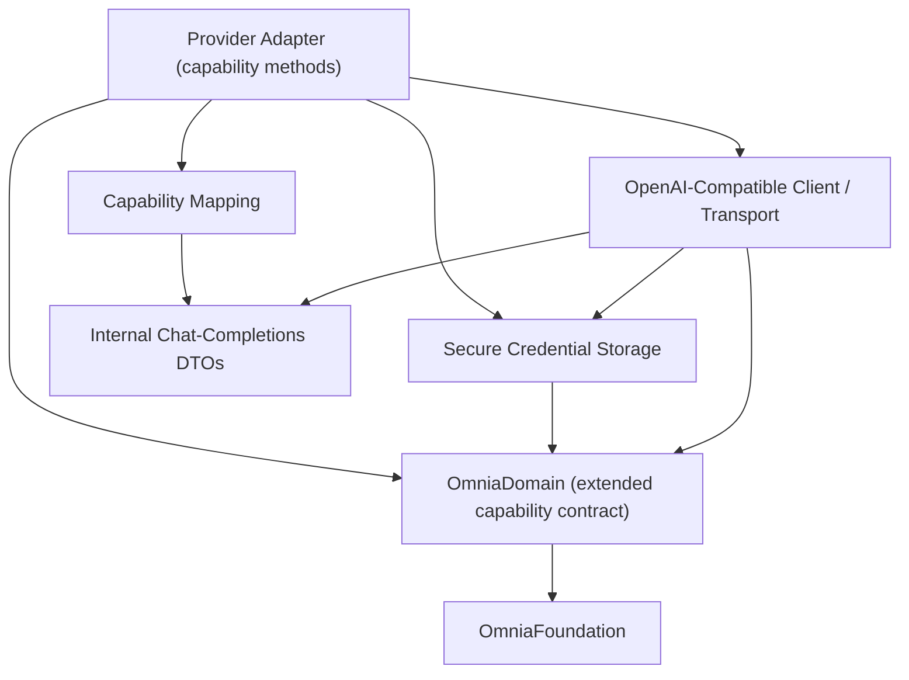

# Infrastructure Sprint 2 Roadmap

> The implementation roadmap for Infrastructure Sprint 2: implement the concrete provider capabilities — Text Generation, Conversation, and Streaming — in the OpenAI-compatible adapter against the extended Domain capability contract and the existing transport seam.

## Purpose

This document is the roadmap for Infrastructure Sprint 2. It defines what the sprint delivers, the concrete capability implementations to be built, the contract revision to be frozen, the order of implementation, and the criteria that mark the sprint complete. It is the planning artifact that `PROJECT_STATE.md` points to for "Infrastructure implementation per the implementation roadmap", and the direct successor to `INFRASTRUCTURE_SPRINT_1_ROADMAP.md` and the dependent of `DOMAIN_SPRINT_2_ROADMAP.md`.

It is read by the engineers and AI agents who execute the sprint. It does not replace the architecture or the frozen Infrastructure API specification; it sequences a specification revision against them.

## Scope

This roadmap covers the OmniaInfrastructure package only: the Infrastructure layer surfaces of the Provider, Storage, Configuration, and Authentication modules (`ARC-009`). It extends exactly one surface of the frozen contract — the provider adapter of `DES-010` §3.6 — with the concrete capability call methods deferred by `DES-010` §3.8, and changes nothing else.

It does not cover the Application, Presentation, or application-shell packages. The Composition Root that assembles the concrete implementations is owned by OmniaApp (`ARC-006`, `ARC-009`) and is out of scope here. It does not define package manifests, targets, or folder structures; those belong to the future WORKSPACE_STRUCTURE document (`ARC-008`, `ARC-009`).

## Sprint Objective

Turn the provider adapter shell into the working AI client backend. Infrastructure Sprint 1 delivered the storage engine, repositories, serializers, secure credential storage, the provider transport seam, the OpenAI-compatible client with SSE streaming, and the provider adapter shells — but the adapter (`OpenAICompatibleProviderAdapter`) is a shell that conforms to the three Domain capability contracts and implements only availability reporting (`DES-010` §3.6). The concrete capability call methods were explicitly held back until the Domain capability contract is extended (`DES-010` §3.6, `DES-010` §3.8). Domain Sprint 2 delivers that extension (`DES-009` v0.3.0); Infrastructure Sprint 2 implements it.

The sprint follows the same contract-first discipline the previous sprints used:

1. **Revise and freeze** the OmniaInfrastructure public API contract (`Documentation/Design/INFRASTRUCTURE_API.md`, DES-010) from v1.0.0 to v1.1.0, specifying the adapter's concrete capability surface, reviewed against the architecture and ratified as an additive, backward-compatible revision (`DES-010` §6.3).
2. **Implement** the concrete capabilities against the revised contract and the extended Domain API (`DES-009` v0.3.0), over the existing transport seam, keeping the package building and its tests green at every step.

The sprint is complete when the revision is ratified, the three concrete capabilities are implemented and tested, the package still depends only on OmniaDomain and OmniaFoundation, and all tests pass.

## Sprint Stages

### Stage 1 — Infrastructure Capability Specification and Freeze

1. Revise `Documentation/Design/INFRASTRUCTURE_API.md` (DES-010) from v1.0.0 to v1.1.0, adding the adapter's concrete capability surface of the Requirements section: the three call methods, the mapping between the Domain capability types and the internal DTOs, the error-translation rules, and the streaming lifecycle.
2. Review the revision with the Documentation workflow (`.ai/prompts/workflows/documentation.md`) and the documentation review checklist (`.ai/checklists/documentation-review.md`), and verify it against `ARC-002`, `ARC-004`, `ARC-005`, `ARC-006`, `ARC-008`, `ARC-009`, `ADR-0001`/`ADR-0002`, the extended `DES-009` v0.3.0, and the existing frozen `DES-010`.
3. Record the freeze. From that point, the revision is part of the frozen contract; a further change requires another specification revision, exactly as Infrastructure API Freeze v1 does (`PROJECT_STATE.md`).

Milestone: **Infrastructure Capability Freeze** — ratified on 2026-08-05; `DES-010` v1.1.0 status is Ratified and the revision is recorded in `PROJECT_STATE.md`.

### Stage 2 — Implementation

Implement the concrete capabilities in the order defined in the Implementation Order section. Each step adds Infrastructure types and leaves the package building with its tests green (`PROJECT_STATE.md` next-tasks rule). No implementation step precedes the review of the corresponding contract in the specification.

## Requirements

The requirements derive from the layer responsibilities of `ARC-009`, the provider architecture of `ARC-004`, the capability contract extension of `DES-009` v0.3.0, and the transport and client foundation of `DES-010` §3.5 delivered by Infrastructure Sprint 1. Infrastructure implements contracts; it never defines them (`ARC-002`, `ARC-009`).

### The Adapter Capability Surface

The revision adds the three concrete capability call methods to `OpenAICompatibleProviderAdapter` (`DES-010` §3.6), each conforming to the extended Domain capability contract (`DES-009` v0.3.0):

- **Text generation** — accepts the Domain text generation request, performs a non-streaming chat-completions request through the OpenAI-compatible client, and returns the Domain text generation response.
- **Conversation** — accepts the Domain conversation request (the message history), performs a non-streaming chat-completions request, and returns the Domain conversation response, the assistant `Message` to append to the history.
- **Streaming** — accepts the Domain streaming request, delivers the streaming updates from the client's stream, ends with the completion event carrying the assembled assistant message, and on interruption ends with the interruption event carrying the preserved partial content.

The adapter owns no business logic and no application state (`ARC-004` Adapter Model). Availability reporting (`isAvailable`) is unchanged (`DES-010` §3.6).

### Request/Response Mapping

The Domain capability types are translated to and from the internal chat-completions DTOs delivered by Infrastructure Sprint 1 (`ChatCompletionRequest`, `ChatCompletionResponse`, `ChatCompletionChunk`):

- The mapping is confined to the adapter's own translation layer; the DTOs remain internal to the package (`ARC-004`, `DES-010` §3.5).
- Provider-specific request, response, and chunk shapes never cross the package boundary (`ARC-004`, `DES-010` §2.2); only Domain capability types are exposed.
- The serialized form of the wire protocol follows the frozen transport contract; no provider API leaks above the adapters (`ARC-004`, `DES-010` §3.5).

### Error Translation

Every failure is surfaced in the terms the Domain owns; raw platform, transport, or provider errors are never exposed (`ARC-004`, `DES-009` §3.9, `DES-010` §3.7):

- Transport and decoding failures are translated into the Domain capability errors of `DES-009` v0.3.0 (provider unavailable, invalid request, invalid response).
- Credential-resolution failures surface as the Domain `CredentialStorageError`; they are never wrapped or redefined (`DES-009` §3.7, §3.9).
- No operation fails silently (`ARC-001`).

### Streaming Behavior

The streaming capability honors the failure philosophy of `ARC-001` and the streaming-state invariants of `DES-009` §3.3:

- Content deltas are delivered incrementally from the client's SSE stream (CRLF-normalized decoding delivered in Infrastructure Sprint 1).
- The completion event carries the assembled assistant message so the Application layer can persist it.
- Interruption preserves partial content as incomplete content; it is never silently discarded (`ARC-001` Streaming Interrupted).
- Interruption is cooperative through the stream lifecycle and the Foundation cancellation primitive (DES-008); a cancelled stream ends with the interruption event, not a lost response.

### Credential Hygiene

The concrete capabilities preserve the credential discipline of the transport client (`DES-010` §3.4, §3.5):

- Credentials are used by reference and resolved through the credential storage only when a request is built.
- Secrets never enter logs, analytics, request metadata, or any representation beyond the authorization header (`ARC-001`, `ARC-005`).
- The data store, serializers, and DTOs hold references, never secrets (`ARC-005`).

### Dependency Graph

The package dependency graph is unchanged (`DES-010` §4, `ARC-009`):

- OmniaInfrastructure continues to depend only on OmniaDomain, whose contracts it implements, and on OmniaFoundation among Omnia packages.
- The adapter consumes the extended Domain capability contract (`DES-009` v0.3.0) and the existing internal transport client.
- The internal type dependency graph remains acyclic: the adapter composes the transport client and the credential storage; nothing depends upward (`ARC-002`, `ARC-007`, `ARC-009`).

Notes on the graph:

- The adapter implements the extended Domain capability contract; it defines no contract (`ARC-002`).
- The capability mapping and the DTOs are internal to the package and are never exposed (`ARC-004`, `DES-010` §3.3, §3.5).
- The transport, the credential storage, and the Domain contracts are composed into the adapter; nothing above the package references them directly (`ARC-009`).

### Implementation Order

The order is bottom-up by dependency. Each step leaves the package building and its tests green.

1. **Infrastructure capability specification and freeze** — `DES-010` v1.0.0 to v1.1.0 written, reviewed, and frozen (Infrastructure Capability Freeze).
2. **Capability mapping** — the translation between the Domain capability types (`DES-009` v0.3.0) and the internal chat-completions DTOs, confined to the adapter's translation layer.
3. **Text generation** — the `generateText` capability over the client's non-streaming chat-completions request, with error translation.
4. **Conversation** — the `sendMessage` capability over the client's non-streaming chat-completions request with the message history, returning the assistant `Message`.
5. **Streaming** — the `stream` capability over the client's streaming request, mapping chunks to streaming updates with completion and interruption events.
6. **Package verification** — full unit-test pass; dependency verification that OmniaInfrastructure depends only on OmniaDomain and OmniaFoundation; layer verification that no UI framework, business rules, or presentation state enter the package and that no provider API leaks above the adapters; confirmation that the internal dependency graph is acyclic and that the existing public surface is unchanged (`ARC-002`, `ARC-004`, `ARC-008`, `ARC-009`).

### Completion Criteria

The sprint is complete when all of the following hold:

- The Infrastructure capability specification is written, reviewed, and frozen (**Infrastructure Capability Freeze**, `DES-010` v1.1.0 Ratified).
- The three concrete capabilities — text generation, conversation, and streaming — exist on the OpenAI-compatible adapter and are tested against the extended Domain contract (`DES-009` v0.3.0).
- Streaming interruption preserves partial content as incomplete content; no partial content is silently discarded (`ARC-001`).
- The capability mapping and the DTOs remain internal; provider APIs never leak above the package (`ARC-004`).
- OmniaInfrastructure depends only on OmniaDomain and OmniaFoundation, and its internal dependency graph is acyclic (`ARC-009`).
- No forbidden dependency exists: no UI framework, business rules, or presentation state; no provider-specific concept above the adapters (`ARC-002`, `ARC-004`, `ADR-0001`, `ADR-0002`).
- Credentials never leave the device and never enter logs; secrets are confined to the authorization header (`ARC-001`, `ARC-005`).
- The package builds and all unit tests pass, verified with the standard build/test pipeline.
- Documentation is updated: `PROJECT_STATE.md` records Infrastructure Sprint 2 progress, and the roadmap reference in `README.md` resolves to this document.

## Non-Goals

The following are explicitly out of scope for Infrastructure Sprint 2:

- **No Composition Root** — the assembly of the object graph is owned by OmniaApp (`ARC-006`); this sprint exposes the concrete capabilities for composition only.
- **No Application, Presentation, or shell** — no use cases, no UI, no application services (`ARC-002`, `ARC-009`); the send-message use case is Application Sprint 1 (milestone #8).
- **No new providers** — only the OpenAI-compatible adapter gains concrete capabilities; adapters for other provider families are future work (`ARC-004`, `PRODUCT_CHARTER`).
- **No new capabilities** — only the three realized capabilities are implemented; Vision, Image Generation, Embeddings, Tool Calling, Structured Output, Audio, and Reasoning remain extension points (`ARC-004`, `DES-009` §3.1).
- **No storage, serialization, or credential-storage changes** — repositories, serializers, and the secure credential storage are unchanged from Infrastructure Sprint 1.
- **No change to the frozen Foundation or Domain API** — the DES-001..DES-009 contracts are the existing contract and are not modified; the `DES-010` revision specified here is the only contract change.
- **No third-party packages** — native Apple APIs are preferred (SWIFT.md, `PRODUCT_CHARTER`).
- **No new packages** — the package set is fixed at six (`ARC-009`).
- **No dependency-injection framework** — explicitly excluded by the architecture (`ARC-006`).

## Related Documents

- `README.md`
- `Documentation/Product/PRODUCT_CHARTER.md`
- `Documentation/Product/PRODUCT_PRINCIPLES.md`
- `Documentation/Product/VISION.md`
- `Documentation/Product/Roadmap/INFRASTRUCTURE_SPRINT_1_ROADMAP.md`
- `Documentation/Product/Roadmap/DOMAIN_SPRINT_1_ROADMAP.md`
- `Documentation/Product/Roadmap/DOMAIN_SPRINT_2_ROADMAP.md`
- `Documentation/Architecture/02_LAYERED_ARCHITECTURE.md`
- `Documentation/Architecture/04_AI_PROVIDER_ARCHITECTURE.md`
- `Documentation/Architecture/05_LOCAL_STORAGE_ARCHITECTURE.md`
- `Documentation/Architecture/06_DEPENDENCY_INJECTION.md`
- `Documentation/Architecture/08_PACKAGE_MODEL.md`
- `Documentation/Architecture/09_PACKAGE_STRUCTURE.md`
- `Documentation/Architecture/ADR/ADR-0001-architectural-style.md`
- `Documentation/Architecture/ADR/ADR-0002-dependency-direction.md`
- `Documentation/Design/DOMAIN_API.md`
- `Documentation/Design/INFRASTRUCTURE_API.md`
- `.ai/context/PROJECT_STATE.md`
