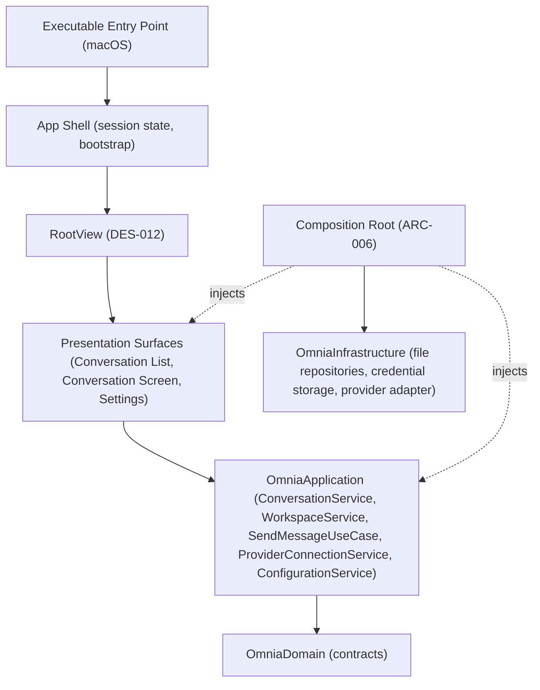

# MVP v0.1 Roadmap

> The implementation roadmap for MVP v0.1 (milestone #10): the integration of the frozen layers — Foundation, Domain, Infrastructure, Application, and Presentation — into a runnable application. OmniaApp delivers the Composition Root, the app shell, the entry point, and the lifecycle, and closes the one integration gap the frozen contract left: a conversation created through the application is never attached to a workspace's membership.

## Purpose

This document is the roadmap for MVP v0.1. It defines what the milestone delivers, the contract artifacts to be written and frozen, the integration work to be done, the order of implementation, and the criteria that mark the milestone complete. It is the planning artifact that `PROJECT_STATE.md` points to for the sprint after Presentation Sprint 1, and the direct successor to `PRESENTATION_SPRINT_1_ROADMAP.md`.

Unlike the preceding layer sprints — each of which built and verified one package in isolation — MVP v0.1 is the first integration sprint: it assembles the already-frozen packages into an application and proves the milestone definition "an OpenAI-compatible client with streaming responses" by launching on macOS.

It is read by the engineers and AI agents who execute the sprint. It does not replace the architecture or the API specifications; it sequences specifications against them.

## Scope

This roadmap covers the assembly of the existing six-package set into a runnable application (`ARC-009`). The only new package is **OmniaApp** — the sixth package the architecture always anticipated — which owns the Composition Root, the app shell, the entry point, and the lifecycle (`ARC-006`, `ARC-009`). It also covers the one additive Application and Presentation contract revision required to make the conversation flow functional (below). It spans no new capabilities, no new modules, and no new product surface.

The milestone does not include: an iOS/iPadOS/macOS platform split (the executable is a macOS app), workspace management screens (workspace application services beyond the minimal slice below remain future work), onboarding, or distribution.

## The Integration Gap

Planning review of the frozen contract surfaced one gap that blocks a functional MVP:

- `ConversationService.createConversation()` (DES-011 v1.0.0) creates and persists a conversation but does **not** attach it to a workspace's membership.
- The conversation list is driven by workspace membership: `ConversationService.conversations(in:)` enumerates `workspace.conversationIdentities` and loads each identity (DES-011 §3.2).
- The `Workspace` aggregate already supports membership by identity — `adding(conversation:)`, `adding(provider:)` — and the frozen `WorkspaceRepository` can persist it, but no application service sequences create-then-attach.
- Therefore a conversation created in the app would never appear in its own list.

Closing the gap requires a minimal application service for the workspace edge — a slice of the workspace application services that DES-011 §3.7 deferred — plus the matching conversation-create flow. Both are **additive** contract revisions, described in the Sprint Objective and specified in Stage 1.

## Sprint Objective

The five frozen packages are verified in isolation, but nothing yet runs them as one application: no Composition Root assembles the concrete Infrastructure implementations into the application services, no app shell hosts the presentation surfaces, and no entry point launches them (ARC-006, ARC-009). MVP v0.1 is the milestone that proves integration: a runnable macOS application in which the user configures a provider connection, creates a conversation, sends a message, and watches the streaming response — with all state persisted across launches (ARC-001, ARC-005).

The sprint follows the same contract-first discipline the previous sprints used:

1. **Write and freeze** the OmniaApp public contract (`Documentation/Design/APP_API.md`, DES-013 v1.0.0) — the Composition Root, the app shell, the entry point, the lifecycle, the storage layout, and the first-run bootstrap — and the **additive revisions** DES-011 v1.1.0 (the workspace application service and create-in-workspace flow) and DES-012 v1.1.0 (the conversation-list create flow). All three are reviewed against the architecture and ratified together as the App Contract Freeze v1.
2. **Implement** the revisions and the OmniaApp package against the frozen contracts, keeping every package building and its tests green at every step, and proving the milestone definition by launching the app on macOS.

The milestone is complete when the contract is frozen, the revisions are implemented and tested, OmniaApp runs on macOS, and all verification gates pass.

## Sprint Stages

### Stage 1 — App Contract Specification and Freeze

1. Write `Documentation/Design/APP_API.md` (DES-013) at v1.0.0, following the DES-011/DES-012 document structure, specifying OmniaApp's public surface: the Composition Root (`ARC-006`) and the exact object graph it assembles — the four file repositories and the credential storage, the application services, the runtime provider adapter binding, and the presentation surfaces; the storage layout (one directory per repository, rooted in the platform Application Support directory, `ARC-005`); the app shell, entry point, and lifecycle (launch → bootstrap → navigation surface → window); and the first-run bootstrap — resolve-or-create the default workspace. The Linux-testability boundary follows the OmniaInfrastructure platform-backend precedent: the Composition Root and bootstrap logic are platform-independent and testable on the Linux build; the executable entry point is isolated behind platform availability.
2. Write the **additive revision** DES-011 v1.1.0: the minimal workspace application surface — `WorkspaceService` (create a workspace, load by identity, attach a conversation/provider to membership over the frozen `WorkspaceRepository` and the aggregate's `adding(conversation:)`/`adding(provider:)` methods) and `ConversationService.createConversation(in:)` (create and attach atomically). v1.0.0 surfaces remain unchanged; the revision is additive only (`ARC-008`).
3. Write the **additive revision** DES-012 v1.1.0: the conversation-list create flow (`ConversationListSurface.create(in:)`) over the revised `ConversationService`, so a created conversation is attached to the presented workspace. v1.0.0 surfaces remain unchanged.
4. Review the documents with the Documentation workflow (`.ai/prompts/workflows/documentation.md`) and the documentation review checklist (`.ai/checklists/documentation-review.md`), and verify them against `ARC-004`, `ARC-005`, `ARC-006`, `ARC-007`, `ARC-008`, `ARC-009`, `ADR-0001`/`ADR-0002`, the frozen DES-001..DES-012 contract, and the UI standard (`.ai/standards/UI.md`).
5. Record the freeze. From that point, DES-013 v1.0.0, DES-011 v1.1.0, and DES-012 v1.1.0 are part of the frozen contract; a further change requires another specification revision, exactly as the prior API freezes do (`PROJECT_STATE.md`).

Milestone: **App Contract Freeze** — ratified; DES-013 v1.0.0, DES-011 v1.1.0, and DES-012 v1.1.0 statuses are Ratified and the freeze is recorded in `PROJECT_STATE.md`.

### Stage 2 — Implementation

Implement in the order defined in the Implementation Order section. Each step leaves every package building with its tests green (`PROJECT_STATE.md` next-tasks rule). No implementation step precedes the review of the corresponding surface in the specification.

### Stage 3 — Milestone Verification

Verify the integrated application against the frozen contract and the layer discipline, run the full test and validation suite, launch the app on macOS to confirm the milestone definition, and update the documentation.

## Requirements

The requirements derive from the milestone definition — "an OpenAI-compatible client with streaming responses" — and from the layer responsibilities and assembly rules of `ARC-006`, `ARC-007`, and `ARC-009`, the product scope of `PRODUCT_CHARTER`, and the frozen DES-001..DES-012 contract. MVP v0.1 adds no product surface: it makes the frozen surface run.

### The Application Surface (DES-013)

The contract defines the public surface of OmniaApp:

- **Composition Root** — the single assembly point that constructs the object graph: the concrete Infrastructure implementations (the four file repositories, the `SecureCredentialStorage` with the platform-appropriate backend, and the OpenAI-compatible provider adapter) injected into the application services, which are injected into the presentation surfaces (`ARC-006`, `ARC-009`). The Composition Root assembles; it owns no business logic and no orchestration beyond construction (`ARC-002`).
- **Storage layout** — one directory per repository — workspaces, conversations, providers, configuration — rooted in the platform Application Support directory, created on first launch (`ARC-005`). Credentials never enter these directories; they live in the Keychain on Apple platforms (`ARC-005`, DES-010 §3.4).
- **Runtime provider adapter binding** — the Composition Root maps a configured provider connection to a bound `OpenAICompatibleProviderAdapter` (endpoint and stored credential reference) and delivers it as the `StreamingContract`/`TextGenerationContract` the send-message use case consumes (DES-010 §3.9, DES-011 §3.3). The exact resolution mechanism — where the endpoint and credential reference are read from the provider-settings configuration — is specified in Stage 1.
- **App shell, entry point, and lifecycle** — the executable entry point launches on macOS, runs the first-run bootstrap, builds the navigation surface over the presentation surfaces (`DES-012` §3.6), and hosts `RootView` with the resolved workspace and configuration keys (DES-012 §3.5). The shell owns session state — the current workspace identity — at the application edge (DES-011 §3.2).
- **First-run bootstrap** — resolve the default workspace identity; when no workspace is stored, create and persist the default workspace. The exact mechanism — a well-known identity or a persisted configuration value — is specified in Stage 1.

### The Workspace Application Surface (DES-011 v1.1.0)

- `WorkspaceService` — create a workspace, load a workspace by identity, and attach a conversation or provider to a workspace's membership over the frozen `WorkspaceRepository` and the aggregate's value-typed membership methods; a missing workspace is never a silent failure (ARC-001).
- `ConversationService.createConversation(in:)` — create a conversation and attach it to the given workspace's membership atomically; the v1.0.0 `createConversation()` remains unchanged (additive revision, `ARC-008`).

### The Conversation Create Flow (DES-012 v1.1.0)

- `ConversationListSurface.create(in:)` — create a conversation within the presented workspace, so the created conversation is attached to the membership the list renders; the v1.0.0 `create()` remains unchanged.

### The Milestone Definition

- Launching OmniaApp on macOS presents the conversation list. The user configures an OpenAI-compatible provider connection in Settings (DES-011 §3.4), creates a conversation, sends a message, and the streaming response renders incrementally without blocking the interface, assembling the assistant message on completion and preserving partial content on interruption (DES-011 §3.3, DES-012 §3.3). The conversation list shows the created conversation; relaunching the app restores the workspace, its conversations, and the configured provider, with the credential in the Keychain (ARC-005).

### Assembly Rules

- The Composition Root is the only place concrete Infrastructure implementations are referenced; no other layer references them (ARC-006, ARC-009).
- The Composition Root owns no business logic, networking, persistence, or credential operations; it constructs and wires (ARC-002, ARC-006).
- OmniaApp depends on OmniaPresentation, OmniaApplication, OmniaInfrastructure, OmniaDomain, and OmniaFoundation — everything, by construction; the internal dependency graph stays acyclic (ARC-002, ARC-007, ARC-009).
- The presentation surfaces receive their services through the DES-012 seams; the app shell never mentions an Infrastructure implementation (DES-012 §3.6, ARC-006).

### Build and Verification Boundary

- The OmniaApp library surface — the Composition Root and the bootstrap logic — is platform-independent and MUST be tested on the Linux build environment, following the conditional-compilation precedent of OmniaInfrastructure (Keychain, URLSession) so the package builds and its testable surface runs on the standard pipeline.
- The executable entry point is Apple-platform code (a SwiftUI `@main` App), isolated behind platform availability; it is not exercised by the Linux test environment and is verified by review against the UI standard and by launching the app on macOS.
- The concrete boundary is specified in Stage 1 (DES-013); the standard build/test pipeline is the verification mechanism.

### Implementation Order

The order is bottom-up by dependency. Each step leaves every package building and its tests green.

1. **App contract specification and freeze** — DES-013 v1.0.0 and the additive revisions DES-011 v1.1.0 and DES-012 v1.1.0 written, reviewed, and frozen (App Contract Freeze).
2. **Workspace application service** — `WorkspaceService` and `ConversationService.createConversation(in:)` implemented in OmniaApplication against the frozen Domain contract, with tests (DES-011 v1.1.0).
3. **Conversation create flow** — `ConversationListSurface.create(in:)` implemented in OmniaPresentation over the revised `ConversationService`, with tests (DES-012 v1.1.0).
4. **Composition Root and storage layout** — the OmniaApp package and library target: the object graph assembly, the storage directories, the first-run bootstrap, and the runtime provider adapter binding, with tests on the Linux build (DES-013).
5. **App shell, entry point, and lifecycle** — the executable target: the SwiftUI `@main` App that launches the Composition Root, runs the bootstrap, and hosts `RootView` with the resolved workspace and configuration keys (DES-013, DES-012 §3.5).
6. **Milestone verification** — full unit-test pass across all packages; dependency verification that OmniaApp depends only on Omnia packages and that the Composition Root is the only Infrastructure reference point; layer verification that no business logic, networking, persistence, provider code, or credential operation leaves its owning layer and that the public surface matches the frozen DES-013/DES-011 v1.1.0/DES-012 v1.1.0 exactly; the Engineering Platform validation suite; and a macOS launch confirming the milestone definition — configure, create, send, stream, persist, relaunch.

### Completion Criteria

The milestone is complete when all of the following hold:

- The App Contract specification and the additive revisions are written, reviewed, and frozen (**App Contract Freeze** — DES-013 v1.0.0, DES-011 v1.1.0, DES-012 v1.1.0 Ratified).
- The workspace application surface exists: `WorkspaceService` creates and loads a workspace and attaches membership; `ConversationService.createConversation(in:)` creates and attaches atomically (DES-011 v1.1.0).
- The conversation create flow exists: a conversation created in the list belongs to the presented workspace and appears in the list (DES-012 v1.1.0).
- The Composition Root exists and is the only Infrastructure reference point in the application: it assembles the repositories, credential storage, application services, provider adapter binding, and presentation surfaces; it owns no business logic (ARC-006, ARC-009).
- The app shell, entry point, and lifecycle exist: launching OmniaApp on macOS runs the first-run bootstrap — resolving or creating the default workspace — and hosts `RootView` with the resolved workspace and configuration keys (DES-013, DES-012 §3.5).
- The milestone definition holds on a real launch: configure a provider connection, create a conversation, send a message, and watch the streaming response render incrementally; relaunching restores the workspace, its conversations, and the configured provider, with the credential in the Keychain (ARC-001, ARC-005).
- The Linux build runs the platform-independent OmniaApp surface — the Composition Root and bootstrap logic — in the standard pipeline; the executable entry point is isolated behind platform availability (DES-013).
- The package builds and all unit tests pass across all six packages, verified with the standard build/test pipeline.
- Documentation is updated: `PROJECT_STATE.md` records MVP v0.1 progress and the roadmap reference in `README.md` resolves to this document.

## Non-Goals

The following are explicitly out of scope for MVP v0.1:

- **No platform split** — the executable is a single macOS app; iOS and iPadOS app targets, with their signing and distribution concerns, are a future sprint and require an Xcode application target the repository does not yet carry.
- **No workspace management UI** — a single default workspace is bootstrapped; workspace create, list, select, rename, delete, and membership screens remain excluded (DES-011 §3.7). The minimal `WorkspaceService` exists only to make the conversation flow functional.
- **No onboarding** — first-run is a silent bootstrap of the default workspace; guided onboarding is future work.
- **No new capabilities** — vision, image, and other capability surfaces remain extension points (ARC-004); the MVP exercises the existing text-generation, conversation, and streaming contracts only.
- **No conversation editing** — renaming remains unexpressible in the frozen Domain contract and out of scope (DES-011 §3.7).
- **No cloud, sync, or multi-device** — all state is local and user-owned (ARC-005).
- **No distribution** — no app-store packaging, signing, or notarization; the app runs from the SwiftPM executable.
- **No third-party packages** — native Apple APIs are preferred (`SWIFT.md`, `PRODUCT_CHARTER`); the package set stays fixed at six (`ARC-009`).
- **No dependency-injection framework** — the Composition Root is hand-written, explicitly per the architecture (`ARC-006`).
- **No SwiftUI verification on the Linux build** — the executable entry point is Apple-platform code isolated behind platform availability and verified by review and by a macOS launch, matching the OmniaInfrastructure platform-backend isolation precedent.
- **No new business rules in any layer** — the revisions are additive surfaces over frozen contracts; the aggregate invariants remain the Domain's (ARC-008).

## Related Documents

- `README.md`
- `Documentation/Product/PRODUCT_CHARTER.md`
- `Documentation/Product/PRODUCT_PRINCIPLES.md`
- `Documentation/Product/VISION.md`
- `Documentation/Product/Roadmap/APPLICATION_SPRINT_1_ROADMAP.md`
- `Documentation/Product/Roadmap/PRESENTATION_SPRINT_1_ROADMAP.md`
- `Documentation/Architecture/01_SYSTEM_OVERVIEW.md`
- `Documentation/Architecture/02_LAYERED_ARCHITECTURE.md`
- `Documentation/Architecture/04_AI_PROVIDER_ARCHITECTURE.md`
- `Documentation/Architecture/05_LOCAL_STORAGE_ARCHITECTURE.md`
- `Documentation/Architecture/06_DEPENDENCY_INJECTION.md`
- `Documentation/Architecture/07_MODULE_STRUCTURE.md`
- `Documentation/Architecture/08_PACKAGE_MODEL.md`
- `Documentation/Architecture/09_PACKAGE_STRUCTURE.md`
- `Documentation/Architecture/ADR/ADR-0001-architectural-style.md`
- `Documentation/Architecture/ADR/ADR-0002-dependency-direction.md`
- `Documentation/Design/APPLICATION_API.md`
- `Documentation/Design/PRESENTATION_API.md`
- `.ai/context/PROJECT_STATE.md`
