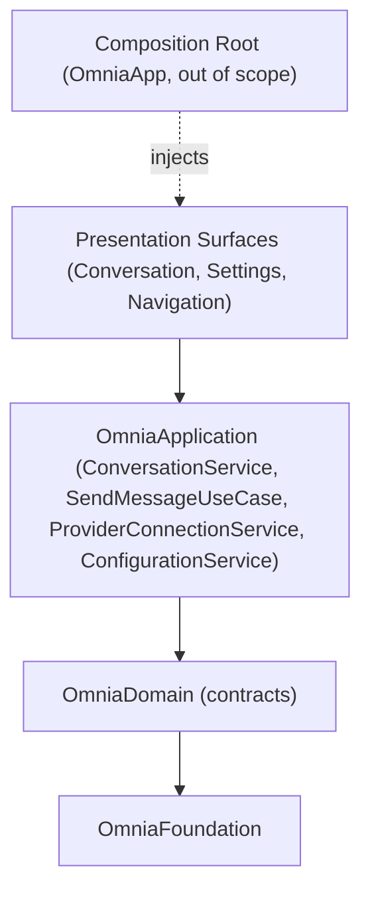

# Presentation Sprint 1 Roadmap

> The implementation roadmap for Presentation Sprint 1: the native user interface for iOS, iPadOS, and macOS — the navigation structure and the conversation and settings presentation surfaces — rendering the verified application services and the streaming send-message flow.

## Purpose

This document is the roadmap for Presentation Sprint 1. It defines what the sprint delivers, the Presentation API contract to be written and frozen, the presentation surfaces to be built, the order of implementation, and the criteria that mark the sprint complete. It is the planning artifact that `PROJECT_STATE.md` points to for the next sprint after Application Sprint 1, and the direct successor to `APPLICATION_SPRINT_1_ROADMAP.md`.

It is read by the engineers and AI agents who execute the sprint. It does not replace the architecture or the Presentation API specification; it sequences a specification against them.

## Scope

This roadmap covers the OmniaPresentation package only: the Presentation layer surfaces of the Navigation, Conversation, and Settings modules (`ARC-009`) — the navigation structure and presentation flow, the conversation presentation surface (the conversation list and the conversation screen presenting the streaming send-message flow), and the settings presentation surface (provider connections and configuration) (milestone #9: "Native UI for iOS, iPadOS, and macOS").

It does not cover the workspace presentation surface — workspace application services are a future application sprint (`DES-011` §3.7), and workspace screens arrive only when the workspace services do — nor the application shell, entry point, lifecycle, or Composition Root, all owned by OmniaApp (`ARC-006`, `ARC-009`). No Application, Infrastructure, Domain, or Foundation work happens in this sprint: no new use cases, no networking, no persistence, no provider adapters.

## Sprint Objective

The Presentation layer renders state and translates user intent into use-case invocations; it owns the navigation structure and presentation flow (`ARC-002`, `ARC-007`, `ARC-009`). Application Sprint 1 delivered the application services and the send-message use case (`DES-011` v1.0.0), but nothing yet renders them in a user-facing interface; the conversation and settings screens are the first such surfaces. The Presentation layer receives the application services it renders and owns its own presentation objects (`ARC-006`), and the style is SwiftUI, the Observation framework, and Navigation, with no business logic (`ADR-0001`).

The sprint follows the same contract-first discipline the previous sprints used:

1. **Write and freeze** the OmniaPresentation public API contract (`Documentation/Design/PRESENTATION_API.md`, DES-012 v1.0.0): the navigation structure and the conversation and settings presentation surfaces, reviewed against the architecture and ratified as Presentation API Freeze v1.
2. **Implement** the presentation surfaces against the frozen contract, consuming only the application services of `DES-011` — never the Infrastructure implementations, which are injected by the future Composition Root (`ARC-006`) — keeping the package building and its tests green at every step.

The sprint is complete when the contract is frozen, the conversation and settings presentation surfaces and the navigation structure are implemented and tested, the package depends only on OmniaApplication and OmniaFoundation, and all tests pass.

## Sprint Stages

### Stage 1 — Presentation API Specification and Freeze

1. Write `Documentation/Design/PRESENTATION_API.md` (DES-012) at v1.0.0, following the DES-011 document structure, specifying the Presentation layer's public surface: the navigation structure and presentation flow, the conversation presentation surface (conversation list: create, select, delete; the conversation screen presenting the streaming send-message flow incrementally, with Markdown rendering and code highlighting), the settings presentation surface (provider connections: configure, list, remove, with the credential boundary; configuration), the presentation value types and presentation state, the seam through which the application services of `DES-011` are delivered (`ARC-006`), and the build and verification boundary between the platform-independent presentation logic and the Apple-platform SwiftUI view layer. The Markdown rendering and code highlighting mechanism MUST be resolved and recorded per the Clarification subsection below (native Apple APIs only; no third-party packages).
2. Review the document with the Documentation workflow and the documentation review checklist, and verify it against `ARC-001`, `ARC-002`, `ARC-004`, `ARC-005`, `ARC-006`, `ARC-007`, `ARC-008`, `ARC-009`, `ADR-0001`/`ADR-0002`, the frozen `DES-011` v1.0.0, and the UI standard.
3. Record the freeze. From that point, DES-012 v1.0.0 is part of the frozen contract; a further change requires another specification revision, exactly as the prior API freezes do (`PROJECT_STATE.md`).

Milestone: **Presentation API Freeze** — ratified; `DES-012` v1.0.0 status is Ratified and the freeze is recorded in `PROJECT_STATE.md`.

### Stage 2 — Implementation

Implement the presentation surfaces in the order defined in the Implementation Order section. Each step adds OmniaPresentation types and leaves the package building with its tests green (`PROJECT_STATE.md` next-tasks rule). No implementation step precedes the review of the corresponding surface in the specification.

### Stage 3 — Package Verification

Verify the OmniaPresentation package against the frozen contract and the layer discipline, and update the documentation.

## Requirements

The requirements derive from the layer responsibilities of `ARC-009`, the dependency-injection rules of `ARC-006`, the module structure of `ARC-007`, the presentation style of `ADR-0001`, the UI standard (`project UI standards`), the product scope of `PRODUCT_CHARTER`, and the frozen application surface of `DES-011` v1.0.0. The Presentation defines no contracts and owns no business rules; it renders state and translates user intent (`ARC-002`, `ARC-009`, `ADR-0001`).

### The Presentation Surface

The contract defines the public surface of OmniaPresentation for the flows in scope (milestone #9):

- **Navigation** — the navigation structure and presentation flow that host and route between the conversation and settings surfaces (the Navigation module, one-to-one with OmniaPresentation, `ARC-007`, `ARC-009`).
- **Conversation** — the conversation list (create, select, and delete conversations over `ConversationService`, `DES-011` §3.2) and the conversation screen that presents the streaming send-message flow (`SendMessageUseCase`, `DES-011` §3.3): the Domain `StreamingUpdate` events rendered incrementally without blocking the interface, the assembled assistant message on completion, and the preserved partial content on interruption — never discarded (`ARC-001`, `PRODUCT_CHARTER`).
- **Settings** — provider connections (configure, list, and remove over `ProviderConnectionService`, `DES-011` §3.4) and configuration (typed settings over `ConfigurationService`, `DES-011` §3.5). The credential boundary is honored: the secret is never rendered, stored, or logged; only the configured state is presented (`ARC-001`, `ARC-005`).

### Native Experience

- SwiftUI views and the Observation framework, with Navigation; platform conventions for iOS, iPadOS, and macOS (`ADR-0001`).
- Follow the Apple Human Interface Guidelines; prefer native SwiftUI components over custom ones (`project UI standards`, `PRODUCT_CHARTER`).
- Accessibility: VoiceOver, Dynamic Type, keyboard navigation where appropriate, high contrast, and reduced motion (`PRODUCT_CHARTER`, `UI.md`).
- Localization: user-visible strings are localized; never hardcoded in view code (`UI.md`).

### Clarification: Markdown Rendering and Code Highlighting

Markdown rendering and code highlighting for assistant messages is an in-scope requirement (`PRODUCT_CHARTER` — Product Goals, In Scope). It is bounded by two sprint non-goals that are themselves product invariants: **no third-party packages** (native Apple APIs are preferred, `PRODUCT_CHARTER` native-first invariant, `SWIFT.md`) and **no provider-specific UI** (`PRODUCT_PRINCIPLES` — Provider Independence).

Expected approach within the constraints:

- **Markdown rendering** uses native Apple APIs only — Foundation `AttributedString` markdown parsing and native SwiftUI/TextKit rendering for inline styling (emphasis, code spans, links) and block presentation (paragraphs, lists, fenced code blocks). No third-party Markdown renderer is added.
- **Code highlighting** is realized as code-block presentation with native components — monospaced text, distinct background, preserved whitespace and wrapping — without language-aware syntax coloring. Language-aware syntax coloring requires a third-party library, which the no-third-party-packages non-goal excludes; it is not part of Presentation Sprint 1 and is introduced only through a specification revision or ADR that amends the non-goal.
- The concrete mechanism is specified and recorded in `DES-012` (Stage 1) as the single source of truth for implementation; a deviation from the constraint is a defect.

### Render State, Never Rules

- The Presentation renders state and translates user intent into use-case invocations; it owns no business logic (`ARC-002`, `ADR-0001`).
- The Presentation consumes capabilities and application services; it never mentions providers (`ARC-004`).
- The Presentation never performs networking, persistence, or credential operations; those are delivered through the application services (`ARC-002`, `ADR-0002`).

### Presentation Value Types and State

- Presentation value types are immutable, `Equatable & Sendable` value types owning no business logic (`ARC-002`).
- Presentation state is owned by the Presentation layer (`ARC-009`) and is composed from the application services it renders (`ARC-006`); it is session state, never a Domain or Application concept (`DES-011` §3.7).

### Dependency Graph

The package dependency graph is fixed (`DES-012`, `ARC-009`):

- OmniaPresentation depends only on OmniaApplication, whose services it renders, and on OmniaFoundation among Omnia packages.
- The Presentation never references Infrastructure types, provider adapters, network, or persistence. Concrete implementations are injected by the Composition Root, which is owned by OmniaApp and out of scope here (`ARC-006`).
- The internal type dependency graph remains acyclic: the presentation surfaces compose the application services; nothing depends upward (`ARC-002`, `ARC-007`, `ARC-009`).

Notes on the graph:

- The presentation surfaces consume the application services of `DES-011`; they define no contract (`ARC-002`).
- The Composition Root injects the concrete Infrastructure implementations; the Presentation never references them (`ARC-006`).
- Nothing above the package boundary of OmniaPresentation is exercised here; the application shell and Composition Root are a future sprint (`ARC-006`, `ARC-009`).

### Build and Verification Boundary

- The presentation logic surface — value types, presentation state, and the navigation model — is platform-independent and MUST be tested on the Linux build environment, following the conditional-compilation precedent of OmniaInfrastructure (Keychain, URLSession) so the package builds and its testable surface runs on the standard pipeline.
- The SwiftUI view layer is Apple-platform code, isolated behind platform availability; it is not exercised by the Linux test environment and is verified by review against the UI standard.
- The concrete boundary is specified in Stage 1 (`DES-012`); the standard build/test pipeline is the verification mechanism.

### Implementation Order

The order is bottom-up by dependency. Each step leaves the package building and its tests green.

1. **Presentation API specification and freeze** — `DES-012` v1.0.0 written, reviewed, and frozen (Presentation API Freeze).
2. **Presentation value types and state** — the platform-independent presentation vocabulary (value types, presentation state, the navigation model) built on the frozen `DES-011` surface.
3. **Conversation presentation surface** — the conversation list (create, select, delete) over `ConversationService` and the conversation screen presenting the streaming flow over `SendMessageUseCase`, with deltas rendered incrementally and Markdown rendering and code highlighting for assistant messages.
4. **Settings presentation surface** — provider connections (configure, list, remove) over `ProviderConnectionService` with the credential boundary, and configuration over `ConfigurationService`.
5. **Navigation structure and presentation flow** — the shell that hosts and routes between the conversation and settings surfaces (the Navigation module, `ARC-007`).
6. **Package verification** — full unit-test pass; dependency verification that OmniaPresentation depends only on OmniaApplication and OmniaFoundation; layer verification that no business logic, networking, persistence, provider code, or Infrastructure concept enters the package and that the public surface matches the frozen `DES-012` v1.0.0 exactly; confirmation that the internal dependency graph is acyclic, the presentation logic surface is testable on the Linux build environment, and the SwiftUI view layer is isolated behind platform availability (`ARC-002`, `ARC-004`, `ARC-006`, `ARC-009`).

### Completion Criteria

The sprint is complete when all of the following hold:

- The Presentation API specification is written, reviewed, and frozen (**Presentation API Freeze**, `DES-012` v1.0.0 Ratified).
- The conversation presentation surface exists: create, select, and delete conversations over the frozen `ConversationService` (`DES-011` §3.2); the conversation screen presents the streaming flow over `SendMessageUseCase` — deltas rendered incrementally without blocking the interface, the assembled assistant message on completion, partial content preserved on interruption — never discarded (`ARC-001`, `PRODUCT_CHARTER`).
- The settings presentation surface exists: provider connections configure, list, and remove over `ProviderConnectionService`, with the credential never rendered (`ARC-001`, `ARC-005`); configuration over `ConfigurationService` (`DES-011` §3.5).
- The navigation structure exists and routes between the conversation and settings surfaces per platform conventions (`ADR-0001`, `UI.md`).
- Markdown rendering with code highlighting exists for assistant messages (`PRODUCT_CHARTER`).
- OmniaPresentation depends only on OmniaApplication and OmniaFoundation, and its internal dependency graph is acyclic (`ARC-009`).
- No forbidden dependency exists: no business logic, networking, persistence, provider code, or Infrastructure reference; concrete implementations are injected, never referenced (`ARC-002`, `ADR-0001`, `ADR-0002`).
- The presentation logic surface is testable on the Linux build environment; the SwiftUI view layer is isolated behind platform availability.
- The package builds and all unit tests pass, verified with the standard build/test pipeline.
- Documentation is updated: `PROJECT_STATE.md` records Presentation Sprint 1 progress, and the roadmap reference in `README.md` resolves to this document.

## Non-Goals

The following are explicitly out of scope for Presentation Sprint 1:

- **No workspace presentation surface** — workspace application services are a future application sprint (`DES-011` §3.7); workspace screens arrive only when the workspace services do (`ARC-007`).
- **No Composition Root** — the assembly of the object graph is owned by OmniaApp (`ARC-006`); this sprint exposes the presentation surfaces for composition only.
- **No application shell, entry point, or lifecycle** — the app shell and the composition contract are owned by OmniaApp (`ARC-009`).
- **No Application, Infrastructure, Domain, or Foundation work** — no new use cases, no networking, no persistence, no provider adapters; the DES-001..DES-011 contracts are the existing frozen contract and are not modified; `DES-012` is the only new contract.
- **No business logic in Presentation** — business rules stay in the Domain and Application layers; the Presentation renders state and translates intent (`ADR-0001`).
- **No provider-specific UI** — the interface never changes per provider; capabilities that differ across providers are expressed through the generic application surface (`PRODUCT_PRINCIPLES` — Provider Independence).
- **No third-party packages** — native Apple APIs are preferred (`SWIFT.md`, `PRODUCT_CHARTER`).
- **No new packages** — the package set is fixed at six (`ARC-009`).
- **No dependency-injection framework** — explicitly excluded by the architecture (`ARC-006`).
- **No SwiftUI verification on the Linux build** — the SwiftUI view layer is Apple-platform code isolated behind platform availability and verified by review, matching the OmniaInfrastructure platform-backend isolation precedent.

## Related Documents

- `README.md`
- `Documentation/Product/PRODUCT_CHARTER.md`
- `Documentation/Product/PRODUCT_PRINCIPLES.md`
- `Documentation/Product/VISION.md`
- `Documentation/Product/Roadmap/APPLICATION_SPRINT_1_ROADMAP.md`
- `Documentation/Architecture/01_SYSTEM_OVERVIEW.md`
- `Documentation/Architecture/02_LAYERED_ARCHITECTURE.md`
- `Documentation/Architecture/04_AI_PROVIDER_ARCHITECTURE.md`
- `Documentation/Architecture/05_LOCAL_STORAGE_ARCHITECTURE.md`
- `Documentation/Architecture/06_DEPENDENCY_INJECTION.md`
- `Documentation/Architecture/07_MODULE_STRUCTURE.md`
- `Documentation/Architecture/08_PACKAGE_MODEL.md`
- `Documentation/Architecture/09_PACKAGE_STRUCTURE.md`
- `Documentation/Architecture/ADR/ADR-0001-architectural-style.md`
- `Documentation/Architecture/ADR/ADR-0002-dependency-direction.md`
- `Documentation/Design/APPLICATION_API.md`
- `project UI standards`
- `project state`
