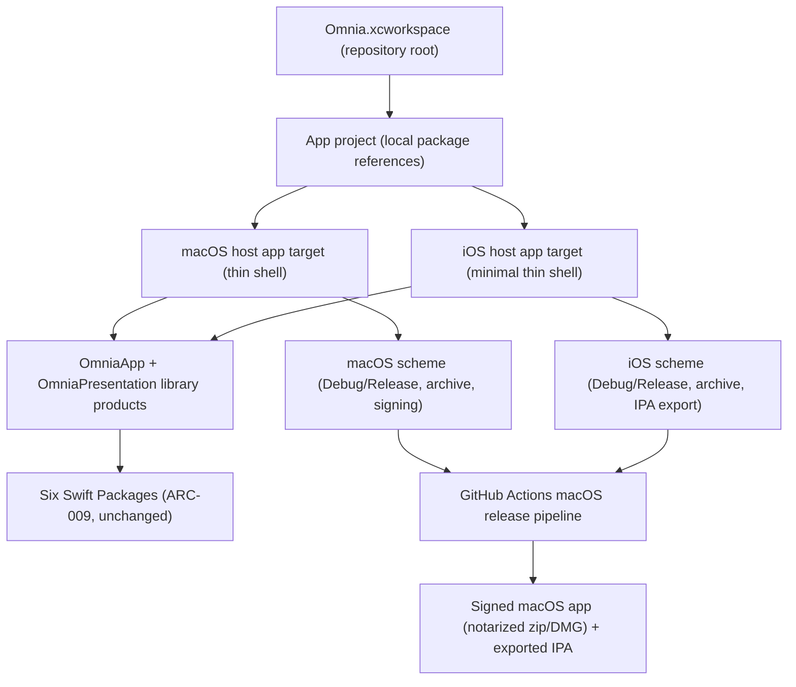

# Release Engineering Sprint 1 Roadmap

> The implementation roadmap for Release Engineering Sprint 1 (milestone #15): turning the verified Swift Package workspace into a distributable, signed Apple application with a repeatable release process — an Xcode workspace that integrates the six Swift Packages, thin Apple host applications that import OmniaApp, build targets and schemes, a reproducible build/archive/sign/package pipeline on GitHub Actions, code signing and notarization support where applicable, and preparation for future iOS distribution — while preserving the verified Omnia architecture unchanged.

## Purpose

This document is the roadmap for Release Engineering Sprint 1. It defines what the sprint delivers, the release-engineering contract to be followed, the distribution topology to be created, the order of implementation, and the criteria that mark the sprint complete. It is the planning artifact that `PROJECT_STATE.md` points to for the sprint after MVP v0.1, and the direct successor to `MVP_V01_ROADMAP.md`.

Unlike the preceding sprints — each of which built and verified packages and application logic — Release Engineering Sprint 1 is the first distribution sprint. MVP v0.1 (PRD-008) explicitly excluded distribution: "no app-store packaging, signing, or notarization; the app runs from the SwiftPM executable." Release Engineering Sprint 1 is the sprint that makes distribution possible while keeping every verified package, every verified API, and the Composition Root exactly as they are.

It is read by the engineers and AI agents who execute the sprint. It does not replace the architecture or the API specifications; it sequences packaging and distribution work against them.

## Scope

This roadmap covers the release-engineering surface only: an Xcode project/workspace, thin Apple host applications (a macOS host and a minimal iOS host) that import OmniaApp, build targets, schemes, and configurations, a reproducible release pipeline (build, archive, signing, packaging) on GitHub Actions, code signing and notarization support where applicable, and preparation for future iOS distribution via TestFlight and/or sideloading. It adds **no new package** — the host applications are Xcode application targets, not Swift packages, so the six-package set of `ARC-009` is unchanged — and it changes **no package source code and no verified API**.

The milestone spans the distribution gap MVP v0.1 left open. It makes the macOS application distributable as a signed, notarized artifact and prepares the same application for iOS distribution, without moving any business logic out of the existing Swift Packages.

## The Distribution Gap

Planning review of the frozen contract surfaced the gap this sprint closes:

- The repository is a Swift Package workspace only: no `*.xcodeproj`, no `*.xcworkspace`, no app bundle, no `Info.plist`, no CI workflow. The only runnable artifact is the SwiftPM executable product `Omnia` (`Packages/OmniaApp/Sources/OmniaAppExecutable/`), which runs on macOS from `swift build`/`swift run`.
- The executable is verified to launch the Composition Root and host the presentation surfaces (DES-013 §3.5), and the platform-independent launch sequencing (`AppLaunch`) is Linux-tested (DES-013 §3.6), but nothing packages it: there is no signing identity, no notarization, no app bundle, and no installation path for a user.
- MVP v0.1 recorded the macOS end-to-end launch (issue #125 AC5) as a **pending environment-blocked verification** to be executed on a real Apple machine (DES-013 §3.6). The repository carries no automated macOS build on which that launch can be executed; Release Engineering Sprint 1 introduces the macOS build (GitHub Actions) that provides it.
- The architecture anticipated Apple distribution: OmniaApp is the sixth package the architecture always planned (`ARC-009`), the iOS and iPadOS app targets were recorded as "a future sprint [that] require[s] an Xcode application target the repository does not yet carry" (PRD-008 Non-Goals), and the packages keep their platform-dependent backends isolated behind conditional compilation (the OmniaInfrastructure canImport precedent), so the package set is buildable for Apple platforms without source changes — with one documented exception recorded below.

The gap closes when the six packages build inside an Xcode workspace, thin Apple host applications import OmniaApp and launch it, a reproducible pipeline builds, archives, signs, notarizes, and packages the application on a macOS runner, and the distribution artifacts are produced.

## Sprint Objective

The verified MVP v0.1 architecture must not change: the six packages keep their responsibilities, the Composition Root remains the single Infrastructure reference point in OmniaApp (ARC-006), the business logic and its 931 Linux-verified tests stay in the packages, and the host application is a thin shell that exists only for packaging, signing, launching, and distribution. No architectural refactoring is allowed.

The sprint delivers:

1. **The Xcode project/workspace** — an `Omnia.xcworkspace` and an app project that integrate the six Swift Packages as local package references, mirroring the root aggregator's dependency graph (ARC-009).
2. **Thin Apple host applications** — a macOS host app and a minimal iOS host app, each a thin SwiftUI `@main` shell that imports OmniaApp, runs `AppLaunch` (compose + prepare), and hosts `RootView` with the resolved workspace and configuration keys — exactly the verified executable shell surface (DES-013 §3.5).
3. **Build targets and schemes** — shared schemes, Debug/Release configurations, bundle identifiers, and versioning aligned with the release workflow (SemVer, `CHANGELOG.md`, tags), reproducible from the command line with `xcodebuild`.
4. **A reproducible release pipeline** — a GitHub Actions workflow on a macOS runner that builds, archives, signs, notarizes, and packages the application, producing a distributable artifact.
5. **Code signing and notarization** — a signing strategy covering development signing for local and sideloaded builds and distribution signing (Developer ID + notarization for macOS; App Store/TestFlight and ad-hoc for iOS), with all credentials held as CI secrets and never committed (SECURITY.md).
6. **Preparation for future iOS distribution** — a minimal iOS host app, reproducible IPA generation, and a documented distribution path for TestFlight (when the Apple Developer account is provisioned) and/or sideloading (ad-hoc/development exports).

The milestone is complete when the workspace builds the two thin hosts, the release pipeline produces signed and packaged artifacts on a macOS runner, the architecture is verified unchanged, and all verification gates pass.

## Sprint Stages

### Stage 1 — Xcode Workspace, Package Integration, and Build Configuration

Create the Xcode project/workspace and wire the packages into it.

1. Create `Omnia.xcworkspace` and the app project, adding the six Swift Packages as local package references (mirroring the root aggregator's dependency graph, `ARC-009`); the app targets link the `OmniaApp` and `OmniaPresentation` products only, matching the verified import set of the executable (OmniaApp, OmniaPresentation, SwiftUI).
2. Create the build targets and schemes: shared schemes for the macOS host and the iOS host, Debug/Release configurations, bundle identifiers, and `MARKETING_VERSION`/build numbering aligned with the release workflow (`.ai/prompts/workflows/release.md`, Semantic Versioning).
3. Record the one package-manifest change the integration requires: the OmniaApp package's `platforms:` gains `.iOS(.v16)` (the library target must build for iOS; the five packages that declare no `platforms:` are already iOS-buildable by construction). This is a build-configuration change only — no Swift source, no API, and no availability of the macOS surface changes — and it is the **only** permitted change to any `Packages/` manifest or source.
4. Verify the workspace opens without warnings and both app targets build against the packages with `xcodebuild` from the command line; the standard Linux build/test pipeline remains green at every step (regression gate).

### Stage 2 — Thin Apple Host Applications

Implement the two thin host applications against the frozen DES-013 §3.5 shell contract.

1. **macOS host app** — a thin SwiftUI `@main` App that runs `AppLaunch` (compose the Composition Root, run `prepare()` resolving the default workspace), hosts `RootView` with the resolved workspace and the settings surface's configuration keys, and owns session state (the current workspace identity) at the application edge — mirroring the verified executable shell (DES-013 §3.5). The host imports only OmniaApp, OmniaPresentation, and SwiftUI; it owns no business logic, no composition, and no persistence.
2. **Minimal iOS host app** — the same thin shell on the iOS App lifecycle, deployment target iOS 16 (the `NavigationStack` root view's availability), hosting the same `RootView`; it is the distribution vehicle for future iOS builds and carries no iOS-specific logic beyond the lifecycle declaration.
3. Apply the macOS app sandbox entitlement and any entitlement the verified storage and credential layout requires (Application Support container, Keychain, outgoing network for the provider adapter); entitlements are a security-sensitive change and receive explicit review per `SECURITY.md`.
4. Both hosts are verified by build (Linux-verified surface unchanged; the shell itself is Apple-platform code verified by review and by build and launch on the macOS runner).

### Stage 3 — Release Pipeline, Signing, and Distribution

Implement the reproducible release pipeline and the signing/distribution workflows.

1. **GitHub Actions release pipeline** — a workflow on a macOS runner: checkout, run the standard test suite, build the two app targets with `xcodebuild`, archive, sign, notarize (macOS), and package (notarized zip and/or DMG; exported IPA for iOS), uploading the artifacts. Signing and notarization steps are gated on the presence of the CI secrets so the pipeline is reproducible and credential-free when secrets are absent.
2. **Code signing and notarization strategy** — development signing (automatic, local) for development and sideloaded builds; distribution signing (Developer ID Application + hardened runtime + notarization via `notarytool` for macOS; Apple Development and App Store/TestFlight or ad-hoc for iOS); certificates, profiles, and App Store Connect credentials held only as GitHub Actions secrets, never committed (SECURITY.md).
3. **iOS distribution preparation** — `xcodebuild archive` + `-exportArchive` producing a reproducible IPA for the App Store (TestFlight) and ad-hoc/development (sideloading) export methods; the TestFlight upload path is defined and executed when the Apple Developer account is provisioned (an environment-dependent step recorded like the macOS launch verification).
4. **Versioning and release** — the pipeline and the release workflow produce a tagged, changelogged release per `.ai/prompts/workflows/release.md`; the first distributable build is the Beta v0.5 (v0.5.0) candidate.

### Stage 4 — Milestone Verification and Closure

Verify the milestone against the frozen architecture and close it.

1. **Architecture-preservation verification** — the six packages are unchanged (diff check against the MVP v0.1 closure state) except the single documented OmniaApp `platforms:` addition; the Composition Root, `AppLaunch`, storage layout, bootstrap, and binding remain in the packages; the host targets import only OmniaApp, OmniaPresentation, and SwiftUI; the host owns no business logic.
2. **Standard pipeline** — the full 931-test Linux suite passes with 0 failures and 0 warnings and the root package builds (regression gate); the Engineering Platform Validation Suite passes.
3. **Platform verification** — the macOS host builds, signs, notarizes, and launches on the macOS runner, executing the pending MVP v0.1 end-to-end launch (issue #125 AC5) and closing it; the iOS host builds and produces an exported IPA.
4. **Closure** — the closure report is recorded, `PROJECT_STATE.md` and `README.md` are updated, `CHANGELOG.md` reflects the changes, and the milestone and its issues are closed.

## Requirements

The requirements derive from the milestone definition — "a distributable signed Apple application with a repeatable release process" — and from the layer responsibilities and assembly rules of `ARC-006`, `ARC-007`, and `ARC-009`, the storage and security architecture of `ARC-005`, the frozen OmniaApp contract (DES-013), the release workflow (`.ai/prompts/workflows/release.md`), and the Security standard (`.ai/standards/SECURITY.md`). Release Engineering Sprint 1 adds no product surface: it makes the verified application distributable.

### The Distribution Topology

- An `Omnia.xcworkspace` at the repository root and an app project (e.g., under `App/`) that add the six packages as **local package references**, mirroring the root aggregator `Package.swift` dependency graph (`ARC-009`). The app targets link the `OmniaApp` and `OmniaPresentation` library products only; no target may import a package product beyond those, matching the executable's verified import set (OmniaApp, OmniaPresentation, SwiftUI).
- The host applications are **Xcode application targets, not Swift packages**. The six-package set is fixed (`ARC-009`); a new Swift package would violate the architecture, an Xcode app target does not.
- The SwiftPM surface of the repository — the root aggregator and the six packages — remains the build surface of the standard Linux pipeline and of the SwiftPM executable; the Xcode workspace is a parallel, distribution-only build surface over the same packages.

### The Thin Host Application Contract

- Each host is a thin SwiftUI `@main` App: launch → `AppLaunch` (compose the Composition Root, run `prepare()`, both idempotent across launches, ARC-005) → host `RootView` with the resolved workspace and the settings surface's configuration keys (DES-012 §3.5, §3.6, DES-013 §3.5).
- The host owns **session state at the application edge** — the current workspace identity — and nothing else (DES-011 §3.2, DES-013 §3.5). It performs no composition, no persistence, no networking, no credential operations, and no business logic (ARC-002, ARC-006).
- The host imports only OmniaApp, OmniaPresentation, and SwiftUI — the same verified import set as the executable (issue #124). OmniaInfrastructure appears nowhere in the host sources; it appears only in the Composition Root library sources (ARC-006).
- The shell logic (launch sequencing, session state, failure rendering) lives in the packages (`AppLaunch`, the verified surface, Linux-tested, DES-013 §3.6). The host shells and the SwiftPM executable shell differ only in the platform `@main` App declaration; the `AppLaunch`/`RootView` contract is the single source of truth, so the shells cannot drift.
- The macOS host enables the app sandbox; the verified storage layout (one directory per repository under the platform Application Support container, credentials in the Keychain, `ARC-005`) and the provider adapter's outgoing network continue to work under the sandbox (verified in Stage 3).

### Build Targets, Schemes, and Configurations

- Two app targets (macOS host, iOS host) with shared schemes, Debug/Release configurations, and build settings reproducible with `xcodebuild` from the command line (no Xcode GUI step required).
- Bundle identifiers and `MARKETING_VERSION`/build numbers follow the release workflow: Semantic Versioning, `CHANGELOG.md` (Keep a Changelog), and version tags (`.ai/prompts/workflows/release.md`); the app version and the tagged release version never diverge.
- The standard Linux build/test pipeline is unaffected by the workspace; it remains the verification mechanism for all business logic (DES-013 §3.6).

### The Release Pipeline

- A GitHub Actions workflow on a macOS runner performs the reproducible release build: checkout, standard test suite, `xcodebuild` build of both app targets, archive, code signing, notarization (macOS), and packaging (notarized zip and/or DMG for macOS; exported IPA for iOS), uploading the artifacts.
- The workflow is **reproducible**: pinned Xcode version, deterministic steps, and the same inputs produce the same artifacts. Signing and notarization steps are gated on the presence of the CI secrets, so a run without credentials still builds and packages unsigned artifacts and reports the signing step as skipped, not failed.
- No secret ever enters the repository: certificates, private keys, profiles, and Apple account credentials are GitHub Actions secrets referenced by name (`SECURITY.md`, release workflow step 7).

### Code Signing and Notarization

- **Development signing** — automatic signing with a development team for local builds and device/sideloaded builds.
- **macOS distribution signing** — a Developer ID Application identity, hardened runtime, and notarization via `notarytool` with stapling, producing a notarized zip and/or DMG for direct download.
- **iOS signing** — Apple Development and App Store distribution provisioning for TestFlight, and ad-hoc/development provisioning for sideloading to registered devices; App Store Connect authentication via an API key held as a CI secret.
- Entitlements (app sandbox, hardened runtime, Keychain access, outgoing network) are declared explicitly and receive the explicit review `SECURITY.md` requires for keychain and entitlement changes.
- Actual notarization and TestFlight upload require an Apple Developer account and its credentials, which are environment-dependent (provisioned as CI secrets) — recorded like the MVP v0.1 macOS launch verification, not a defect of the sprint.

### iOS Distribution Preparation

- The minimal iOS host app builds for iOS 16+ and exports a reproducible IPA via `xcodebuild archive` + `-exportArchive`.
- Two export paths are prepared: **App Store** (for TestFlight distribution) and **ad-hoc/development** (for sideloading to registered devices).
- The TestFlight upload path is defined (transporter/`altool` with an App Store Connect API key) and executed when the account is provisioned; sideloading is documented as a device-install workflow.

### Architecture Preservation

The following are hard requirements, verified in Stage 4:

- **No business logic moves.** All business logic, application services, presentation logic, and the platform-independent launch surface remain in the six packages. The host contains no logic beyond the `@main` App declaration and the call into `AppLaunch`/`RootView`.
- **No package source changes.** Zero Swift source files under `Packages/` change. The only permitted manifest change is the OmniaApp `platforms:` addition of `.iOS(.v16)` (build configuration, not architecture).
- **No Composition Root change.** The Composition Root stays the single Infrastructure reference point in the OmniaApp library (ARC-006); the host never composes a graph.
- **No new package.** The six-package set is unchanged (ARC-009); the host is an Xcode application target.
- **No verified API change.** DES-013, DES-011 v1.1.0, and DES-012 v1.1.0 remain frozen and unchanged; the host consumes them exactly as the executable does.

### Build and Verification Boundary

- The business logic and the platform-independent launch surface (Composition Root, storage layout, bootstrap, binding, `AppLaunch`) are verified by the standard Linux build/test pipeline, unchanged (DES-013 §3.6).
- The host shells are Apple-platform code verified by build on the macOS runner, by review against the DES-013 §3.5 shell contract and `.ai/standards/UI.md`, and by the macOS launch that executes the pending end-to-end verification (issue #125 AC5).
- The release pipeline is verified by its run on the macOS runner producing the signed, notarized, packaged artifacts.

### Implementation Order

The order is: workspace and package integration first (so every later step builds inside Xcode), then the thin hosts, then the pipeline and signing, then verification. Each step leaves the standard Linux pipeline green.

1. **Xcode workspace and package integration** — `Omnia.xcworkspace`, app project, local package references, the single OmniaApp `platforms:` manifest addition, both app targets compiling against the packages (RE-1).
2. **Build targets, schemes, and configurations** — shared schemes, Debug/Release, bundle identifiers, and versioning aligned with the release workflow (RE-3).
3. **Thin macOS host application** — the thin shell importing OmniaApp, sandbox entitlements, launch on the macOS runner (RE-2).
4. **Minimal iOS host application** — the same thin shell on the iOS lifecycle, deployment target iOS 16 (RE-4).
5. **Reproducible release pipeline** — the GitHub Actions macOS workflow: build, archive, sign, notarize, package, upload (RE-5).
6. **Code signing and notarization strategy** — identities, profiles, entitlements, secrets, notarization (RE-6).
7. **iOS distribution preparation** — IPA export (App Store and ad-hoc) and the TestFlight/sideloading path (RE-7).
8. **Milestone verification and closure** — architecture-preservation verification, standard pipeline, Validation Suite, macOS launch (closing issue #125 AC5), closure report, documentation, milestone close (RE-8).

### Completion Criteria

The milestone is complete when all of the following hold:

- The Xcode workspace and app project exist, open without warnings, integrate the six Swift Packages as local package references, and both thin host app targets build against them; the workspace mirrors the root aggregator dependency graph (ARC-009).
- The thin macOS host app imports only OmniaApp, OmniaPresentation, and SwiftUI, runs `AppLaunch` and hosts `RootView`, owns only session state at the application edge, and contains no business logic (DES-013 §3.5, ARC-002, ARC-006).
- The thin iOS host app builds for iOS 16+ from the same shell and imports only the packages (preparation for future iOS distribution).
- Build targets, shared schemes, and configurations are reproducible with `xcodebuild` from the command line, and versioning follows the release workflow (SemVer, `CHANGELOG.md`, tags).
- The GitHub Actions macOS pipeline builds, archives, signs, notarizes, and packages the application, producing a distributable artifact; signing steps gate on CI secrets and never require a secret in the repository (SECURITY.md).
- The code signing and notarization strategy is documented and implemented where credentials are provisioned; entitlements are reviewed per SECURITY.md.
- The iOS distribution path is prepared: reproducible IPA export for App Store (TestFlight) and ad-hoc (sideloading), with the upload executed when the account is provisioned.
- The architecture is preserved and verified: zero package source changes, the single documented OmniaApp `platforms:` manifest addition, the Composition Root and `AppLaunch` unchanged in the packages, and the host import set exactly OmniaApp/OmniaPresentation/SwiftUI.
- The standard Linux build/test pipeline passes — the full suite across all six packages, 0 failures and 0 warnings, the root package builds — and the Engineering Platform Validation Suite passes.
- The macOS host launches on a macOS runner and the pending MVP v0.1 end-to-end launch verification (issue #125 AC5) is executed and closed.
- Documentation is updated: `PROJECT_STATE.md` records the sprint and its closure, `README.md`'s roadmap reference resolves to this document, and `CHANGELOG.md` reflects the changes.

## Non-Goals

The following are explicitly out of scope for Release Engineering Sprint 1:

- **No architectural refactoring** — no change to the layered architecture, the package boundaries, the dependency graph, the Composition Root, the storage layout, or any verified API (ARC-002, ARC-006, ARC-007, ARC-008, ARC-009).
- **No business logic in the host** — the host applications exist only for packaging, signing, launching, and distribution; they own no logic beyond the `@main` App declaration, the call into `AppLaunch`, and the hosting of `RootView`.
- **No new Swift package** — the six-package set is fixed (ARC-009); the host is an Xcode application target, not a package.
- **No package source changes** — the only permitted `Packages/` change is the OmniaApp `platforms:` addition of `.iOS(.v16)`; any other change that a target requires is out of scope and a defect of the plan.
- **No macOS App Store submission pipeline** — macOS distribution in this sprint is a notarized zip/DMG for direct download; App Store (macOS) submission is future work.
- **No Xcode Cloud, Fastlane, or third-party packaging tools** — the pipeline uses native Apple tooling (`xcodebuild`, `xcrun`, `notarytool`, transporter/`altool`) and GitHub Actions, consistent with the no-third-party-packages preference (`SWIFT.md`).
- **No Linux CI** — the standard Linux pipeline remains a developer-run verification; adding Linux CI is an Engineering Platform v2 backlog item (RFC-002 Track C), out of scope here.
- **No app-store metadata, screenshots, or marketing** — release notes and changelog per the release workflow are included; store listing content is not.
- **No localization** — the UI.md localization follow-up remains a separate backlog item.
- **No new capabilities, screens, or product surface** — the sprint makes the verified application distributable; it adds no product behavior.
- **No telemetry, analytics, or tracking** — enabled by default nowhere (`SECURITY.md`).

## Risks

- **`pbxproj` reviewability** — Xcode project files are generated and noisy in review. Mitigated by keeping the project minimal (two targets, shared schemes), reviewing the project at the file level, and documenting the generated-artifact status.
- **Signing and notarization environment-dependence** — notarization and TestFlight upload require an Apple Developer account and credentials not available on this host. Mitigated by gating those pipeline steps on CI secrets and executing them on the macOS runner when provisioned, recorded exactly like the MVP v0.1 macOS launch verification.
- **Shell drift** — the SwiftPM executable shell and the Xcode host shells could diverge. Mitigated by the thin-shell contract: all logic lives in the Linux-tested `AppLaunch`/`RootView` surface in the packages; the shells differ only in the `@main` App declaration.
- **iOS platform addition** — adding `.iOS(.v16)` to the OmniaApp manifest could affect the Linux or macOS build. Mitigated by the regression gate (the standard pipeline stays green at every step) and by the change being additive availability only.
- **Sandbox and entitlement constraints** — the app sandbox could change the verified storage or network behavior. Mitigated by declaring entitlements explicitly, verifying the Application Support layout and the provider adapter's outgoing network under the sandbox on the macOS runner, and the SECURITY.md review of the entitlement change.
- **Reproducibility** — Xcode toolchain differences across runners. Mitigated by pinning the Xcode version in the workflow and documenting the pinned toolchain.
- **Pending macOS launch defects** — the pending end-to-end launch (issue #125 AC5) may surface defects on a real Apple machine. Mitigated by executing it in Stage 3/4 verification and treating findings as defects to fix in the packages, never in the host.
- **Secret handling** — signing and notarization involve long-lived credentials. Mitigated by holding them only as GitHub Actions secrets, never committing them, and reviewing all secret references (SECURITY.md).

## Related Documents

- `README.md`
- `Documentation/Product/PRODUCT_CHARTER.md`
- `Documentation/Product/PRODUCT_PRINCIPLES.md`
- `Documentation/Product/VISION.md`
- `Documentation/Product/Roadmap/MVP_V01_ROADMAP.md`
- `Documentation/Architecture/05_LOCAL_STORAGE_ARCHITECTURE.md`
- `Documentation/Architecture/06_DEPENDENCY_INJECTION.md`
- `Documentation/Architecture/08_PACKAGE_MODEL.md`
- `Documentation/Architecture/09_PACKAGE_STRUCTURE.md`
- `Documentation/Architecture/ADR/ADR-0001-architectural-style.md`
- `Documentation/Architecture/ADR/ADR-0002-dependency-direction.md`
- `Documentation/Design/APP_API.md`
- `Documentation/Design/APPLICATION_API.md`
- `Documentation/Design/PRESENTATION_API.md`
- `.ai/context/PROJECT_STATE.md`
- `.ai/prompts/workflows/release.md`
- `.ai/standards/SECURITY.md`
- `.ai/standards/SWIFT.md`
